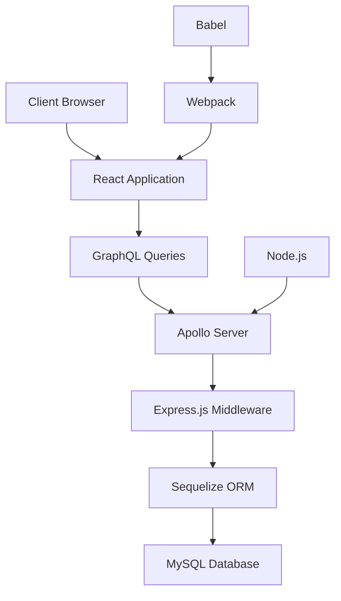
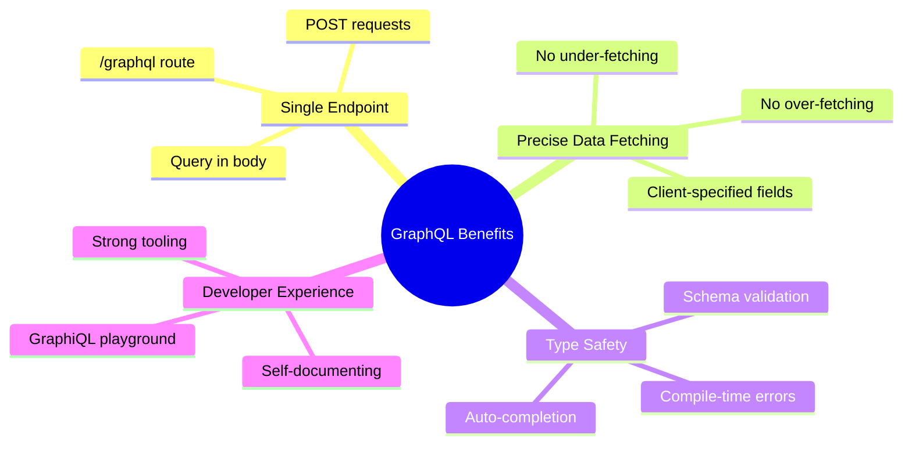
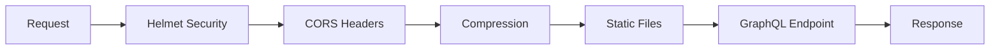
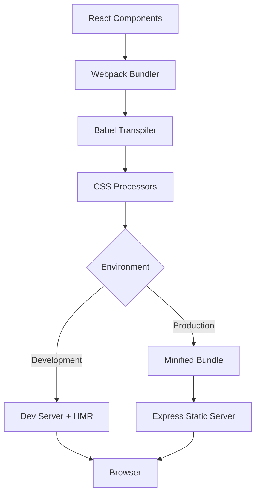
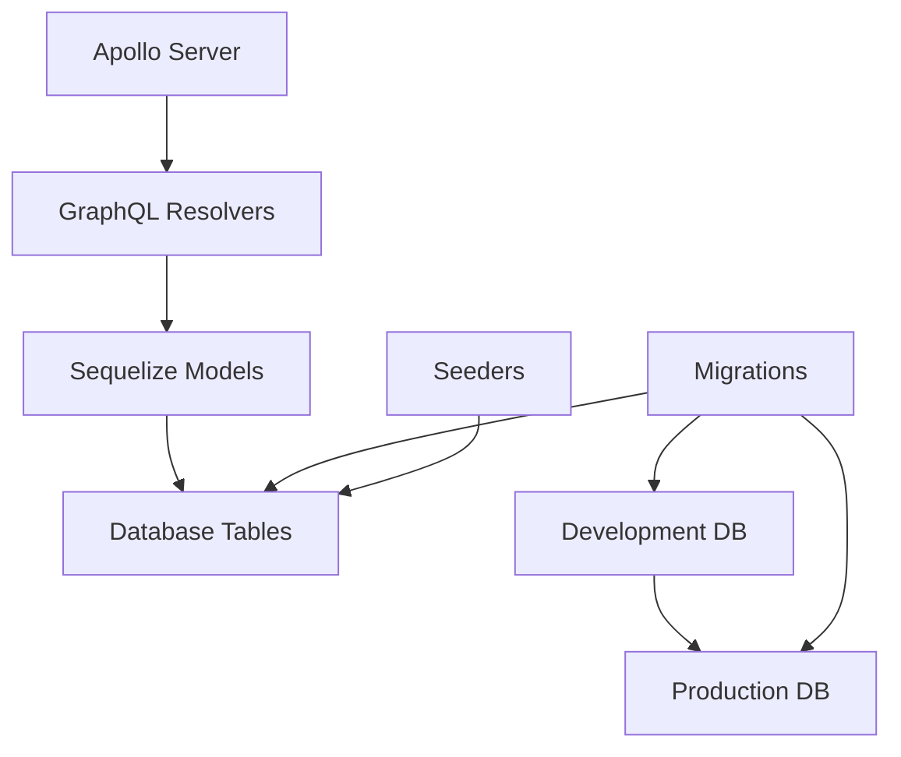
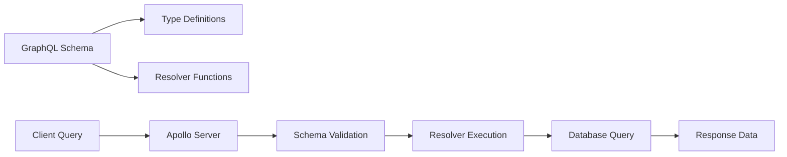
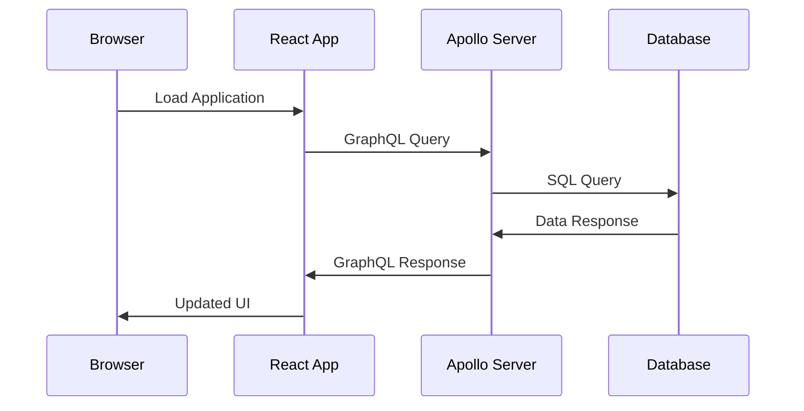
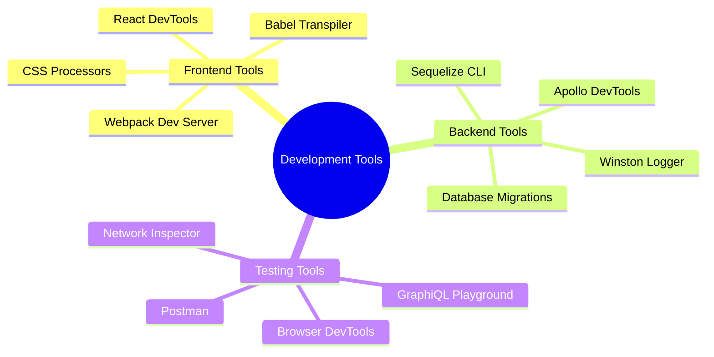

# Building the Stack

## 🏗️ **Development Environment Architecture**

### **Stack Components:**
- **Node.js**: Server-side JavaScript runtime
- **Express.js**: Web framework for API endpoints
- **GraphQL + Apollo**: Query language and server implementation
- **MySQL + Sequelize**: Database and ORM layer
- **React**: Frontend UI library
- **Webpack + Babel**: Build tools and transpilation

## 🎯 **GraphQL Core Concepts**

### **Query Language Features:**
- **Specific field selection**: Request only needed data
- **Single endpoint**: All operations through `/graphql`
- **Strongly typed**: Schema defines available operations
- **Resolver functions**: Map schema fields to data sources
- **Real-time subscriptions**: Live data updates

### **GraphQL vs REST:**
- **Single request**: Multiple resources in one query
- **No over-fetching**: Client specifies exact data needs
- **No under-fetching**: Related data in single request
- **Schema documentation**: Self-documenting API
- **Type safety**: Compile-time error detection

## 🛠️ **Node.js + Express.js Setup**

### **Installation Process:**
- **Node.js 14+ LTS**: Stable runtime environment
- **Package management**: npm for dependency installation
- **Express.js framework**: HTTP server and middleware
- **Development tools**: nodemon for auto-restart

### **Express.js Middleware Stack:**
- **Helmet**: Security headers and XSS protection
- **CORS**: Cross-origin request handling
- **Compression**: Gzip response compression
- **Static files**: Serve bundled frontend assets

## ⚛️ **React Frontend Architecture**

### **Webpack Configuration:**
- **Entry point**: `src/client/index.js`
- **Babel transpilation**: ES6+ and JSX support
- **CSS processing**: style-loader and css-loader
- **Development server**: Hot reloading on port 3000
- **Production builds**: Minification and optimization

### **Component Structure:**
- **App component**: Root application container
- **State management**: useState hook for local state
- **Event handling**: Form submissions and user interactions
- **CSS modules**: Scoped styling per component

### **Development vs Production:**
- **Development mode**: Source maps and hot reloading
- **Production mode**: Minified bundles and asset optimization
- **Static serving**: Express.js serves production builds
- **Asset management**: webpack handles file bundling

## 🗄️ **Database Integration**

### **MySQL + Sequelize Setup:**
- **Database creation**: phpMyAdmin or CLI setup
- **Connection pooling**: Optimized database connections
- **Model definitions**: JavaScript classes for database tables
- **Migrations**: Version-controlled schema changes
- **Seeders**: Test data for development

### **ORM Benefits:**
- **JavaScript queries**: No raw SQL needed
- **Relationship mapping**: Automatic JOIN operations
- **Data validation**: Schema enforcement at application level
- **Migration management**: Database version control

## 🔄 **GraphQL Schema & Resolvers**

### **Schema Definition:**
- **Type definitions**: Describe available data structures
- **Query operations**: Read-only data retrieval
- **Mutation operations**: Data modification and creation
- **Input types**: Parameters for mutations
- **Scalar types**: Basic data types (String, Int, Boolean)

### **Resolver Implementation:**
- **RootQuery**: Entry point for all queries
- **RootMutation**: Entry point for all mutations
- **Field resolvers**: Individual property resolution
- **Database integration**: Sequelize model queries
- **Promise handling**: Async data fetching

## 🎨 **Frontend-Backend Integration**

### **Request Flow:**
- **Static HTML**: Express serves initial page
- **JavaScript bundle**: React application loads
- **GraphQL requests**: Apollo client queries
- **Data rendering**: React components update
- **Real-time updates**: Optional subscriptions

### **Development Workflow:**
- **Separate servers**: Frontend (3000) + Backend (8000)
- **Proxy setup**: CORS for cross-origin requests
- **Hot reloading**: Instant frontend updates
- **API testing**: Postman or GraphiQL playground

## 🔧 **Development Tools**

### **Debugging & Testing:**
- **React DevTools**: Component inspection and state
- **Apollo DevTools**: GraphQL query debugging
- **winston logging**: Structured server-side logging
- **Postman**: API endpoint testing
- **Chrome DevTools**: Network and performance analysis

### **Code Quality:**
- **Babel presets**: ES6+ and React transformations
- **ESLint**: Code linting and style enforcement
- **Prettier**: Automated code formatting
- **nodemon**: Automatic server restarts
- **webpack-dev-server**: Live reloading

