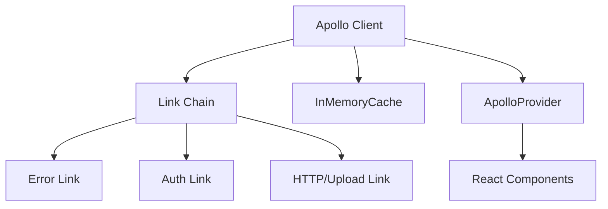
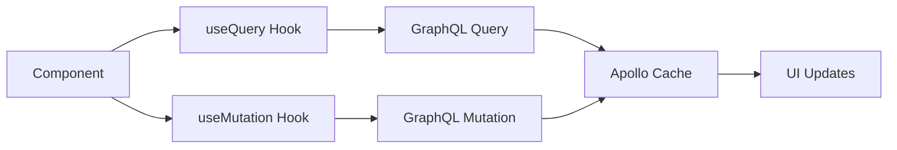
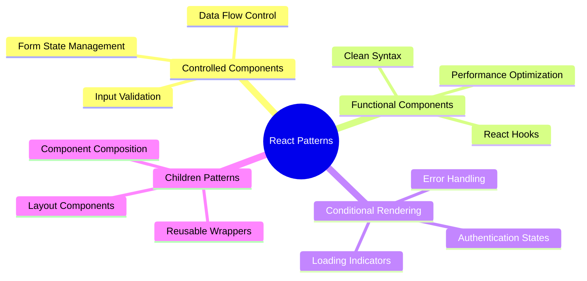
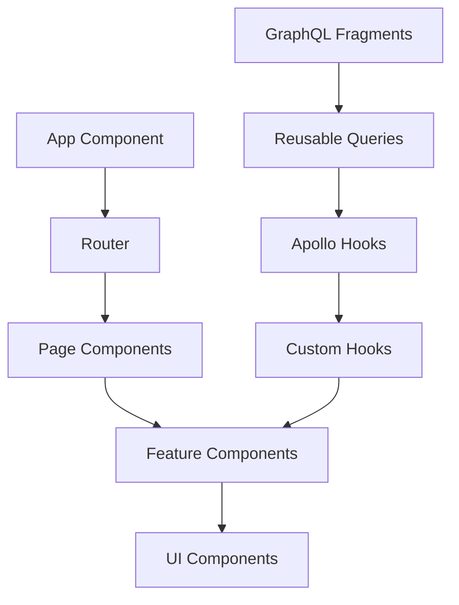
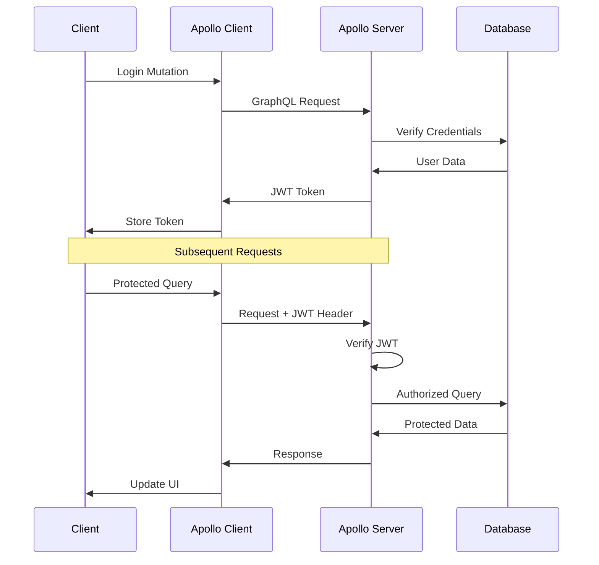
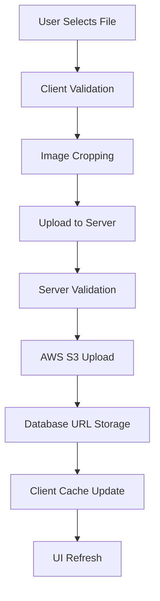
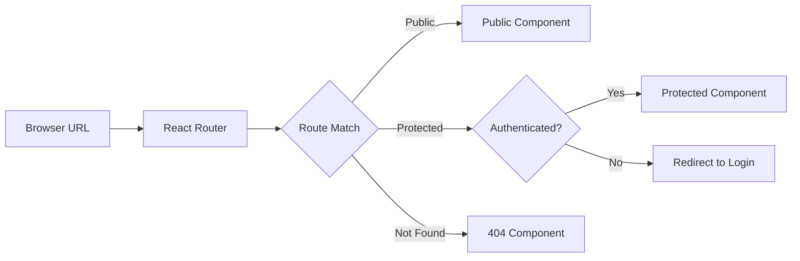
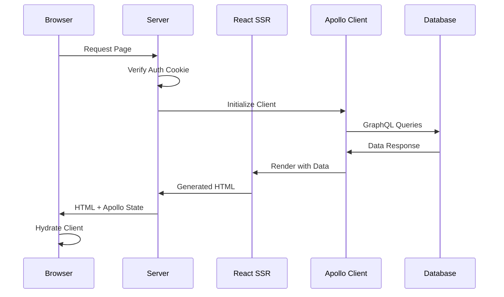
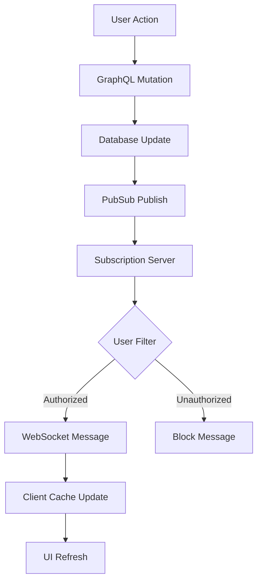
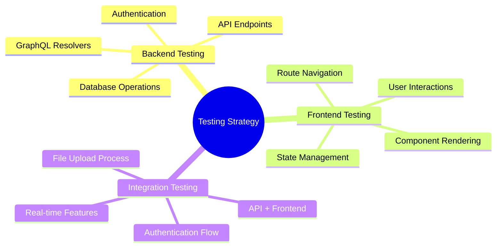

# Building the Application

## 🚀 **Apollo Client Integration**

### **Installation & Setup:**
- **Apollo Client packages**: `@apollo/client`, `graphql`
- **Core configuration**: ApolloProvider wrapping React app
- **Link system**: HTTP link for queries, upload link for files
- **Cache management**: InMemoryCache for client-side data storage
- **Error handling**: onError link for GraphQL and network errors

## ⚛️ **React Apollo Hooks**

### **useQuery Hook:**
- **Data fetching**: Automatic loading states and error handling
- **Polling**: Real-time updates with `pollInterval`
- **Variables**: Dynamic query parameters
- **Cache integration**: Automatic cache updates and reuse
- **Loading states**: Built-in loading, error, and data properties

### **useMutation Hook:**
- **Data modification**: Create, update, delete operations
- **Optimistic updates**: Immediate UI feedback before server response
- **Cache updates**: Manual cache modifications after mutations
- **Error handling**: Mutation-specific error states
- **Variables**: Dynamic mutation parameters

## 🎯 **React Component Patterns**

### **Controlled Components:**
- **State management**: React state controls input values
- **Event handling**: onChange updates component state
- **Form validation**: Client-side validation before submission
- **Predictable data flow**: Single source of truth in React state

### **Functional Components:**
- **Hooks integration**: useState, useEffect, custom hooks
- **Performance optimization**: React.memo for unnecessary re-renders
- **Clean code**: Simpler syntax compared to class components
- **Modern approach**: Recommended pattern for new React applications

### **Conditional Rendering:**
- **Dynamic UI**: Show/hide components based on state
- **Authentication gates**: Different views for logged-in users
- **Loading states**: Conditional display during data fetching
- **Error boundaries**: Graceful error handling and display

## 🏗️ **Application Architecture**

### **Component Organization:**
- **Feature-based structure**: Group by functionality, not file type
- **Reusable components**: Common UI elements in shared folders
- **Page-level components**: Top-level route components
- **Custom hooks**: Shared logic extraction
- **Helper utilities**: Pure functions for data transformation

### **Apollo Integration Patterns:**
- **Query fragments**: Reusable GraphQL field selections
- **Custom hooks**: Wrapped Apollo hooks with business logic
- **Cache management**: Optimistic updates and cache modifications
- **Error handling**: Centralized error processing and user feedback

## 🔐 **Authentication Implementation**

### **JWT Token Management:**
- **Token storage**: localStorage vs cookies comparison
- **Automatic headers**: Authorization header injection
- **Token refresh**: Handling expiration and renewal
- **Logout functionality**: Token removal and cache clearing
- **Security considerations**: XSS and CSRF protection

### **Protected Routes:**
- **Route guards**: Authentication-based route access
- **Redirect logic**: Automatic navigation for unauthorized users
- **User context**: Global user state management
- **Login persistence**: Maintaining login state across sessions

### **GraphQL Authentication:**
- **Schema directives**: `@auth` directive for protected fields
- **Context injection**: User data in resolver context
- **Middleware setup**: JWT verification in Apollo Server
- **Error handling**: Authentication-specific error responses

## 📁 **File Upload System**

### **AWS S3 Integration:**
- **Bucket configuration**: Public access and CORS setup
- **Server-side uploads**: Secure API key handling
- **File processing**: Image cropping and optimization
- **URL generation**: Public accessible file URLs
- **Security measures**: File type validation and size limits

### **Frontend Upload Flow:**
- **Drag & drop interface**: react-dropzone integration
- **Image cropping**: react-cropper for user customization
- **Upload progress**: Real-time feedback during upload
- **Error handling**: User-friendly error messages
- **Preview functionality**: Immediate visual feedback

## 🛣️ **React Router Implementation**

### **Route Configuration:**
- **Dynamic routing**: Runtime route matching
- **Parameterized routes**: URL parameters for data fetching
- **Protected routes**: Authentication-based access control
- **Catch-all routes**: 404 handling and redirects
- **Programmatic navigation**: History API manipulation

### **Navigation Patterns:**
- **Link components**: Declarative navigation
- **History hooks**: Programmatic route changes
- **Route parameters**: Dynamic data loading
- **Query parameters**: State persistence in URLs
- **Redirect logic**: Conditional navigation flow

## 🔄 **Server-Side Rendering (SSR)**

### **SSR Architecture:**
- **Universal rendering**: Same code for client and server
- **Static Router**: Server-side routing without browser APIs
- **Apollo SSR**: Server-side GraphQL query execution
- **Cache hydration**: Client-side cache initialization
- **Performance benefits**: Faster initial page loads and SEO

### **Authentication with SSR:**
- **Cookie management**: Server-accessible authentication
- **Context passing**: User data through render pipeline
- **Cache population**: Pre-filled Apollo cache
- **Redirect handling**: Server-side navigation logic
- **Security considerations**: httpOnly cookies and CSRF protection

## ⚡ **Real-Time Features**

### **WebSocket Subscriptions:**
- **Apollo subscriptions**: Real-time GraphQL updates
- **WebSocket transport**: Bidirectional communication
- **Authentication**: JWT over WebSocket connections
- **Filtered updates**: User-specific message delivery
- **Connection management**: Automatic reconnection handling

### **Subscription Patterns:**
- **useSubscription Hook**: Component-level subscriptions
- **subscribeToMore**: Query enhancement with real-time updates
- **PubSub system**: Server-side event broadcasting
- **Message filtering**: User authorization for subscription data
- **Cache integration**: Real-time cache updates

## 🧪 **Testing Strategy**

### **Testing Tools:**
- **Mocha framework**: Test structure and execution
- **Chai assertions**: Expressive test assertions
- **Enzyme**: React component testing
- **JSDOM**: Browser environment simulation
- **Automated testing**: CI/CD integration for quality assurance

### **Testing Patterns:**
- **Unit tests**: Individual component functionality
- **Integration tests**: Component interaction testing
- **API tests**: GraphQL endpoint verification
- **Authentication tests**: Login/logout flow validation
- **E2E scenarios**: Complete user journey testing

## 📊 **Performance Optimization**

### **Apollo Client Optimization:**
- **Query batching**: Multiple queries in single request
- **Cache optimization**: Efficient data storage and retrieval
- **Subscription filtering**: Minimize unnecessary updates
- **Fragment reuse**: Consistent field selection patterns
- **Optimistic updates**: Immediate UI feedback

### **React Performance:**
- **Component memoization**: Prevent unnecessary re-renders
- **Code splitting**: Lazy loading for better initial load
- **Bundle optimization**: Tree shaking and compression
- **Image optimization**: Proper sizing and compression
- **Critical path**: Prioritize above-the-fold content