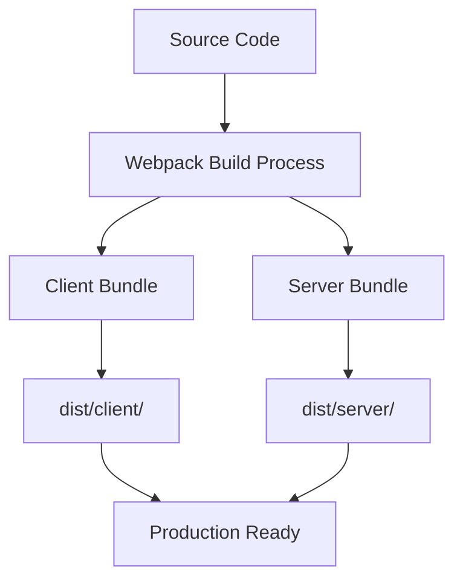
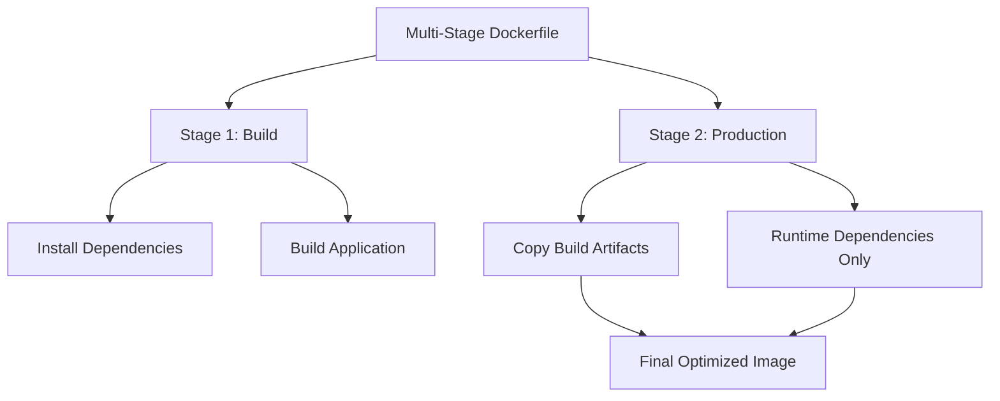
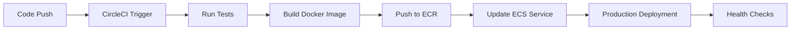

# Docker & Deployment - Production Build & Continuous Deployment

## 🏗 **Production Build Preparation**

### **Bundle Optimization:**
- **Webpack configuration**: Separate server-side bundling for production
- **Code splitting**: Remove development dependencies and debug tools
- **Environment variables**: Set NODE_ENV to production for optimizations
- **Asset optimization**: Minimize JavaScript, CSS, and static assets

### **Build Process Setup:**
- **Server bundling**: webpack-node-externals to exclude node_modules
- **Production scripts**: Separate build commands for client and server
- **Bundle structure**: dist/ folder with organized client/server directories
- **Runtime optimization**: Transform plugins to reduce bundle size

## 🐳 **Docker Containerization**

### **Docker Fundamentals:**
- **Container isolation**: Application runs in isolated environment
- **Base images**: Start from pre-configured runtime environments
- **Layer optimization**: Multi-stage builds for smaller final images
- **Port exposure**: Make application accessible from outside container

### **Dockerfile Structure:**
- **FROM instruction**: Specify base image (node:14)
- **WORKDIR setup**: Create application directory structure
- **COPY optimization**: Only copy necessary files for build
- **RUN commands**: Install dependencies and build application
- **CMD instruction**: Define container startup command

### **Multi-Stage Build Benefits:**
- **Build stage**: Install all dependencies and build application
- **Production stage**: Copy only built artifacts and runtime dependencies
- **Size optimization**: Exclude development tools from final image
- **Security**: Minimal surface area in production container

## ☁️ **AWS Infrastructure Setup**

### **Amazon RDS Configuration:**
- **Database service**: Managed MySQL/PostgreSQL instances
- **Security groups**: Network access control configuration
- **Public access**: Enable remote connections for application
- **Credentials management**: Environment variable injection

### **Amazon ECR Registry:**
- **Private registry**: Store Docker images securely
- **Image versioning**: Tag-based version management
- **Access control**: IAM-based permissions
- **Integration**: Seamless ECS deployment integration

### **Amazon ECS Container Service:**
- **Cluster management**: EC2-based container orchestration
- **Task definitions**: Container configuration and resource allocation
- **Service management**: Maintain desired number of running tasks
- **Load balancer integration**: Traffic distribution and health checks

## 🔄 **Continuous Integration/Deployment**

### **CI/CD Pipeline Concept:**
- **Continuous Integration**: Automated testing on every code change
- **Continuous Deployment**: Automated deployment after successful tests
- **Quality gates**: Prevent broken code from reaching production
- **Automation benefits**: Reduce manual errors and deployment time

### **CircleCI Configuration:**
- **YAML configuration**: .circleci/config.yml defines pipeline
- **Docker executors**: Run jobs in containerized environments
- **Parallel jobs**: Test, build, and deploy in coordinated workflow
- **Environment variables**: Secure credential management

### **Pipeline Stages:**
- **Test stage**: Run automated tests against database
- **Build stage**: Create and push Docker images to ECR
- **Deploy stage**: Update ECS service with new task definition
- **Rollback capability**: Revert to previous version if issues occur

## 🚀 **Deployment Architecture**

### **Load Balancer Setup:**
- **Application Load Balancer**: Distribute traffic across container instances
- **Target groups**: Define backend service endpoints
- **Health checks**: Monitor application availability
- **Dynamic port mapping**: Handle container port assignments

### **Service Orchestration:**
- **ECS services**: Maintain desired task count
- **Rolling deployments**: Zero-downtime updates
- **Auto-scaling**: Adjust capacity based on demand
- **Service discovery**: Automatic endpoint management

### **Monitoring & Logging:**
- **CloudWatch integration**: Centralized log aggregation
- **Performance metrics**: Track application health
- **Error tracking**: Identify and debug issues
- **Audit trails**: Deployment and access logging

## 🔧 **Configuration Management**

### **Environment Variables:**
- **Development vs Production**: Different configurations per environment
- **Secrets management**: Secure handling of sensitive data
- **Database connections**: Dynamic connection string configuration
- **Feature flags**: Runtime behavior modification

### **Security Considerations:**
- **Network isolation**: VPC and security group configurations
- **Access control**: IAM roles and policies
- **Data encryption**: In-transit and at-rest protection
- **Vulnerability scanning**: Regular security assessments

### **Scalability Planning:**
- **Horizontal scaling**: Add more container instances
- **Resource allocation**: CPU and memory optimization
- **Database scaling**: Read replicas and connection pooling
- **CDN integration**: Static asset distribution

## 📊 **Best Practices Summary**

| Aspect | Development | Production |
|---------|-------------|------------|
| **Build** | Development mode | Optimized bundles |
| **Dependencies** | All packages | Production only |
| **Logging** | Verbose output | Structured logs |
| **Security** | Relaxed | Hardened |
| **Monitoring** | Basic | Comprehensive |
| **Scaling** | Single instance | Auto-scaling |

## 🎯 **Key Takeaways**

### **Deployment Pipeline Benefits:**
- **Reliability**: Automated testing prevents broken deployments
- **Speed**: Rapid iteration and deployment cycles
- **Consistency**: Identical environments across development and production
- **Rollback**: Quick recovery from deployment issues

### **Infrastructure Advantages:**
- **Scalability**: Handle varying traffic loads automatically
- **Maintenance**: Managed services reduce operational overhead
- **Security**: Enterprise-grade protection and compliance
- **Cost optimization**: Pay-per-use pricing models

### **Development Workflow:**
- **Local development**: Docker ensures environment consistency
- **Testing**: Automated validation before deployment
- **Integration**: Seamless CI/CD pipeline execution
- **Monitoring**: Real-time visibility into application performance