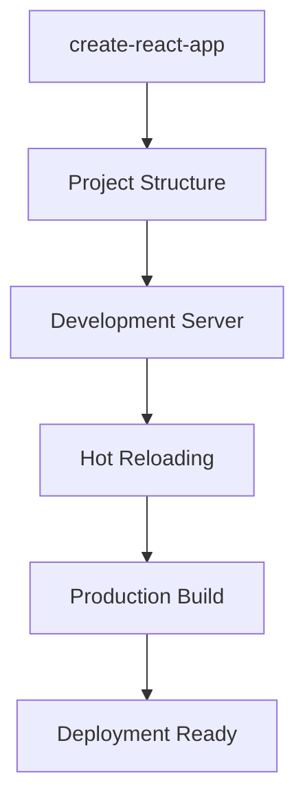
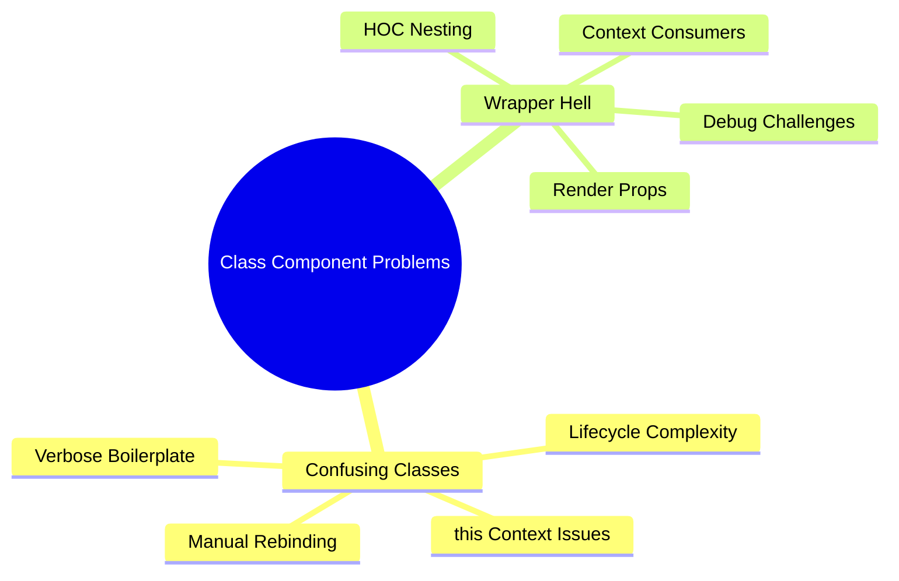
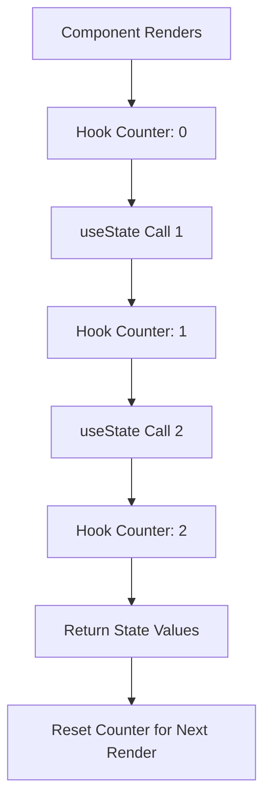
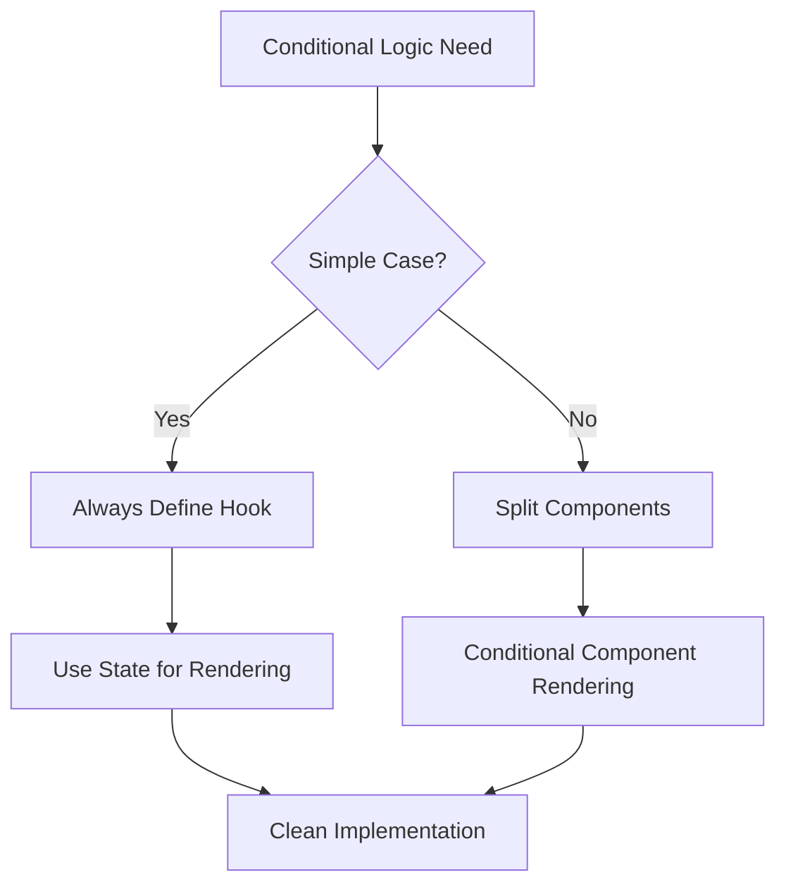

# React Hooks - Section 1: Introduction to Hooks

## 🚀 **React Overview & Fundamentals**
- **JavaScript library** for building user interfaces developed by Facebook
- **Component-based architecture** with two types: Function and Class components
- **Three fundamental principles**: Declarative, Component-based, Learn once write anywhere
- **JSX syntax** enables HTML-like markup directly in JavaScript
- **Virtual DOM** provides efficient rendering through smart diffing algorithms

## 🛠 **Development Environment Setup**

### **Required Tools:**
- **Node.js v11.12.0+** (JavaScript runtime environment)
- **NPM package manager** for dependency management
- **create-react-app** tool for project initialization
- **Modern code editor** (VS Code recommended)

### **Project Commands:**
- **Initialize**: `npx create-react-app <app-name>`
- **Start development**: `npm start` (opens localhost:3000)
- **Build production**: `npm run-script build`
- **Serve static**: `serve -s build`

## ⚡ **Problems with Class Components**

### **Confusing Classes:**
- **this context complexity**: Difficult for humans and machines to understand
- **Manual rebinding required**: `this.handleChange = this.handleChange.bind(this)`
- **Multiple lifecycle methods**: Logic scattered across componentDidMount, componentDidUpdate
- **Verbose boilerplate**: Constructor, super(props), setState patterns

### **Wrapper Hell:**
- **Higher-order components**: Create deep nesting structures
- **Render props pattern**: Multiple consumer components wrapping each other
- **Context consumers**: Complex tree structures for accessing multiple contexts
- **Debugging difficulties**: Large component trees with wrapper components

## 🎯 **Hooks Solution & Motivation**

### **What Hooks Solve:**
- **Eliminate class components**: Use functions for all React features
- **Simplify state management**: Direct access without this.state
- **Remove wrapper hell**: Context Hook replaces consumer patterns
- **Reusable stateful logic**: Share logic between components without HOCs

### **Hook Principles:**
- **Functions not classes**: Leverage existing JavaScript knowledge
- **Declarative approach**: Tell React what you want, not how to do it
- **Encapsulation**: Keep related logic together in custom Hooks
- **Composability**: Combine multiple Hooks for complex functionality

## 🔧 **useState Hook Fundamentals**

### **Basic Implementation:**
- **Returns array**: `[currentState, setterFunction]`
- **Array destructuring**: `const [name, setName] = useState('')`
- **Initial state**: Passed as argument to useState function
- **State updates**: Trigger component re-renders automatically

### **Internal Mechanics:**
- **Global state array**: Hooks stored by call order index
- **Hook counter**: Tracks current Hook position during render
- **Closure storage**: State persists between function calls
- **Reconciliation**: React manages state updates and re-renders

## ⚠️ **Rules of Hooks**

### **Critical Constraints:**
- **Function components only**: Cannot use in class components
- **Top-level calls**: No conditionals, loops, or nested functions
- **Consistent order**: Same Hooks in same order every render
- **React function context**: Must be called from React functions

### **Why Order Matters:**
- **Index-based storage**: Hooks identified by call position
- **Conditional breakage**: Inserting Hooks changes subsequent indices
- **State corruption**: Wrong Hook gets wrong state value
- **Debugging complexity**: Values appear in unexpected places

## 🔄 **Hook Implementation Patterns**

### **Multiple State Hooks:**
- **Separate concerns**: Each Hook handles single state value
- **Naming convention**: Descriptive variable names for clarity
- **Handler functions**: Dedicated functions for state updates
- **Input field patterns**: Common pattern for form handling

### **Conditional Logic Solutions:**
- **Always define Hooks**: Keep all Hooks at component top
- **Component splitting**: Separate components for conditional features
- **State management**: Use state values for conditional rendering
- **Prop passing**: Move Hooks to parent components when needed

## 📦 **React Hook Categories**

### **Basic Hooks:**
- **useState**: State management in function components
- **useEffect**: Side effects and lifecycle replacement
- **useContext**: Context consumption without wrapper components

### **Additional Hooks:**
- **useReducer**: Complex state logic with reducer pattern
- **useMemo**: Performance optimization through memoization
- **useCallback**: Memoized callback functions
- **useRef**: Mutable references and DOM access
- **useLayoutEffect**: Synchronous DOM mutations
- **useDebugValue**: Custom Hook debugging labels

## 🌟 **Hook Advantages & Migration**

### **Benefits Over Classes:**
- **Less boilerplate**: Significantly reduced code verbosity
- **Better logic reuse**: Custom Hooks for shared functionality
- **Easier testing**: Simple functions easier to test
- **Performance optimization**: React can optimize function calls better

### **Migration Strategy:**
- **Gradual adoption**: Mix class and function components
- **100% backward compatible**: No breaking changes required
- **Component-by-component**: Migrate when beneficial
- **New development**: Use Hooks for all new components

### **Hook Mindset Shift:**
- **Data flow focus**: Think about data dependencies, not lifecycle
- **Effect-based thinking**: Consider what triggers updates
- **Composition over inheritance**: Combine Hooks for functionality
- **Functional programming**: Embrace function-based patterns