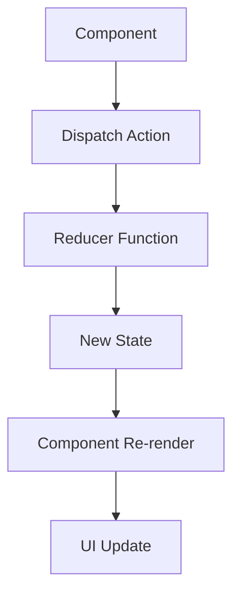
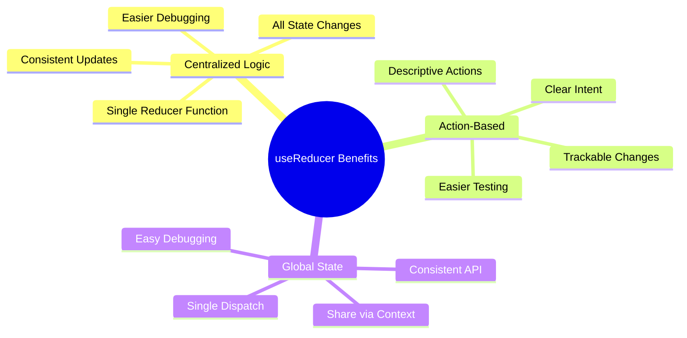
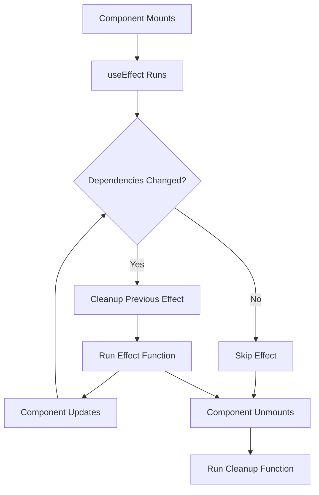
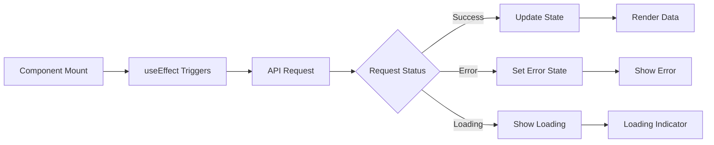
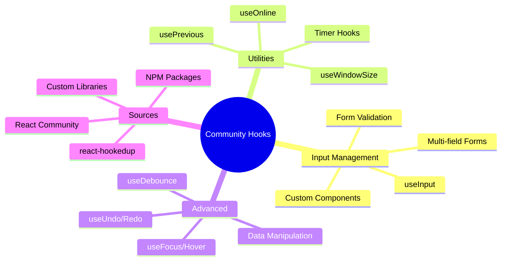

# React Hooks - Section 2: Understanding Hooks in Depth

## 🔄 **Reducer vs State Hooks**

### **State Hook Limitations:**
- **Complex state objects**: Manual spread syntax required to avoid overwriting
- **Multiple dependencies**: Hard to maintain synchronicity between related State Hooks
- **Error-prone updates**: Easy to accidentally remove state properties
- **Scattered logic**: State change logic spread across multiple locations

### **Actions & Reducers Pattern:**
- **Action objects**: Contain `type` and additional data describing state changes
- **Reducer functions**: Take current state and action, return new state
- **Centralized logic**: All state changes handled in one place
- **Predictable updates**: Well-defined actions prevent accidental state corruption

## ⚡ **useReducer Hook Implementation**

### **Hook Signature:**
- **Pattern**: `const [state, dispatch] = useReducer(reducer, initialState)`
- **Reducer function**: `(state, action) => newState`
- **Dispatch function**: Accepts action objects to trigger state changes
- **State management**: More predictable than multiple useState calls

### **When to Use Reducer Hooks:**
- **Complex state logic**: Multiple state values that depend on each other
- **State transitions**: When next state depends on previous state
- **Global state**: Shared state across multiple components
- **Action patterns**: When you need to track what happened (actions)

## 🌊 **Effect Hook Fundamentals**

### **Lifecycle Replacement:**
- **componentDidMount + componentDidUpdate**: Single useEffect with no dependencies array
- **componentDidMount only**: useEffect with empty dependencies array `[]`
- **componentWillUnmount**: Return cleanup function from useEffect
- **Dependency tracking**: Effect runs when specified values change

### **Effect Hook Patterns:**
- **Data fetching**: Request resources when component mounts or dependencies change
- **Subscriptions**: Set up event listeners with cleanup
- **Manual DOM changes**: Direct DOM manipulation outside React
- **Timers**: Set intervals/timeouts with proper cleanup

### **Dependency Management:**
- **Dependency array**: Second argument controls when effect runs
- **Missing dependencies**: Can cause stale closures and bugs
- **ESLint plugin**: Automatically warns about missing dependencies
- **Performance optimization**: Prevent unnecessary effect executions

## 🎯 **React Context Integration**

### **Context Problem Solution:**
- **Prop drilling**: Eliminates passing props through multiple levels
- **Global state access**: Components access state without intermediate components
- **Provider/Consumer pattern**: Context provides values, Hooks consume them
- **Clean component trees**: No wrapper hell from multiple consumers

### **Context Hook Patterns:**
- **useContext(MyContext)**: Direct access to context values
- **Custom context Hooks**: Abstract context usage into reusable Hooks
- **Multiple contexts**: Combine different contexts for different concerns
- **Context + Reducer**: Powerful pattern for global state management

### **Context Performance:**
- **Context changes**: All consumers re-render when context value changes
- **Value stability**: Memoize context values to prevent unnecessary renders
- **Context splitting**: Separate frequently-changing from stable values
- **Alternative patterns**: Sometimes prop passing or component composition better

## 📡 **Requesting Resources with Hooks**

### **Effect + State Pattern:**
- **Manual implementation**: useEffect for requests, useState for results
- **Loading states**: Track request status (loading, success, error)
- **Cleanup**: Cancel requests on component unmount
- **Dependency tracking**: Re-fetch when parameters change

### **Library Solutions:**
- **axios + react-request-hook**: Declarative API request handling
- **Resource Hooks**: `useResource()` returns data, loading, error states
- **Request cancellation**: Automatic cleanup of pending requests
- **Error boundaries**: Centralized error handling

### **Advanced Patterns:**
- **Optimistic updates**: Update UI before server confirms
- **Cache invalidation**: Refresh data when mutations occur
- **Background sync**: Update data without blocking UI
- **Offline support**: Queue requests when network unavailable

## 🚀 **Performance Optimization**

### **React.memo for Components:**
- **Shallow comparison**: Prevents re-renders when props unchanged
- **Custom comparison**: Define custom prop comparison logic
- **Function components**: Equivalent to PureComponent for classes
- **Strategic use**: Only optimize actual performance bottlenecks

### **React.Suspense & Lazy Loading:**
- **Code splitting**: Load components only when needed
- **Bundle size**: Reduce initial JavaScript payload
- **Fallback UI**: Show loading states during component loading
- **Error boundaries**: Handle loading failures gracefully

### **Memoization Hooks:**
- **useMemo**: Memoize expensive calculations
- **useCallback**: Memoize function references
- **Dependency arrays**: Control when memoization recomputes
- **Performance vs complexity**: Balance optimization with code simplicity

## 🧭 **Navigation with Hooks**

### **Routing Fundamentals:**
- **Route definitions**: Map URLs to components
- **Dynamic routes**: URL parameters and query strings
- **Nested routing**: Complex application structure
- **Route guards**: Authentication and authorization

### **Navigation Hooks:**
- **useNavigation**: Programmatic navigation between routes
- **useCurrentRoute**: Access current route information
- **useLoadingRoute**: Handle loading states during navigation
- **Route parameters**: Access URL parameters in components

### **Advanced Routing:**
- **Link components**: Declarative navigation elements
- **Route matching**: Pattern matching for complex URLs
- **History management**: Browser back/forward button handling
- **Route transitions**: Animated page changes

## 🛠 **Community Hooks Ecosystem**

### **Input Handling:**
- **useInput**: Simplified form field management
- **Validation**: Built-in form validation patterns
- **Multi-field forms**: Handle complex form state
- **Custom inputs**: Bind to any input-like component

### **Utility Hooks:**
- **usePrevious**: Access previous values of props/state
- **useOnline**: Detect network connectivity status
- **useWindowSize**: Responsive design with window dimensions
- **Timer Hooks**: useInterval, useTimeout for timing operations

### **Advanced Features:**
- **useUndo**: Undo/redo functionality with history management
- **useDebounce**: Delay expensive operations
- **useFocus/useHover**: Handle element interaction states
- **Data manipulation**: Boolean, array, counter management Hooks

## 📏 **Rules and Best Practices**

### **Hook Rules (Essential):**
- **Function components only**: Cannot use in class components
- **Top-level calls**: No conditions, loops, or nested functions
- **Consistent order**: Same Hooks in same order every render
- **Naming convention**: Always prefix custom Hooks with "use"

### **ESLint Integration:**
- **eslint-plugin-react-hooks**: Automatic rule enforcement
- **Exhaustive dependencies**: Warns about missing Effect dependencies
- **Auto-fix**: Automatically fix common dependency issues
- **CI/CD integration**: Enforce rules in build pipeline

### **Testing Strategies:**
- **React Hooks Testing Library**: Test Hooks in isolation
- **Context wrappers**: Provide context for Hook tests
- **Async testing**: Handle async operations in Hook tests
- **Component integration**: Test Hooks within component context

## 🔧 **Custom Hook Development**

### **Extraction Patterns:**
- **Identify repetition**: Extract common patterns into custom Hooks
- **Single responsibility**: Each Hook should handle one concern
- **Parameter flexibility**: Accept configuration options
- **Return consistency**: Consistent return patterns across similar Hooks

### **Hook Composition:**
- **Hook interactions**: Use values from one Hook in another
- **Local vs global**: When to create local vs reusable Hooks
- **API design**: Design Hook APIs for ease of use
- **Documentation**: Clear examples and parameter documentation

### **Advanced Techniques:**
- **useCallback optimization**: Memoize functions to prevent unnecessary renders
- **Custom Hook libraries**: Package and distribute reusable Hooks
- **Hook factories**: Generate configured Hooks for specific use cases
- **Performance considerations**: When custom Hooks impact performance