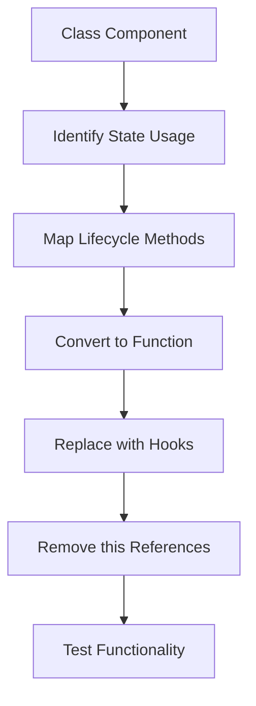
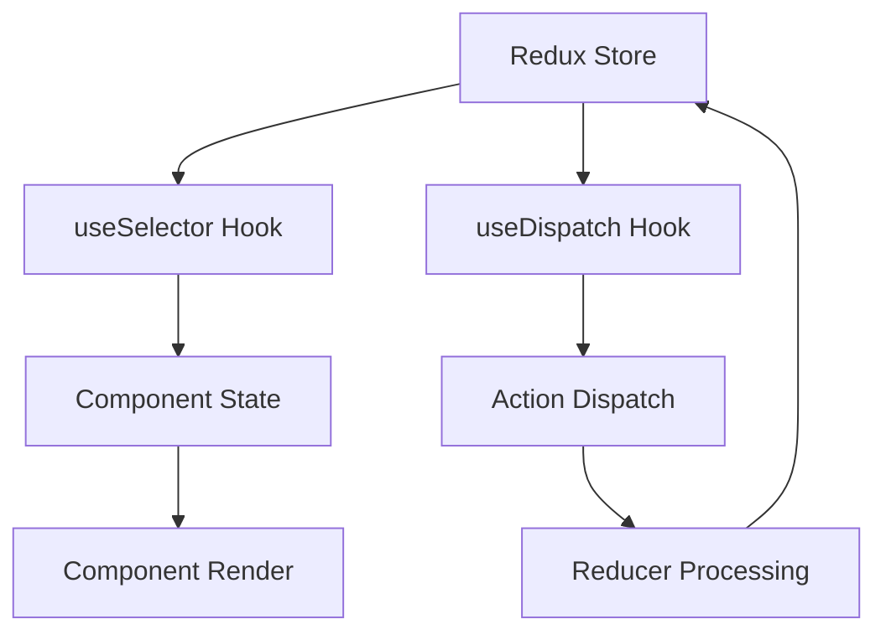
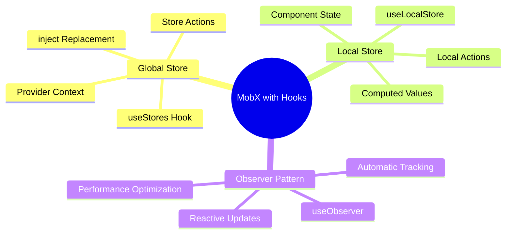

# React Hooks - Section 3: Integration and Migration

## 🔄 **Migrating from React Class Components**

### **Class Component Structure:**
- **Constructor pattern**: `super(props)` and initial state setup required
- **Lifecycle methods**: componentDidMount, componentDidUpdate, componentWillUnmount
- **this binding**: Manual rebinding required for handler methods
- **State management**: `this.state` and `this.setState()` patterns

### **Function Component Benefits:**
- **No constructors**: Direct function definition with props parameter
- **No this binding**: Handler functions work without rebinding
- **Hooks replace lifecycle**: useEffect replaces multiple lifecycle methods
- **Cleaner state**: Direct useState calls instead of state object management

### **Migration Strategy:**
- **Gradual approach**: Migrate component by component, not entire app at once
- **State Hook conversion**: Replace `this.state` with `useState`
- **Effect Hook conversion**: Replace lifecycle methods with `useEffect`
- **Reducer Hook option**: For complex state, use `useReducer` instead of multiple `useState`

## 🏪 **Redux Integration with Hooks**

### **Redux Core Concepts:**
- **Single source of truth**: All state in one store object
- **Read-only state**: Only actions can modify state
- **Pure reducer functions**: Predictable state changes
- **Action creators**: Functions that return action objects

### **Traditional Redux vs Hooks:**
- **connect() HOC**: Wraps components with mapStateToProps/mapDispatchToProps
- **Container components**: Separate presentation from state logic
- **Boilerplate heavy**: Action types, creators, containers required
- **Props drilling**: State passed down through component tree

### **Redux Hooks API:**
- **useSelector**: Extract data from Redux store state
- **useDispatch**: Get dispatch function to trigger actions
- **useStore**: Access store object directly (rarely needed)
- **Provider still required**: Wrap app with Redux Provider component

### **Migration Benefits:**
- **Less boilerplate**: No container components needed
- **Cleaner code**: Direct Hook usage in components
- **Better performance**: Granular subscriptions with useSelector
- **Easier testing**: Components can be tested independently

## 📱 **MobX Integration with Hooks**

### **MobX Philosophy:**
- **Automatic updates**: MobX tracks state changes automatically
- **Direct mutations**: Modify state objects directly, no immutability required
- **Observable state**: State changes trigger component re-renders
- **Computed values**: Derived state automatically recalculated

### **MobX Core Concepts:**
- **@observable**: Mark state as trackable
- **@action**: Functions that modify state
- **@computed**: Derived values from state
- **observer**: Components that react to state changes

### **MobX Hooks API:**
- **useObserver**: Replace observer HOC for component tracking
- **useLocalStore**: Create component-local observable state
- **Custom store hooks**: Access global stores via context
- **Provider pattern**: Similar to Redux, provides stores via context

### **Migration Strategy:**
- **Replace inject**: Use custom hooks to access stores
- **Replace observer**: Use useObserver for reactive components
- **Local state**: Use useLocalStore for complex component state
- **Global state**: Keep in MobX stores, access via custom hooks

## 🏗 **Architecture Patterns & Best Practices**

### **State Management Decision Tree:**
- **Local simple state**: Use useState Hook
- **Local complex state**: Use useReducer or useLocalStore (MobX)
- **Global simple state**: Use Context + useReducer
- **Global complex state**: Use Redux or MobX stores

### **Migration Approach:**
- **Bottom-up**: Start with leaf components, work toward root
- **Feature-by-feature**: Migrate complete features rather than random components
- **Gradual adoption**: Mix old and new patterns during transition
- **Test coverage**: Ensure tests pass before and after migration

### **Performance Considerations:**
- **useSelector optimization**: Multiple selectors vs single selector with shallowEqual
- **useObserver granularity**: Wrap only parts that need reactive updates
- **Memoization**: Use useMemo and useCallback for expensive operations
- **Component splitting**: Smaller components for better performance tracking

## 📊 **Comparison Matrix**

| Feature | Class Components | Redux + Hooks | MobX + Hooks | useState/useReducer |
|---------|------------------|---------------|--------------|-------------------|
| **Learning Curve** | Medium | High | Low | Low |
| **Boilerplate** | High | High | Low | Very Low |
| **Performance** | Good | Excellent | Good | Excellent |
| **DevTools** | Basic | Excellent | Good | Basic |
| **Testing** | Complex | Good | Good | Excellent |
| **Scalability** | Medium | Excellent | Good | Medium |

## 🚀 **Migration Benefits Summary**

### **Code Quality Improvements:**
- **Less boilerplate**: Significant reduction in code volume
- **Better readability**: More declarative, less imperative code
- **Easier maintenance**: Simpler state management patterns
- **Improved testing**: Functions easier to test than classes

### **Performance Gains:**
- **Granular updates**: Components update only when relevant state changes
- **Better optimization**: React can optimize function components better
- **Reduced re-renders**: More precise dependency tracking
- **Lazy evaluation**: Computed values and memoization opportunities

### **Developer Experience:**
- **Modern patterns**: Align with React's current direction
- **Better tooling**: Enhanced development tools support
- **Community support**: More resources and examples available
- **Future-proof**: Position for upcoming React features

## 🛠 **Practical Migration Steps**

### **Phase 1: Assessment**
- **Inventory components**: Catalog existing class components
- **Identify dependencies**: Map state flows and component relationships
- **Plan order**: Prioritize leaf components and standalone features
- **Setup testing**: Ensure comprehensive test coverage

### **Phase 2: Component Migration**
- **Convert to functions**: Remove class syntax, use function declarations
- **Replace lifecycle**: Map componentDidMount/Update to useEffect
- **Update state**: Convert this.state to useState/useReducer
- **Fix references**: Remove all this references

### **Phase 3: State Management**
- **Local state**: Keep simple state local with useState
- **Complex state**: Use useReducer for complex local state
- **Global state**: Choose Redux or MobX for shared state
- **Connect components**: Use appropriate hooks for state access

### **Phase 4: Optimization**
- **Performance audit**: Identify unnecessary re-renders
- **Add memoization**: Use React.memo, useMemo, useCallback strategically
- **Optimize selectors**: Ensure efficient state subscriptions
- **Monitor bundle size**: Check for any size increases