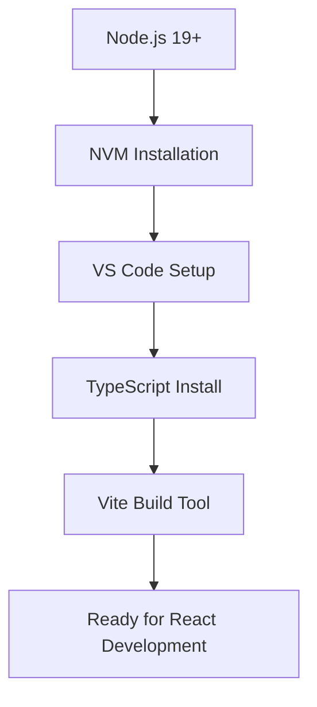
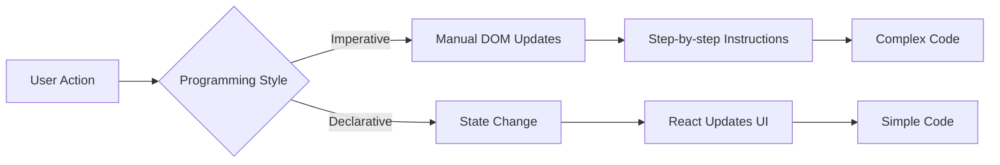
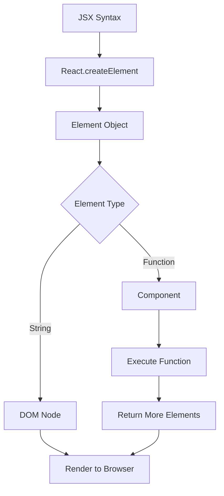
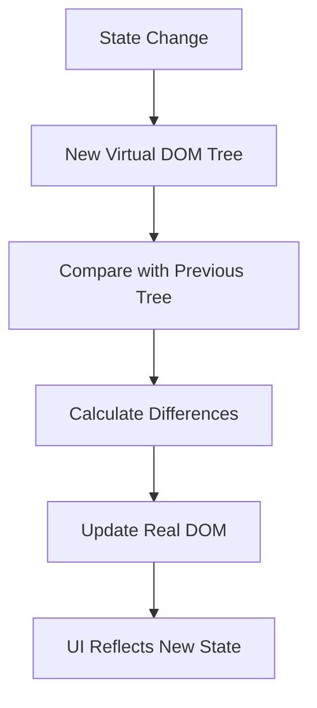
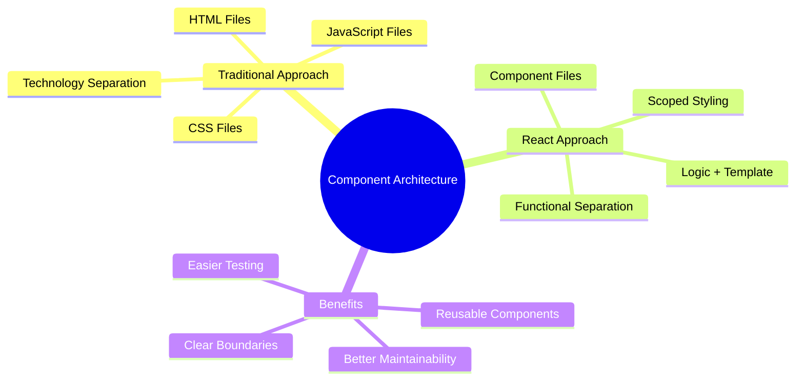
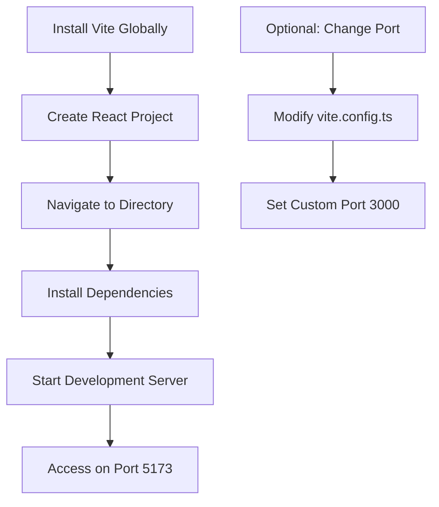
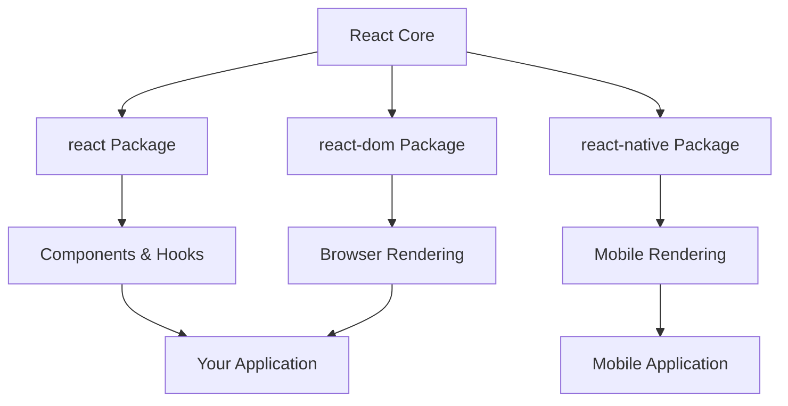

# React 18 Design Patterns - React

## 🚀 **React Overview**
- **Meta-maintained library** for building user interfaces
- **Fast DOM manipulation** through smart Virtual DOM implementation
- **JSX syntax** - HTML-like markup directly in JavaScript
- **Server-side rendering** capability for universal applications
- **Component-based architecture** for building complex UIs

## 🛠 **Development Environment Setup**

### **Required Components:**
- **Node.js 19+** (JavaScript runtime)
- **NVM** (Node Version Manager) for version switching
- **VS Code** (recommended IDE)
- **TypeScript** for type safety
- **Vite** (modern build tool replacing Create React App)

### **NVM Commands:**
- **Install versions**: `nvm install node`, `nvm install 18`
- **Switch versions**: `nvm use 16`, `nvm use node`
- **Set default**: `nvm alias default 18`



## 🎯 **Declarative vs Imperative Programming**

### **Imperative Approach:**
- **How-focused**: Describes step-by-step instructions
- **Manual DOM manipulation**: Direct element selection and modification
- **State management**: Manual tracking of UI state changes
- **More verbose**: Requires detailed implementation steps

### **Declarative Approach:**
- **What-focused**: Describes desired end result
- **React handles DOM**: Framework manages UI updates
- **State-driven**: UI reflects current application state
- **Cleaner code**: Less boilerplate, easier maintenance



## 📦 **React Elements & Components**

### **Element Characteristics:**
- **Lightweight objects**: Immutable descriptions of UI
- **Virtual DOM nodes**: In-memory representation
- **Type property**: Distinguishes DOM nodes from components
- **Props container**: Holds component properties and children

### **Component Types:**
- **Class components**: `extends Component`
- **Function components**: Simple JavaScript functions
- **Stateless functions**: Pure components without state
- **Custom components**: User-defined reusable UI blocks

### **Element Creation Flow:**


## 🔄 **Virtual DOM & Reconciliation**

### **Virtual DOM Process:**
- **In-memory representation**: JavaScript objects mirroring real DOM
- **Diffing algorithm**: Compares current vs new Virtual DOM trees
- **Minimal updates**: Only changed elements updated in real DOM
- **Performance optimization**: Batched updates reduce browser reflows

### **Reconciliation Steps:**


## 🏗️ **Modern Component Architecture**

### **Breaking Traditional Patterns:**
- **Logic + Templates together**: HTML and JavaScript in same file
- **Component-based separation**: Organize by functionality, not technology
- **Encapsulation**: Each component contains its own logic and styling
- **Reusability**: Components as building blocks

### **Separation of Concerns Evolution:**
- **Old way**: Separate HTML, CSS, JavaScript files
- **React way**: Separate by component functionality
- **Better coupling**: Related code stays together
- **Domain-driven**: Organize by business logic



## 🎨 **CSS-in-JS Concepts**

### **Styling Evolution:**
- **Traditional CSS**: Separate stylesheets with selectors
- **CSS-in-JS**: JavaScript objects defining styles
- **Component encapsulation**: Styles scoped to components
- **Dynamic styling**: Conditional styles based on props/state

### **Style Object Structure:**
- **camelCase properties**: `backgroundColor` instead of `background-color`
- **Vendor prefixes**: `WebkitTransition`, `msTransition`
- **JavaScript values**: Template literals, variables, functions

## ⚡ **JavaScript Fatigue Solutions**

### **Common Misconceptions:**
- **React isn't complex**: Core library is lightweight
- **Tooling is optional**: Can start with simple script tags
- **Progressive enhancement**: Add complexity as needed
- **Ecosystem choice**: Pick tools that fit your needs

### **Vite Setup Process:**


### **Vite Advantages:**
- **Fast development server**: Native ES modules support
- **Hot module replacement**: Instant updates during development
- **Minimal configuration**: Works out of the box
- **Modern build tools**: Optimized for current browsers
- **TypeScript support**: Built-in TypeScript integration

## 🔧 **Package Structure**

### **React Split Packages:**
- **react**: Core functionality and hooks
- **react-dom**: Browser-specific rendering
- **Platform flexibility**: React Native, React VR support
- **Modular architecture**: Import only what you need

### **Development vs Production:**
- **Development builds**: Helpful warnings and debugging
- **Production builds**: Optimized and minified
- **CDN options**: Can include via script tags
- **Bundle optimization**: Tree shaking removes unused code



## User trial

```
React

- imperative vs declarative programming
- React elements
- Virtual DOM
- Vite
```

```
npm install -g create-vite
create-vite react-ts-app --template react-ts

npm create vite@latest my-react-app

npm install -g create-react-app

npx create-react-app my-app
```

```
npm create vite@latest my-app
```

```
◇  Select a framework:
│  React
│
◆  Select a variant:
│  ● TypeScript
│  ○ TypeScript + SWC
│  ○ JavaScript
│  ○ JavaScript + SWC
│  ○ React Router v7 ↗ (npm create react-router@latest)
│  ○ TanStack Router ↗ (npm create -- tsrouter-app@latest TARGET_DIR --framework react --interactive)

```

```
◇  Select a framework:
│  Vue
│
◆  Select a variant:
│  ● TypeScript
│  ○ JavaScript
│  ○ Official Vue Starter ↗ (npm create vue@latest)
│  ○ Nuxt ↗ (npm exec nuxi init)
└
```

```
◇  Select a framework:
│  Svelte
│
◆  Select a variant:
│  ○ TypeScript
│  ○ JavaScript
│  ● SvelteKit ↗ (npm exec sv create)
```

```
Select a framework:
│  Solid
│
◆  Select a variant:
│  ○ TypeScript
│  ○ JavaScript
│  ● TanStack Router ↗ (npm create -- tsrouter-app@latest TARGET_DIR --framework solid --interactive)
└
```

```
Select a framework:
│  Preact
│
◆  Select a variant:
│  ○ TypeScript
│  ○ JavaScript
│  ● Official Preact Starter ↗ (npm create preact@latest)
└
```

```
◇  Select a framework:
│  Others
│
◆  Select a variant:
│  ● Extra Vite Starters ↗ (npm create vite-extra@latest)
│  ○ Electron ↗ (npm create electron-vite@latest)
```
