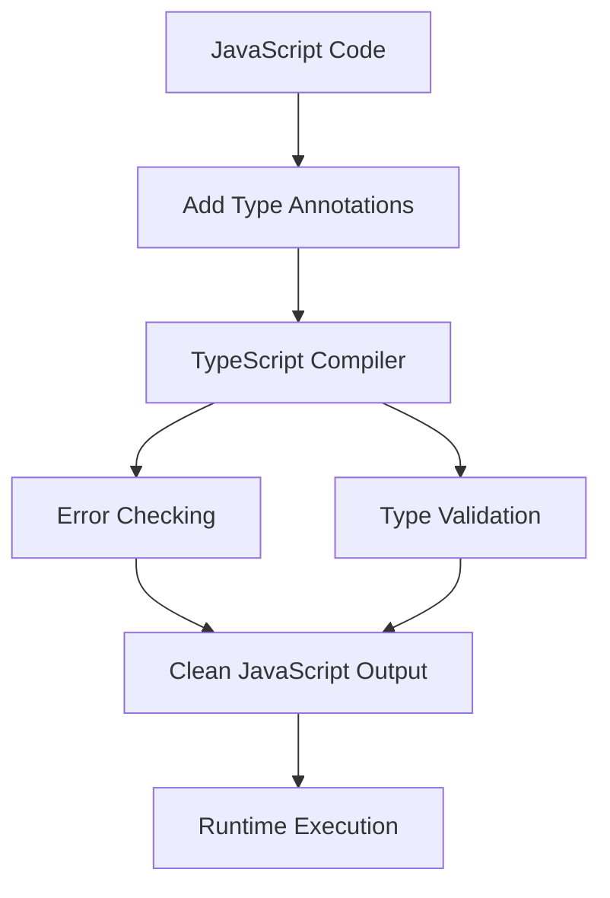
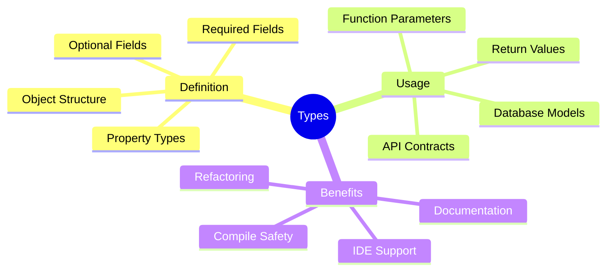
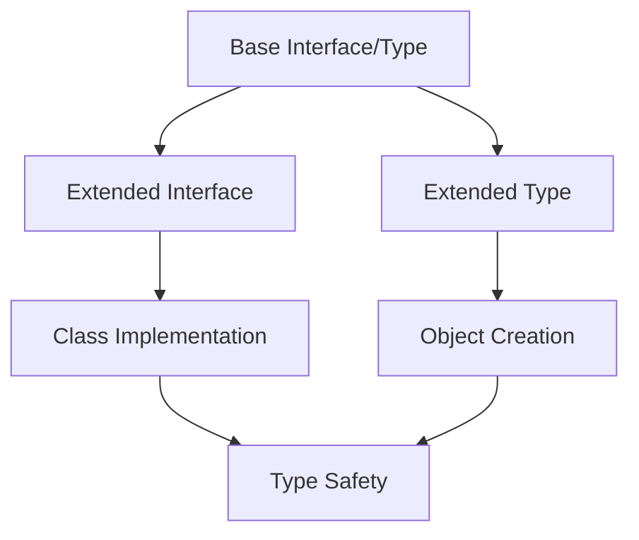
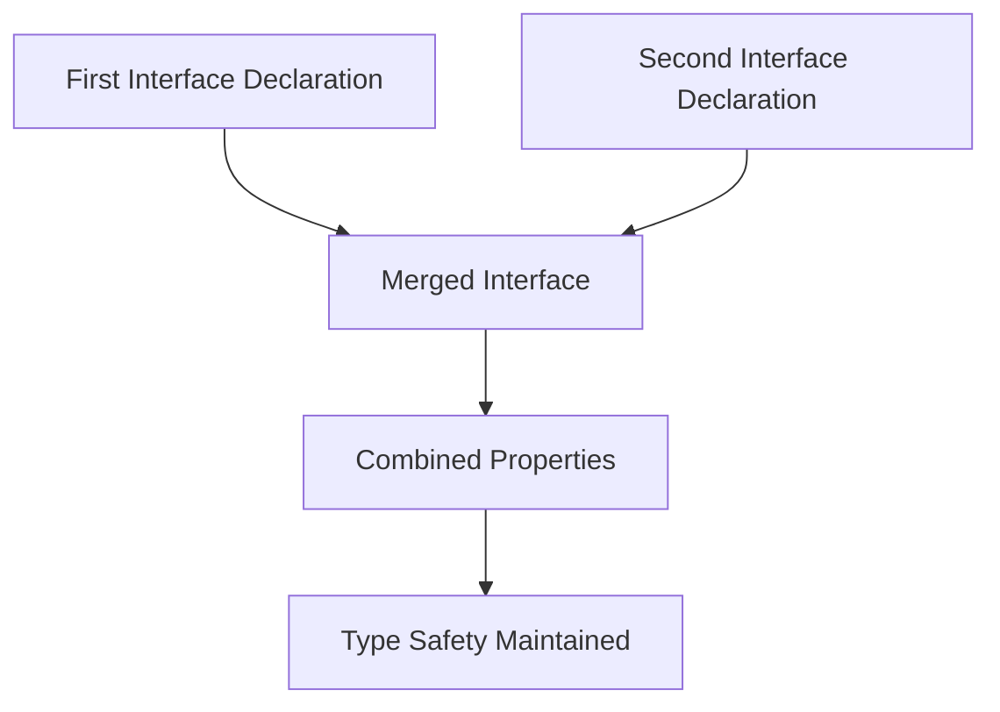
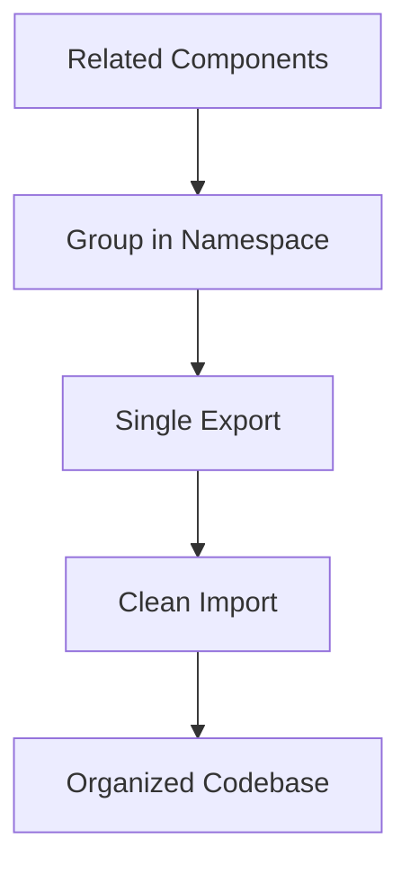
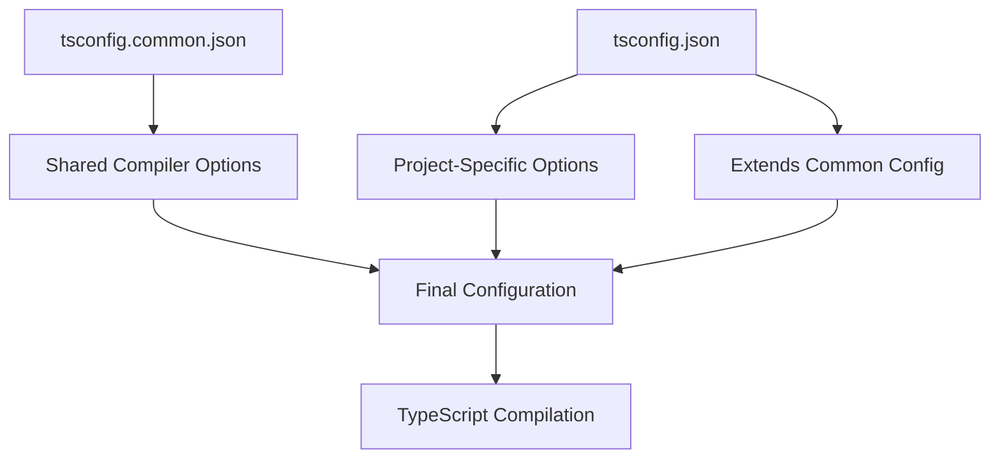

# React 18 Design Patterns - TypeScript Breakdown

## 🚀 **TypeScript Overview**
- **JavaScript superset** designed by Anders Hejlsberg (C# creator)
- **Compiles to JavaScript** - maintains full compatibility
- **Static typing** reduces runtime bugs and improves code quality
- **Gradual adoption** - any valid JavaScript is TypeScript
- **Open-source Microsoft project** with active community

## 🛠 **Core TypeScript Features**

### **Language Characteristics:**
- **TypeScript is JavaScript**: All JS code works in TS
- **JavaScript is TypeScript**: Rename `.js` to `.ts` and it works
- **Compile-time error checking**: Catches issues before runtime
- **Strong typing**: Add types to variables, functions, return values
- **OOP support**: Classes, interfaces, inheritance, advanced concepts

### **Development Benefits:**


## 🔄 **JavaScript to TypeScript Conversion**

### **Basic Function Transformation:**
- **JavaScript function**: No type information
- **TypeScript function**: Parameter types + return type
- **Error prevention**: Invalid parameter types caught at compile time
- **IDE benefits**: Better autocomplete and refactoring

### **Conversion Example Flow:**


## 📊 **Types Definition**

### **Object Type Structure:**
- **Property definitions**: Specify each object property type
- **Required vs optional**: Use `?` for optional properties
- **Type aliases**: Create reusable type definitions
- **Naming convention**: Prefix with `T` (e.g., `TUser`)

### **Type Usage Benefits:**
- **Database integration**: Ensure data matches expected schema
- **API contracts**: Validate request/response structures
- **Code documentation**: Types serve as inline documentation
- **Refactoring safety**: Changes caught across entire codebase



## 🏗️ **Interfaces**

### **Interface Characteristics:**
- **Object shape description**: Define structure and function signatures
- **Naming convention**: Prefix with `I` (e.g., `IUser`)
- **Similar to types**: Different syntax, additional capabilities
- **Extensibility**: Can be extended, implemented, merged

### **Interface vs Types:**
- **Interfaces**: More flexible, can be merged and extended
- **Types**: More powerful with unions and intersections
- **Use cases**: Interfaces for object contracts, types for complex combinations

## 🔗 **Extension Patterns**

### **Interface Extension:**
- **Extends keyword**: `interface IPerson extends IWork`
- **Inheritance chain**: Build complex interfaces from simple ones
- **Code reuse**: Avoid duplicating common properties

### **Type Extension:**
- **Intersection operator**: `type TPerson = TWork & { additional props }`
- **Flexible combinations**: Mix interfaces and types
- **Union support**: Types can handle union combinations



## 🎯 **Implementation Patterns**

### **Class Implementation:**
- **Implements keyword**: Classes must fulfill interface contracts
- **Type checking**: Ensures all required properties exist
- **Union limitation**: Cannot implement union types
- **Contract enforcement**: Compile-time validation of class structure

### **Implementation Rules:**
- **Object types only**: Cannot implement union types
- **All properties required**: Must implement every interface property
- **Method signatures**: Function types must match exactly

## 🔄 **Interface Merging**

### **Declaration Merging:**
- **Multiple declarations**: Same interface name merges definitions
- **Additive properties**: New properties added to existing interface
- **Global augmentation**: Extend third-party library types
- **Module enhancement**: Add properties to existing modules

### **Merging Benefits:**


## 🏷️ **Enums**

### **Enum Characteristics:**
- **Named constants**: Set of predefined values
- **Numeric or string**: Can store either value type
- **Intent documentation**: Makes code more readable
- **Distinct cases**: Perfect for state machines, themes, configurations

### **Common Use Cases:**
- **Color palettes**: Theme system colors
- **Status codes**: Application states
- **Configuration options**: Feature flags and settings
- **API endpoints**: Predefined URL paths

## 📦 **Namespaces**

### **Organization Tool:**
- **Logical grouping**: Related code in single namespace
- **Naming conflict prevention**: Avoid global scope pollution
- **Styled-components organization**: Group related styles
- **Simple implementation**: Easier than modules for basic cases

### **Namespace Benefits:**


## 🎨 **Template Literal Types**

### **String Literal Types:**
- **Union constraints**: Limit strings to specific values
- **Type safety**: Prevent invalid string assignments
- **Theme systems**: Define allowed theme names
- **API routes**: Constrain endpoint paths

### **Advanced String Types:**
- **Template literals**: Combine string patterns
- **Dynamic generation**: Create types from string templates
- **Validation**: Compile-time string format checking

## ⚙️ **TypeScript Configuration**

### **tsconfig.json Structure:**
- **Compiler options**: Control TypeScript behavior
- **File inclusion/exclusion**: Specify which files to process
- **Module resolution**: Configure import/export handling
- **Target environment**: Specify JavaScript version output

### **MonoRepo Configuration:**
- **Shared config**: `tsconfig.common.json` for shared settings
- **Project-specific**: `tsconfig.json` extends common config
- **Path mapping**: Configure module resolution paths
- **Build optimization**: Separate build and development configs



### **Essential Compiler Options:**
- **Strict mode**: Enable all strict type checking
- **Module system**: CommonJS, ESNext, or other formats
- **JSX support**: React JSX transformation
- **Source maps**: Enable debugging in development
- **Declaration files**: Generate `.d.ts` for libraries

## User think

```
TypeScript
- superset
```

```
- TypeScript’s features
- Convert JavaScript code into TypeScript
- Types
- Interfaces
- Extending interfaces and types
- Implementing interfaces and types
- Merging interfaces
- Enums
- Namespaces
- Template literal types
- TypeScript configuration file
```
---

```
- Strong typing
- Error checking
- Object-oriented programming
```