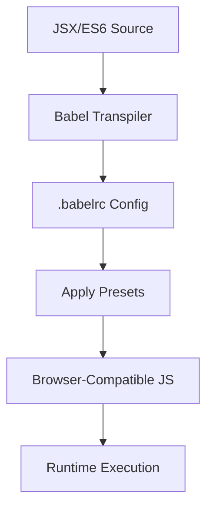
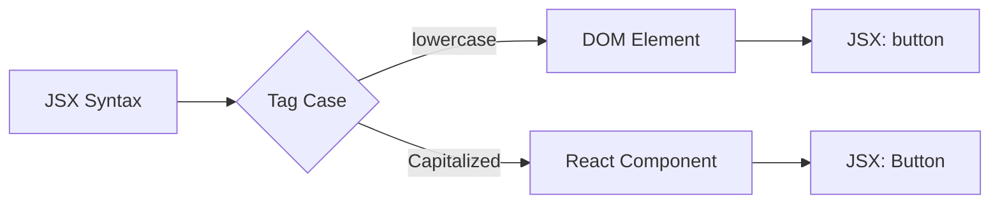
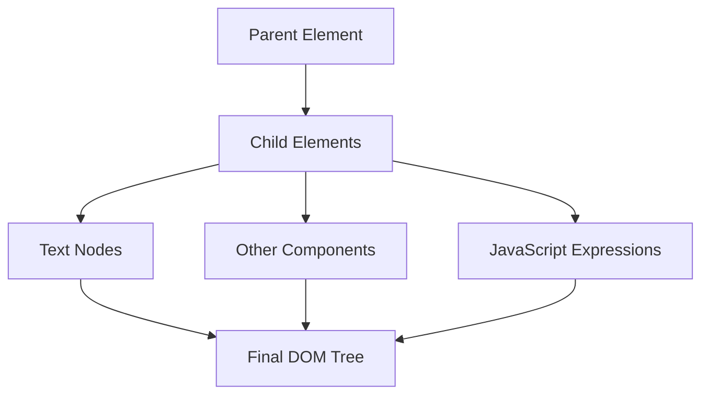
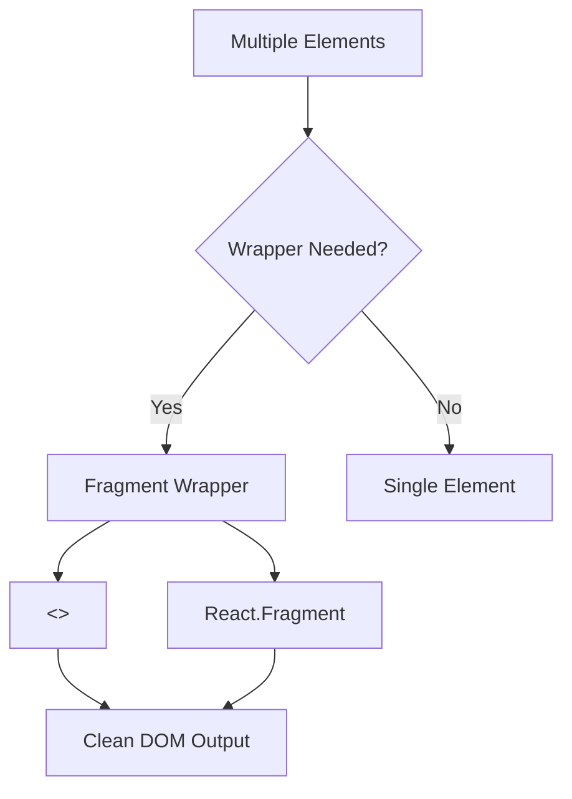
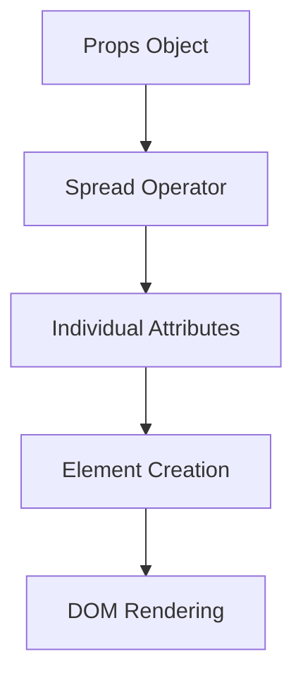
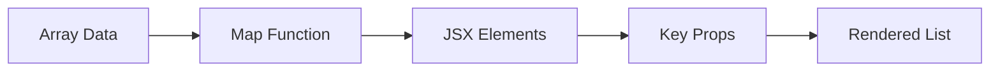
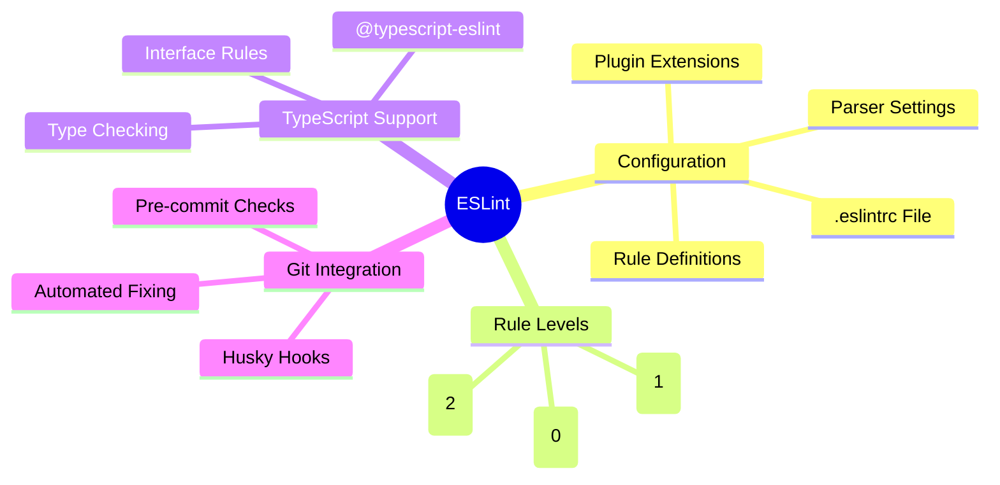
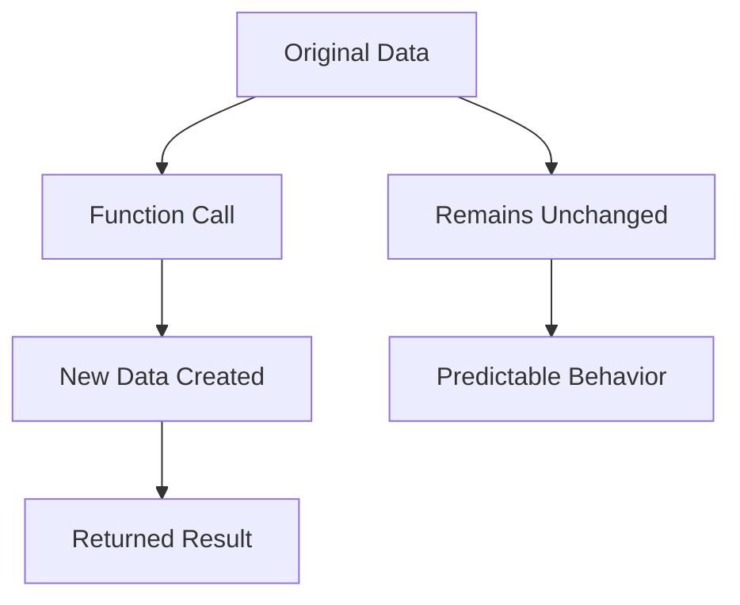

# React 18 Design Patterns - JSX/TSX

## 🚀 **JSX Overview**
- **XML-like syntax** for JavaScript - looks familiar to HTML developers
- **Optional but recommended** - alternative to `React.createElement()`
- **Transpiled to JavaScript** - JSX becomes function calls at runtime
- **Tree representation** - balanced tags perfect for nested UI structures
- **React 17+ improvement** - no need to import React for JSX

## 🛠 **Babel Configuration**

### **Babel Setup Process:**
- **Modern packages**: `@babel/core`, `@babel/cli`, `@babel/node`
- **Essential presets**: `@babel/preset-env`, `@babel/preset-react`
- **Configuration file**: `.babelrc` in project root
- **Transpilation**: Converts ES6 + JSX to browser-compatible ES5

### **Babel Workflow:**

## 📦 **JSX Element Creation**

### **Element Types:**
- **DOM elements**: Lowercase tags like `
`, `<button />`
- **React components**: Capitalized tags like `<Button />`, `<Header />`
- **Self-closing syntax**: Concise notation for elements without children
- **Runtime compilation**: JSX becomes `_jsx()` function calls

### **Component vs Element Distinction:**

## 🎯 **Props and Attributes**

### **Prop Definition:**
- **XML-style attributes**: Similar to HTML attribute syntax
- **JavaScript expressions**: Use `{}` for dynamic values
- **Type flexibility**: Strings, numbers, objects, functions
- **Readable syntax**: Much cleaner than function call equivalents

### **Prop Patterns:**
- **Static props**: `src="image.png"` for fixed values
- **Dynamic props**: `src={imageUrl}` for variables
- **Function props**: `onClick={handleClick}` for event handlers
- **Object props**: `style={{color: 'red'}}` for complex data

## 👶 **Children Elements**

### **Child Nesting:**
- **Tree structure**: Elements can contain other elements
- **Text content**: Simple strings as children
- **JavaScript expressions**: Variables and functions in `{}`
- **Mixed content**: Combine text, elements, and expressions

### **Children Compilation:**

## ⚠️ **JSX vs HTML Differences**

### **Reserved Word Conflicts:**
- **className**: Instead of `class` (JavaScript reserved word)
- **htmlFor**: Instead of `for` (JavaScript reserved word)
- **camelCase events**: `onClick` instead of `onclick`
- **JavaScript compatibility**: Avoid conflicts with language keywords

### **Style Attribute Changes:**
- **Object syntax**: `style={{backgroundColor: 'red'}}` instead of strings
- **camelCase properties**: `backgroundColor` instead of `background-color`
- **Dynamic styling**: Variables and functions for style values
- **Type safety**: Better validation of style properties

## 🏗️ **JSX Structure Rules**

### **Root Element Requirements:**
- **Single root**: Cannot return adjacent elements without wrapper
- **Fragment solution**: `<React.Fragment>` or `<></>` for grouping
- **Array returns**: React 16+ supports returning arrays
- **String returns**: Simple text can be returned directly

### **Fragment Usage:**

## 🔤 **Whitespace Handling**

### **Space Behavior:**
- **Different from HTML**: JSX doesn't preserve spaces between elements
- **Manual spacing**: Use `{' '}` for explicit spaces
- **Line breaks**: Multiline JSX requires careful space management
- **Text rendering**: Understanding how spaces affect final output

## ✅ **Boolean Attributes**

### **Boolean Logic:**
- **Implicit true**: `<button disabled />` equals `disabled={true}`
- **Explicit false**: Must write `disabled={false}` for false values
- **No omission**: Omitting attribute means `true`, not `false`
- **Clear intention**: Always be explicit to avoid confusion

## 📡 **Spread Attributes**

### **Spread Operator Usage:**
- **Object spreading**: `
` passes all object properties
- **Code reduction**: Avoid manually listing every prop
- **Props forwarding**: Common pattern for component composition
- **Performance consideration**: Use judiciously to avoid unnecessary renders

## 🎨 **Template Literals**

### **String Template Features:**
- **Backtick syntax**: Use `` ` `` instead of quotes
- **Expression embedding**: `${variable}` for dynamic content
- **Multiline support**: Natural line breaks without concatenation
- **Complex strings**: Better readability for dynamic text

## 📝 **JSX Best Practices**

### **Formatting Guidelines:**
- **Multiline elements**: Use parentheses to wrap multiline JSX
- **Attribute alignment**: One attribute per line for multiple props
- **Closing bracket**: Align with opening tag for readability
- **Consistent indentation**: Maintain proper nesting levels

### **Conditional Rendering:**
- **Logical AND**: `{condition && <Component />}` for simple conditions
- **Ternary operator**: `{condition ? <A /> : <B />}` for if/else
- **Helper functions**: Extract complex conditions for readability
- **RenderIf component**: Custom component for conditional logic

### **List Rendering:**

## 🔧 **Code Quality Tools**

### **EditorConfig Setup:**
- **Cross-IDE consistency**: Maintains same style across editors
- **File-specific rules**: Different settings for different file types
- **Team standardization**: Ensures consistent formatting
- **Root configuration**: `.editorconfig` file in project root

### **Prettier Configuration:**
- **Opinionated formatting**: Automatic code style enforcement
- **Save-on-format**: Automatic formatting when saving files
- **Team consistency**: Eliminates style discussions in reviews
- **Customizable options**: `.prettierrc` for project preferences

### **ESLint Setup:**

### **Essential ESLint Rules:**
- **Semicolon control**: `"semi": [2, "never"]` for consistent punctuation
- **TypeScript rules**: Specific linting for TS files
- **React-specific**: JSX and component best practices
- **Import/export**: Module organization standards

## 🧮 **Functional Programming Concepts**

### **Core FP Principles:**
- **First-class functions**: Functions as variables, parameters, return values
- **Pure functions**: No side effects, same input → same output
- **Immutability**: Data cannot be changed, create new versions instead
- **Function composition**: Combine simple functions into complex ones

### **Higher-Order Functions:**
- **Function enhancement**: Add behavior to existing functions
- **Reusable patterns**: Common functionality across components
- **React HOCs**: Component enhancement using FP principles
- **Logging example**: Wrap functions with additional capabilities

### **Immutability Patterns:**

### **Currying and Composition:**
- **Partial application**: Functions that return functions
- **Reusable logic**: Create specialized functions from general ones
- **Function chaining**: Combine multiple operations elegantly
- **React patterns**: Common in state management and event handling