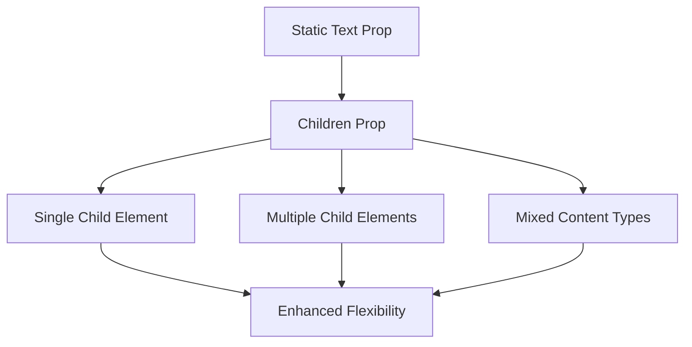
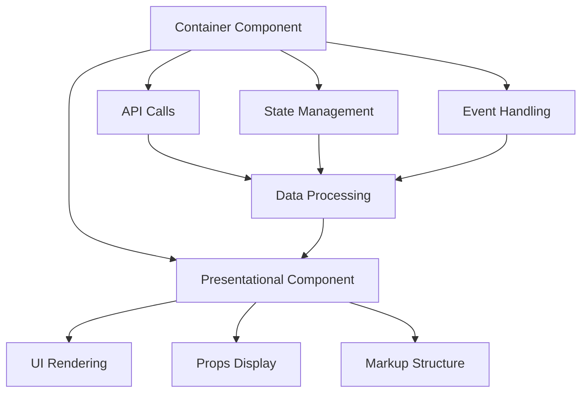
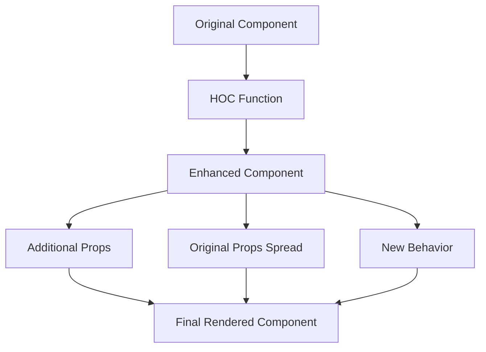
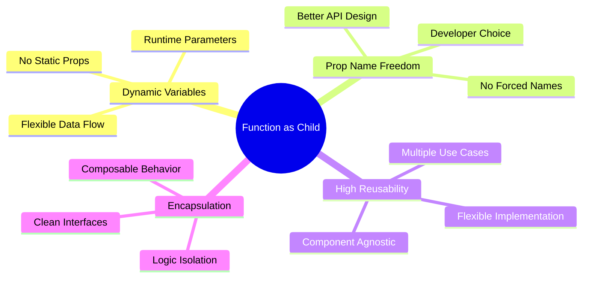
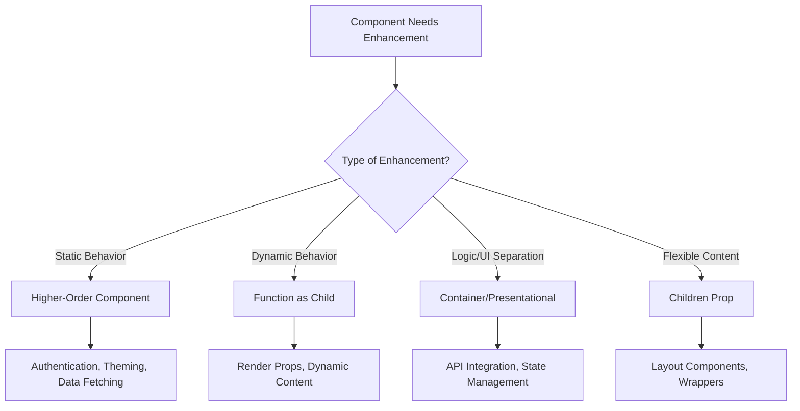

# React 18 Design Patterns - Composition Patterns

## 🚀 **Component Composition Overview**
- **Small reusable components** with clean interfaces for complex applications
- **Component ownership** - passing props creates owner relationship
- **Data flow** - props enable parent-to-child communication
- **Maintainable architecture** - composable components reduce complexity
- **Scalable applications** - build powerful UIs from simple building blocks

## 👶 **Children Prop Pattern**

### **Children Prop Characteristics:**
- **Opaque property** - doesn't reveal its content structure
- **Flexible content** - can contain text, elements, or components
- **Wrapper pattern** - components act as containers for nested content
- **Enhanced reusability** - same component, different content

### **Children Usage Evolution:**

### **Button Component Evolution:**
- **Traditional approach**: `<Button text="Click me!" />`
- **Children approach**: `<Button>Click me!</Button>`
- **Enhanced capability**: Images, icons, labels, other components
- **Wrapper functionality**: Consistent styling with flexible content

## 🏗️ **Container and Presentational Pattern**

### **Pattern Separation:**
- **Logic separation** - API calls, data manipulation, event handling
- **Presentation separation** - UI rendering and display logic
- **Clear boundaries** - well-defined responsibilities
- **Parallel development** - teams can work on logic and UI independently

### **Container Component Characteristics:**
- **Behavior-focused** - handles application logic
- **API integration** - makes external data calls
- **State management** - manages component state
- **Event handling** - processes user interactions
- **Data manipulation** - transforms and processes data

### **Presentational Component Characteristics:**
- **Visual representation** - renders HTML markup
- **Props consumption** - receives data from containers
- **Functional components** - often stateless functions
- **Pure rendering** - predictable output from given props
- **Reusable UI** - can be used across different containers

### **Geolocation Example Benefits:**
- **Testability** - mock data for presentational component
- **Reusability** - same UI for different data sources
- **Maintainability** - separate concerns for easier debugging
- **Team collaboration** - parallel development of logic and UI

### **Pattern Decision Guidelines:**
- **Start simple** - begin with single component
- **Split when needed** - refactor when logic/presentation couple
- **Clear responsibilities** - each component has defined purpose
- **Avoid over-engineering** - don't split unnecessarily

## 🔗 **Higher-Order Components (HOCs)**

### **HOC Fundamentals:**
- **Function pattern**: `const HOC = Component => EnhancedComponent`
- **Component enhancement** - adds behavior without modification
- **Naming convention** - use `with` prefix (e.g., `withClassName`)
- **Props transparency** - spread original props to wrapped component

### **HOC Structure:**

### **withClassName Example:**
- **Simple enhancement** - adds consistent CSS class
- **Props spreading** - `{...props}` maintains component interface
- **Behavior isolation** - enhancement logic separate from component
- **Reusable pattern** - apply to any component needing className

### **withInnerWidth Example:**
- **State management** - HOC handles window resize logic
- **Event handling** - adds/removes event listeners
- **Props injection** - provides `innerWidth` to wrapped component
- **Cleanup logic** - proper event listener removal on unmount

### **HOC Benefits:**
- **Separation of concerns** - component doesn't handle enhancement logic
- **Reusability** - same HOC for multiple components
- **Testing isolation** - test component and enhancement separately
- **Composition** - combine multiple HOCs for complex behavior

### **Real-World HOC Examples:**
- **Redux connect** - provides store state and dispatch
- **Relay createFragmentContainer** - GraphQL data fetching
- **Authentication** - injects user permissions and login state
- **Theming** - provides theme context to components

## 🎯 **Function as Child Pattern**

### **Pattern Characteristics:**
- **Children as function** - `{() => 
Content
}`
- **Dynamic rendering** - parent passes parameters to child function
- **Flexible composition** - no predefined prop names
- **Runtime flexibility** - decisions made during render

### **Function as Child Benefits:**

### **Name Component Example:**
- **Parameter passing** - parent provides data to child function
- **Render prop** - child function returns JSX
- **Dynamic content** - content changes based on parent data
- **Flexible interface** - child decides how to use provided data

### **Fetch Component Pattern:**
- **Data fetching** - HOC handles API calls
- **Loading states** - manages async operation states
- **Error handling** - provides error information to child
- **Data provision** - passes fetched data to render function

### **Pattern Advantages:**
- **Variable encapsulation** - dynamic data passing vs static props
- **Naming freedom** - developers choose parameter names
- **Wrapper reusability** - same wrapper, different child functions
- **Composition flexibility** - build complex UIs from simple patterns

## 🔄 **Pattern Comparison**

### **When to Use Each Pattern:**

### **Pattern Selection Criteria:**
- **Static enhancement** - HOCs for consistent behavior addition
- **Dynamic content** - Function as Child for runtime flexibility
- **Logic separation** - Container/Presentational for maintainability
- **Content wrapping** - Children prop for flexible composition

## 🎨 **Composition Best Practices**

### **Component Design Principles:**
- **Single responsibility** - each component has one clear purpose
- **Prop interface** - clean, well-defined component APIs
- **Composition over inheritance** - build complex from simple
- **Reusability focus** - design for multiple use cases

### **Pattern Implementation:**
- **Start simple** - begin with basic component structure
- **Refactor incrementally** - add patterns as complexity grows
- **Test isolation** - separate testing of logic and presentation
- **Documentation** - clear examples of component usage

### **Team Collaboration:**
- **Parallel development** - separate teams on logic vs UI
- **Consistent patterns** - establish team conventions
- **Code reviews** - ensure proper pattern application
- **Knowledge sharing** - document pattern decisions