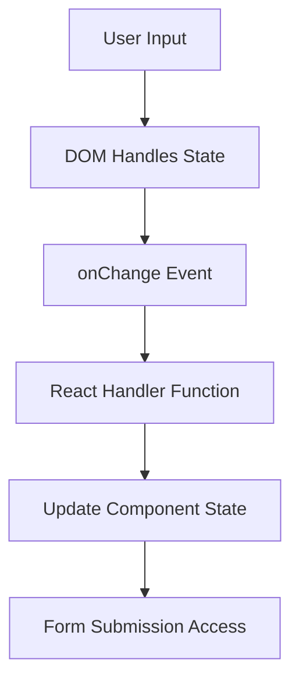
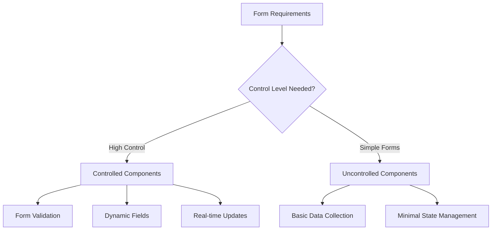
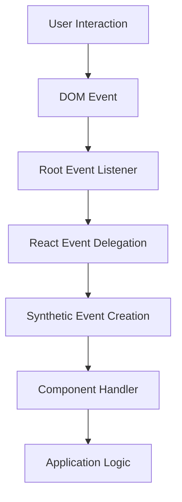
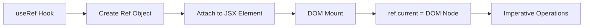
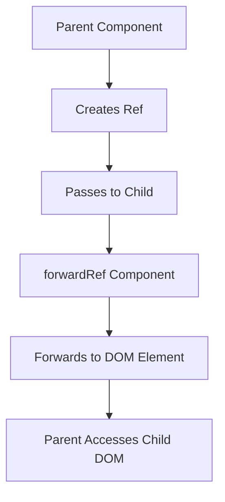
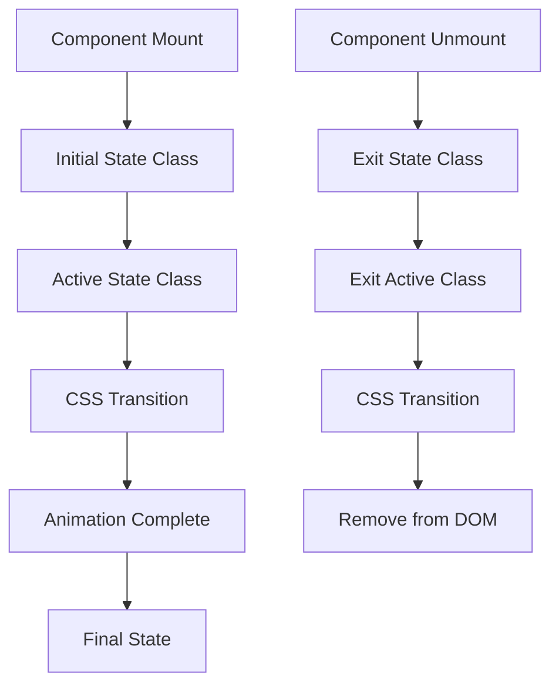
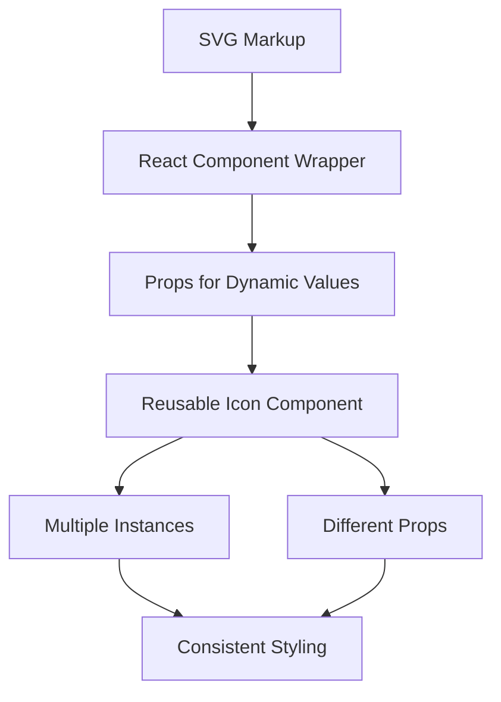
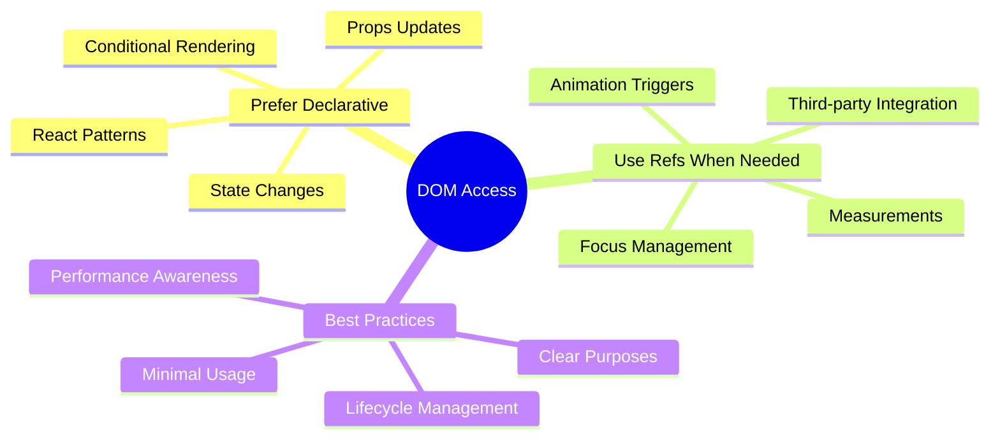

# React 18 Design Patterns - Browser Development

## 🚀 **Browser Development Overview**
- **Form handling** - controlled vs uncontrolled components
- **Event management** - synthetic events and browser abstraction
- **DOM access** - refs for imperative operations
- **Animation support** - declarative animations with React
- **SVG integration** - scalable graphics as React components

## 📝 **Form Implementation Strategies**

### **Uncontrolled Components:**
- **DOM-managed state** - input fields handle their own values
- **Minimal React control** - similar to traditional HTML forms
- **Ref-based access** - get values when needed
- **Less predictable** - harder to manage complex form logic

### **Uncontrolled Component Flow:**

### **Single Field Example:**
- **Basic input** - `<input type="text" />` with onChange handler
- **Event handling** - `handleChange(e)` captures input changes
- **State storage** - store value for form submission
- **Submit handler** - access stored value on form submit

### **Multi-Field Optimization:**
- **Dynamic handlers** - single onChange for multiple fields
- **Name-based routing** - use input `name` attribute for state updates
- **Spread syntax** - `{...values, [name]: value}` for state updates
- **Scalable approach** - add fields without new handlers

### **Controlled Components:**
- **React-managed state** - component controls input values
- **Predictable behavior** - full control over form state
- **Value prop** - explicitly set input values from state
- **Two-way binding** - value flows down, changes flow up

### **Controlled vs Uncontrolled Decision Matrix:**

## 🎯 **Event Handling System**

### **Synthetic Events:**
- **Browser abstraction** - consistent interface across browsers
- **Vendor-agnostic** - same properties regardless of browser
- **Performance optimization** - event pooling and reuse
- **Native event access** - `syntheticEvent.nativeEvent` when needed

### **Event Delegation:**
- **Single root handler** - one event listener on root element
- **Event bubbling** - leverages DOM event propagation
- **Memory optimization** - fewer actual DOM listeners
- **Performance benefit** - faster event handling

### **Event System Architecture:**

### **Event Handling Patterns:**
- **Naming convention** - `handle` prefix (e.g., `handleClick`)
- **Event switching** - single handler for multiple event types
- **Generic handlers** - `handleEvent(event)` with type switching
- **Code reduction** - avoid multiple similar handlers

### **Event Persistence:**
- **Automatic recycling** - synthetic events reused for performance
- **Persistence method** - `event.persist()` to prevent recycling
- **Storage limitation** - cannot store unpersisted events
- **Memory efficiency** - reduces garbage collection pressure

## 🔗 **Refs and DOM Access**

### **Ref Fundamentals:**
- **Imperative escape hatch** - direct DOM node access
- **useRef Hook** - functional component ref creation
- **Current property** - `ref.current` contains DOM element
- **Lifecycle management** - ref populated on mount, cleared on unmount

### **Ref Usage Pattern:**

### **Focus Example Implementation:**
- **Ref creation** - `const inputRef = useRef(null)`
- **Element attachment** - `<input ref={inputRef} />`
- **Imperative action** - `inputRef.current.focus()`
- **Event triggering** - button click calls focus method

### **ForwardRef Pattern:**
- **Ref forwarding** - pass refs through component boundaries
- **Higher-order component** - `React.forwardRef()`
- **Parent-child communication** - parent controls child DOM
- **Component composition** - maintain ref chain through wrappers

### **ForwardRef Implementation:**

### **Best Practices:**
- **Avoid when possible** - prefer declarative solutions
- **Specific use cases** - focus management, measurements, integrations
- **Third-party integration** - connecting with non-React libraries
- **Performance considerations** - imperative operations can break optimizations

## 🎨 **Animation Implementation**

### **React Transition Group:**
- **Declarative animations** - describe desired animation states
- **CSS transition integration** - leverages browser CSS animations
- **Component lifecycle** - animations tied to mount/unmount
- **State-based classes** - automatic CSS class application

### **Animation Lifecycle:**

### **Transition Group Properties:**
- **transitionName** - base CSS class name for animation
- **transitionAppear** - animate on initial mount
- **transitionAppearTimeout** - duration of appearance animation
- **CSS class application** - automatic state-based class names

### **CSS Animation Structure:**
- **Initial state** - `.fade-appear { opacity: 0.01; }`
- **Active transition** - `.fade-appear-active { opacity: 1; transition: ... }`
- **Multiple states** - enter, exit, appear animations
- **Timing coordination** - CSS duration matches timeout props

### **Animation Types:**
- **Appear animations** - component first render
- **Enter animations** - new elements added
- **Exit animations** - elements removed
- **Update animations** - state change transitions

## 🎨 **SVG Integration**

### **SVG Advantages:**
- **Scalable vectors** - resolution-independent graphics
- **Accessibility** - better than icon fonts for screen readers
- **CSS control** - styleable with CSS and JavaScript
- **React compatibility** - declarative markup matches React paradigm

### **SVG Component Pattern:**

### **Basic SVG Component:**
- **Functional wrapper** - `const Circle = ({ x, y, radius, fill }) => ...`
- **Props mapping** - React props become SVG attributes
- **Default values** - `fill = 'red'` for fallback behavior
- **Composition** - wrap base components for variations

### **SVG Component Benefits:**
- **Reusability** - same component, different props
- **Consistency** - standardized icon set across app
- **Flexibility** - runtime customization via props
- **Team sharing** - common icon library with sensible defaults

### **Advanced SVG Patterns:**
- **Specialized components** - `RedCircle`, `SmallCircle` variations
- **Fixed properties** - some props locked for consistency
- **Transparent props** - pass-through props to base component
- **Icon libraries** - collections of SVG components

## 🔧 **Browser Development Best Practices**

### **Form Management:**
- **Choose appropriate pattern** - controlled vs uncontrolled based on needs
- **Validation strategy** - real-time vs submit-time validation
- **Performance considerations** - controlled components re-render more
- **User experience** - immediate feedback vs simple forms

### **Event Handling:**
- **Consistent naming** - `handle` prefix for event handlers
- **Generic handlers** - reduce boilerplate with event switching
- **Performance awareness** - understand event delegation benefits
- **Synthetic events** - leverage React's cross-browser abstraction

### **DOM Access Strategy:**

### **Animation Guidelines:**
- **Declarative approach** - use React Transition Group
- **CSS integration** - leverage browser animation capabilities
- **Performance** - CSS transitions over JavaScript animations
- **User experience** - meaningful animations that guide users

### **SVG Implementation:**
- **Component wrapping** - create reusable SVG components
- **Props flexibility** - dynamic values through React props
- **Default values** - sensible fallbacks for missing props
- **Icon systems** - build comprehensive icon libraries