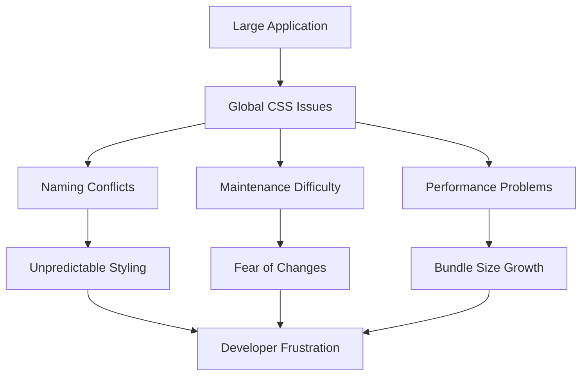
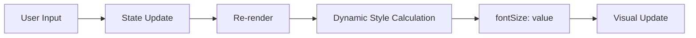
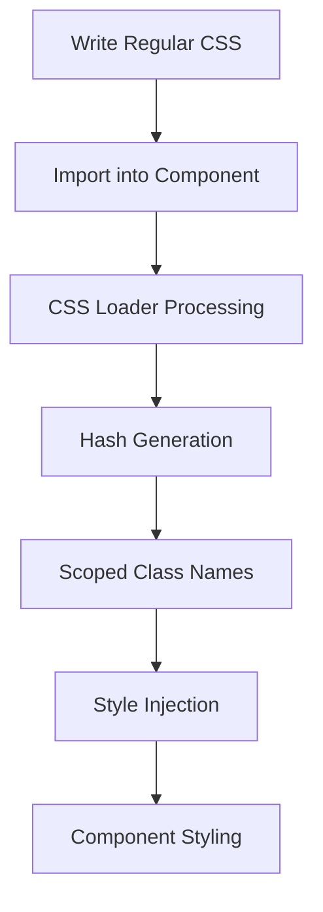
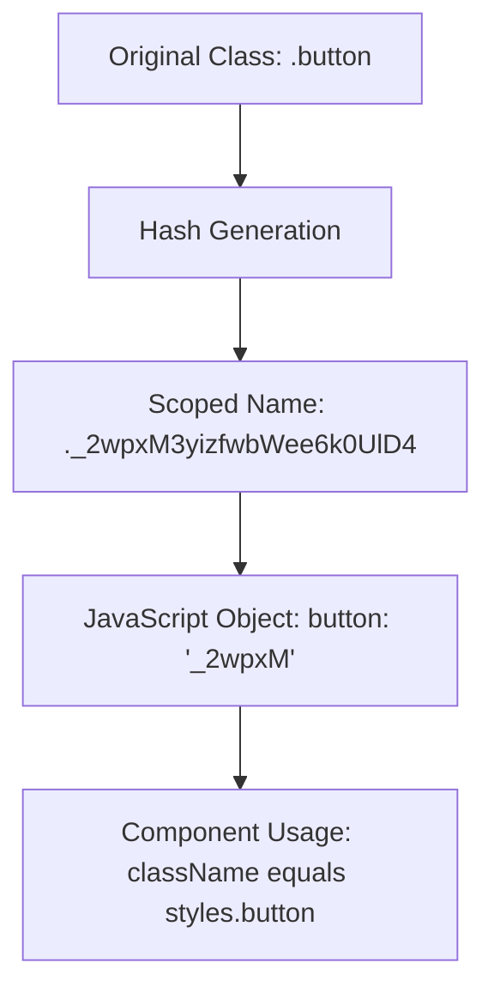
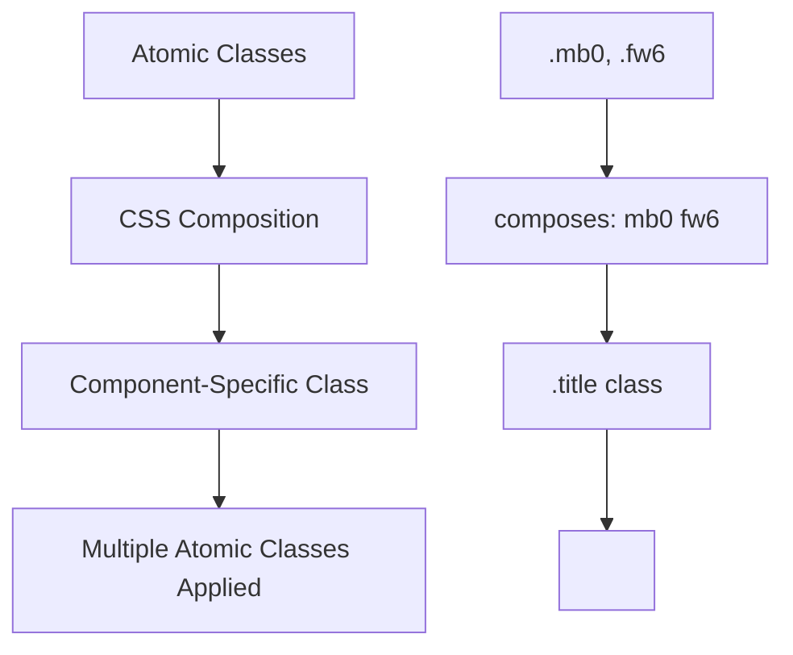
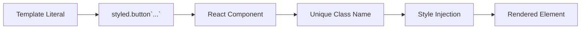
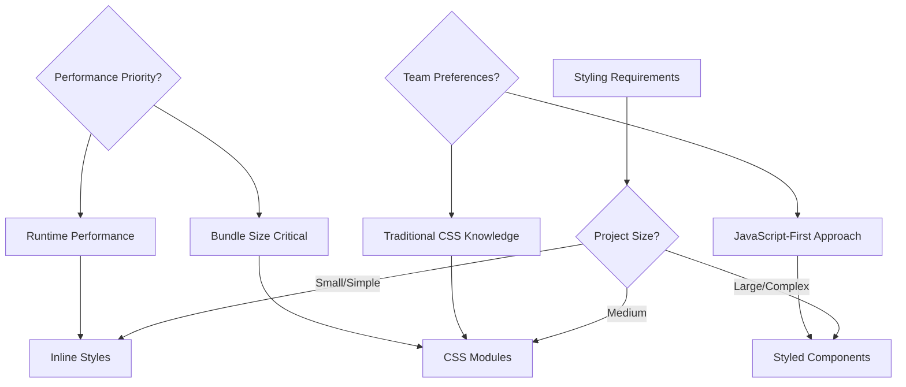
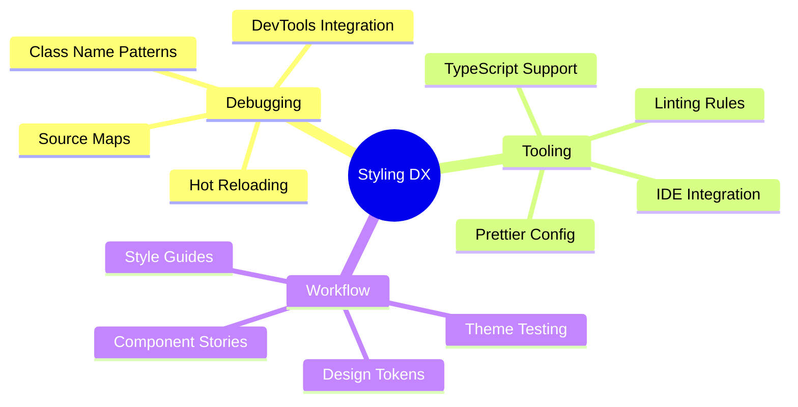

# React 18 Design Patterns - Styling Components

## 🚀 **CSS in JavaScript Revolution**
- **Christopher Chedeau's 2014 talk** sparked CSS-in-JS movement at Facebook
- **Scale problems** - traditional CSS breaks down in large applications
- **Component-focused styling** - styles co-located with components
- **Multiple solutions** - over 40 CSS-in-JS libraries emerged
- **React paradigm shift** - separation by component, not technology

## ⚠️ **CSS at Scale Problems**

### **Seven Core Issues:**
- **Global namespace** - all selectors pollute global scope
- **Dependencies unclear** - hard to track CSS-component relationships
- **Dead code elimination** - difficult to identify unused styles
- **Minification challenges** - class names can't be optimized
- **Sharing constants** - no easy way to share values between CSS and JS
- **Non-deterministic resolution** - load order affects final styles
- **Isolation impossible** - styles can affect unrelated components

### **Problem Impact:**

## 🎨 **Inline Styles Approach**

### **React's Inline Style Philosophy:**
- **Component co-location** - styles live with component logic
- **Separation by component** - not by technology (HTML/CSS/JS)
- **Style objects** - JavaScript objects define styles
- **CamelCase properties** - `backgroundColor` instead of `background-color`
- **Dynamic styling** - runtime style calculations

### **Inline Style Benefits:**
- **Component portability** - styles move with components
- **Dynamic values** - runtime style calculations possible
- **No global conflicts** - styles scoped to elements
- **JavaScript integration** - full programming language power

### **FontSize Component Example:**

### **Inline Style Limitations:**
- **No pseudo-selectors** - `:hover`, `:focus` not supported
- **No media queries** - responsive design impossible
- **No animations** - CSS animations can't be defined inline
- **No style fallbacks** - can't have duplicate properties
- **Debugging difficulty** - styles mixed with markup
- **Server-side rendering** - larger HTML payload

## 🏗️ **CSS Modules Solution**

### **CSS Modules Concept:**
- **Locally scoped CSS** - class names scoped to importing module
- **Webpack integration** - css-loader with modules flag
- **Hash-based naming** - unique class names prevent conflicts
- **Explicit dependencies** - import CSS files like JavaScript modules

### **CSS Modules Workflow:**

### **Webpack Configuration:**
- **css-loader** - processes CSS imports with modules flag
- **style-loader** - injects styles into document head
- **Development naming** - `[local]--[hash:base64:5]` for debugging
- **Production optimization** - shorter hashes for performance

### **CSS Modules Features:**
- **Full CSS support** - pseudo-classes, media queries, animations
- **Composition** - `composes: other-class` for style inheritance
- **Global escape hatch** - `:global .class` for global styles
- **Dead code elimination** - unused CSS easily identified

### **Class Name Generation:**

## ⚛️ **Atomic CSS Modules**

### **Atomic CSS Concept:**
- **Single-purpose classes** - one CSS rule per class
- **Functional approach** - `.mb0` for `margin-bottom: 0`
- **Composition over inheritance** - combine multiple atomic classes
- **Utility-first methodology** - similar to Tailwind CSS

### **Atomic CSS Benefits:**
- **Fast prototyping** - quickly apply styles without writing CSS
- **Controlled file size** - reuse existing classes instead of creating new ones
- **Consistent spacing** - standardized values across application
- **Design system enforcement** - limited options promote consistency

### **CSS Modules + Atomic CSS:**

### **Atomic CSS Modules Example:**
- **Define atomic classes** - `.mb0 { margin-bottom: 0; }`
- **Compose in CSS** - `.title { composes: mb0 fw6; }`
- **Use in component** - `className={styles.title}`
- **Result** - multiple classes applied automatically

## 💅 **Styled Components**

### **Styled Components Philosophy:**
- **CSS-in-JS evolution** - learns from previous solutions
- **Template literals** - ES6 tagged templates for styling
- **Component creation** - `styled.button` creates React components
- **Full CSS support** - pseudo-classes, media queries, animations

### **Tagged Template Literals:**

### **Styled Components Features:**
- **Dynamic styling** - use props in style calculations
- **Theming support** - ThemeProvider for consistent design
- **Automatic vendor prefixing** - browser compatibility handled
- **Dead code elimination** - unused styles automatically removed

### **Component Creation Pattern:**
- **Basic styling** - `const Button = styled.button\`...\``
- **Pseudo-classes** - `&:hover { ... }` SASS-like syntax
- **Media queries** - `@media (max-width: 480px) { ... }`
- **Props-based styling** - `${props => props.primary ? 'blue' : 'gray'}`

### **Advanced Features:**
- **Style inheritance** - extend existing styled components
- **Theming** - consistent color schemes and spacing
- **Polymorphic components** - change underlying element type
- **CSS helper functions** - utilities for complex styling logic

## 🔧 **Styling Strategy Comparison**

### **Solution Selection Matrix:**

### **Pros and Cons Summary:**

**Inline Styles:**
- ✅ Simple, no build setup
- ✅ Dynamic styling easy
- ❌ Limited CSS features
- ❌ Poor debugging experience

**CSS Modules:**
- ✅ Full CSS feature support
- ✅ Local scoping without conflicts
- ✅ Great debugging experience
- ❌ Requires build configuration
- ❌ Separate CSS files

**Styled Components:**
- ✅ Full CSS + JavaScript power
- ✅ Excellent developer experience
- ✅ Component-based architecture
- ❌ Runtime CSS generation
- ❌ Bundle size considerations

## 🚀 **Modern Styling Best Practices**

### **Component Architecture:**
- **Co-location principle** - styles near components they style
- **Single responsibility** - one styling concern per file
- **Composition patterns** - build complex styles from simple pieces
- **Design system integration** - consistent tokens and patterns

### **Performance Considerations:**
- **Build-time optimization** - prefer compile-time CSS generation
- **Critical path CSS** - inline essential styles for first paint
- **Code splitting** - load styles only when components load
- **Bundle analysis** - monitor CSS bundle size growth

### **Development Experience:**

### **Team Adoption Strategy:**
- **Start simple** - begin with familiar approaches
- **Incremental migration** - gradually adopt new patterns
- **Documentation** - clear examples and conventions
- **Training** - invest in team education on chosen approach