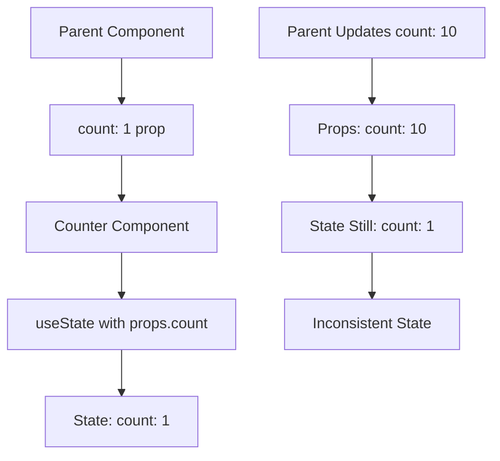
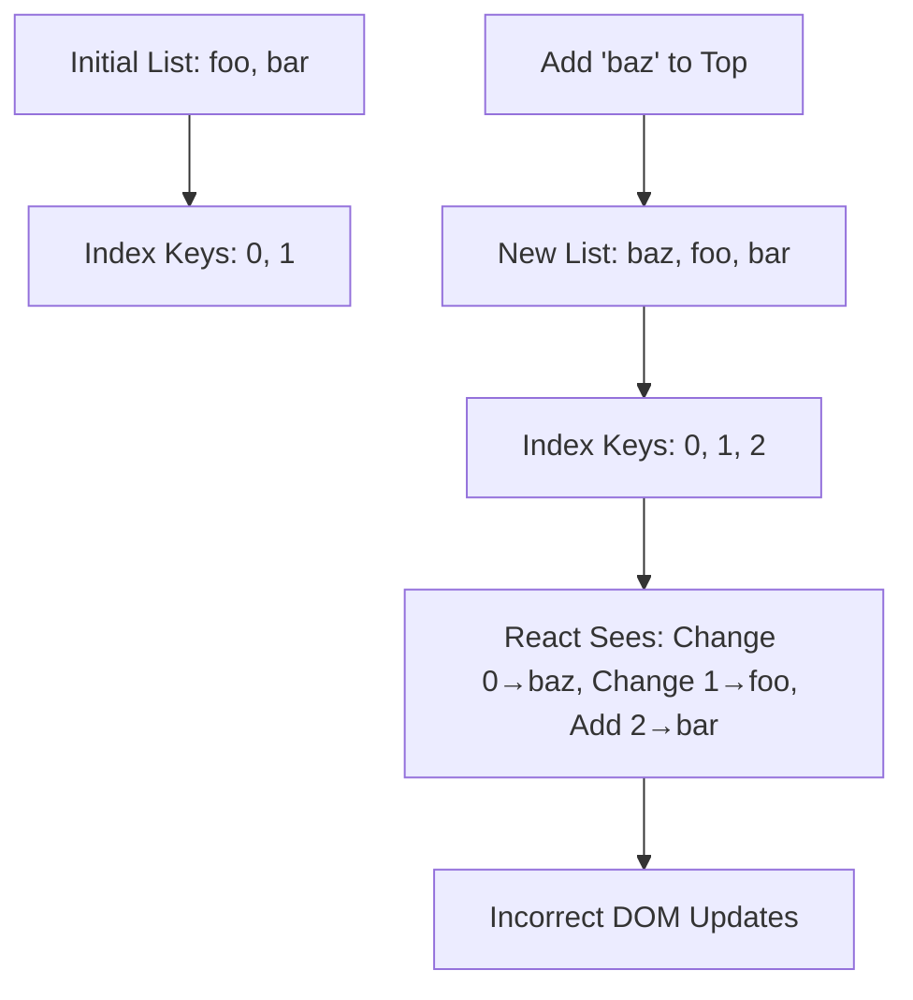
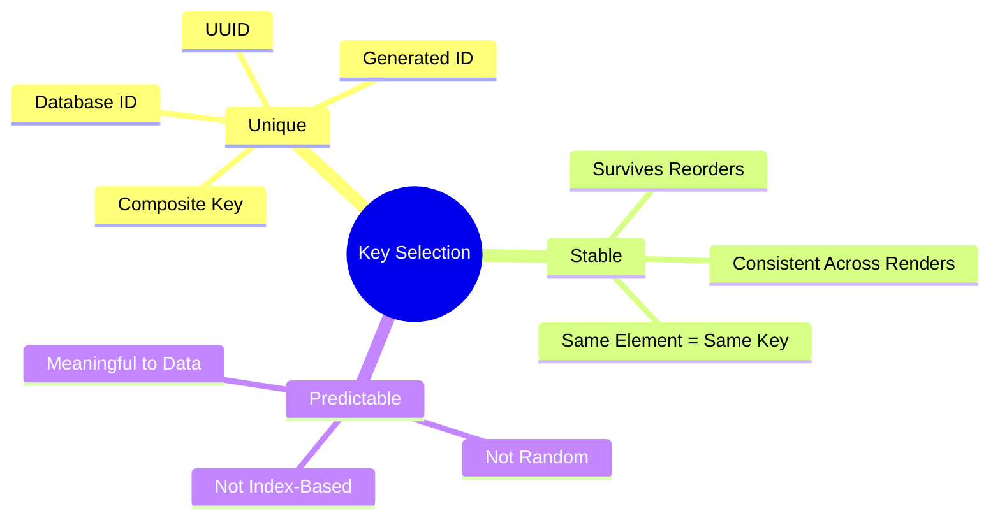
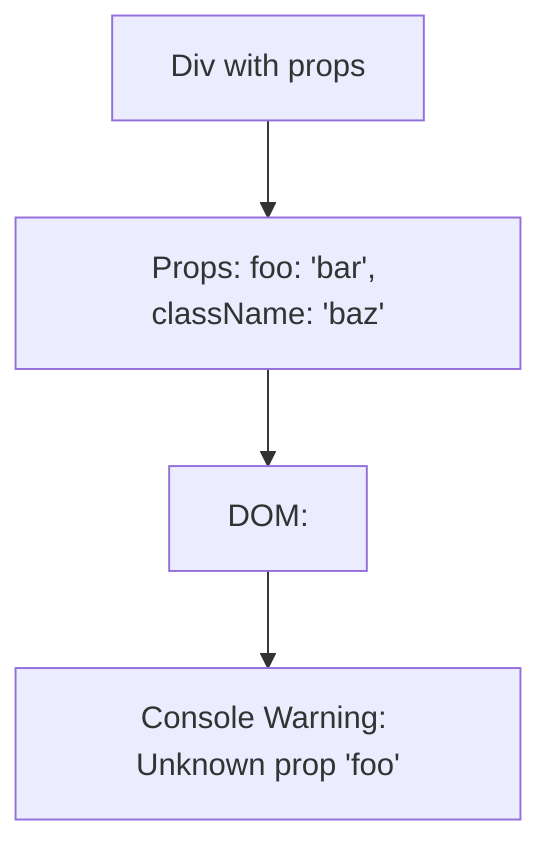
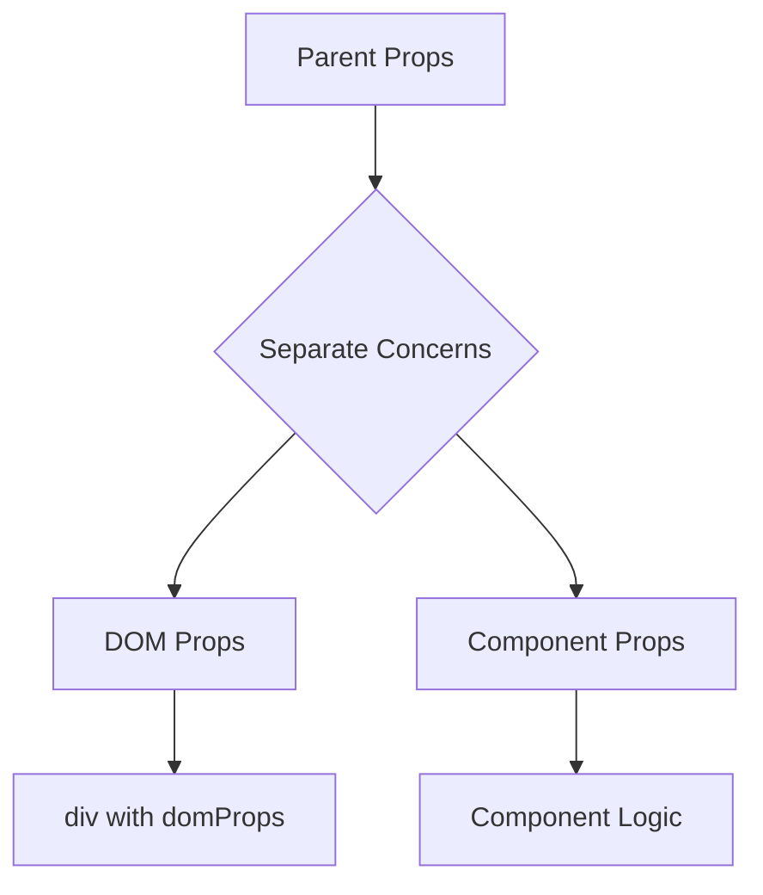
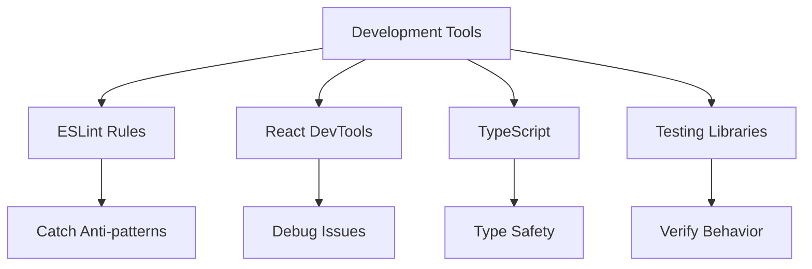
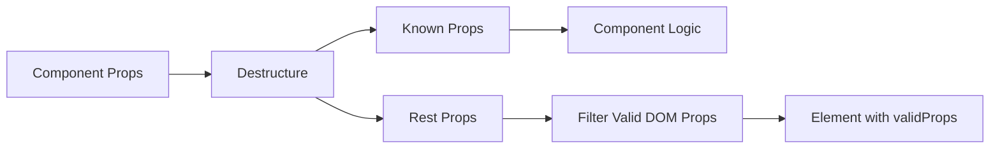

# React 18 Design Patterns - Anti-Patterns

## 🚨 **Anti-Pattern Overview**
- **Common mistakes** developers make when writing React applications
- **Performance impacts** - anti-patterns can harm application performance
- **Behavioral issues** - unexpected component behavior and bugs
- **Best practice violations** - going against React's intended usage patterns
- **Learning opportunity** - understanding why certain approaches are problematic

## 🔄 **State Initialization Anti-Pattern**

### **The Problem:**
- **Props-to-state initialization** - setting initial state from props
- **Duplicated source of truth** - same data in both props and state
- **Stale state** - component doesn't update when prop changes
- **Unclear data ownership** - ambiguous which value is current

### **Problematic Code Example:**

### **Issues with Props-to-State:**
- **Initialization only** - useState only runs once on mount
- **Prop changes ignored** - subsequent prop updates don't affect state
- **Developer confusion** - unclear which value to trust
- **Debugging difficulty** - hard to track source of data

### **Solution Strategies:**
- **Explicit naming** - use `initialCount` instead of `count`
- **Controlled components** - parent manages state, child receives props
- **useEffect updates** - sync state with prop changes when necessary
- **Derived state** - calculate values from props instead of storing

### **When It's Acceptable:**
- **Truly initial values** - prop only sets initial state, never changes
- **Clear naming** - `initialValue`, `defaultValue` prefixes
- **Documentation** - clear comments about intended behavior
- **Team agreement** - consistent patterns across codebase

## 🔑 **Array Index as Key Anti-Pattern**

### **Key Property Purpose:**
- **Element identification** - React tracks elements across renders
- **Reconciliation optimization** - efficient DOM updates
- **Component identity** - maintains component state correctly
- **Performance improvement** - minimizes unnecessary re-renders

### **Index Key Problems:**

### **Index Key Issues:**
- **Non-stable identifiers** - same element gets different keys
- **Wrong reconciliation** - React updates existing elements instead of creating new ones
- **State confusion** - component state stays with wrong elements
- **Performance degradation** - unnecessary DOM manipulations

### **Visual Example:**
- **Input fields** maintain their values when items reorder
- **List items** get new text but input values stay in place
- **User confusion** - form data doesn't match displayed items
- **Data integrity** - user input associated with wrong items

### **Proper Key Strategies:**
- **Unique identifiers** - use database IDs or UUIDs
- **Stable values** - content-based keys if items don't repeat
- **Composite keys** - combine multiple fields for uniqueness
- **Generated IDs** - create unique identifiers when none exist

### **Key Selection Guidelines:**

## 📡 **Props Spreading Anti-Pattern**

### **Spreading Concept:**
- **Convenience pattern** - `<Component {...props} />` passes all props
- **Common practice** - widely used in React community
- **Hidden danger** - can pass invalid HTML attributes
- **DOM pollution** - unknown attributes added to DOM elements

### **The Problem:**
- **Unknown HTML attributes** - non-standard props become DOM attributes
- **Console warnings** - React warns about invalid props
- **HTML validation** - creates invalid HTML markup
- **Hidden properties** - unclear what props are being passed

### **Warning Example:**

### **Spreading Issues:**
- **Lack of control** - can't filter out invalid props
- **Debugging difficulty** - hard to track which props cause issues
- **Maintainability** - changes to parent props affect DOM unexpectedly
- **HTML standards** - violates semantic HTML principles

### **Safe Spreading Solutions:**
- **Explicit DOM props** - `
`
- **Prop filtering** - extract known props, rest for DOM
- **Destructuring** - separate DOM props from component props
- **Prop validation** - use PropTypes or TypeScript to catch issues

### **Better Patterns:**

## 🛡️ **Anti-Pattern Prevention**

### **Development Practices:**
- **Code reviews** - catch anti-patterns before merge
- **Linting rules** - ESLint rules for common anti-patterns
- **TypeScript** - type safety prevents many issues
- **Testing** - unit tests reveal unexpected behaviors

### **Team Guidelines:**
- **Coding standards** - document acceptable patterns
- **Training** - educate team on React best practices
- **Pair programming** - knowledge sharing prevents mistakes
- **Documentation** - clear examples of dos and don'ts

### **Tool Support:**

## 🔍 **Debugging Anti-Patterns**

### **State Initialization Issues:**
- **React DevTools** - compare props vs state values
- **Console logging** - track prop changes over time
- **Component lifecycle** - understand when initialization occurs
- **State updates** - verify when and why state changes

### **Key-Related Problems:**
- **DOM inspection** - check actual key attributes
- **React DevTools** - see component tree with keys
- **Console warnings** - React warns about missing keys
- **List behavior** - test reordering and updates

### **Props Spreading Debug:**
- **Console warnings** - unknown prop messages
- **DOM inspection** - check for invalid attributes
- **Prop logging** - see what props are being passed
- **HTML validation** - use tools to check markup validity

## 📚 **Best Practice Alternatives**

### **State Management:**
- **Lifted state** - manage state in parent component
- **Controlled components** - parent controls child behavior
- **useEffect sync** - sync state with prop changes when needed
- **Derived state** - calculate from props instead of storing

### **List Rendering:**
- **Unique IDs** - generate or use existing unique identifiers
- **Content hashing** - create stable keys from item content
- **Database keys** - use server-provided unique identifiers
- **UUID generation** - create unique keys for client-side items

### **Props Handling:**

### **Prop Validation:**
- **TypeScript interfaces** - define expected prop types
- **PropTypes** - runtime prop validation
- **Default props** - provide sensible defaults
- **Required props** - mark essential props as required

## 🎯 **Anti-Pattern Detection**

### **Code Review Checklist:**
- **State initialization** - check for props-to-state patterns
- **List keys** - verify unique, stable keys
- **Props spreading** - ensure safe DOM prop spreading
- **Performance impact** - consider reconciliation efficiency

### **Automated Detection:**
- **ESLint rules** - `react/no-array-index-key`, `react/no-unknown-property`
- **TypeScript errors** - catch type mismatches
- **React warnings** - development mode console messages
- **Testing failures** - unexpected behavior in tests

### **Learning Approach:**
- **Understand why** - learn the reasoning behind anti-patterns
- **Practice identification** - recognize patterns in existing code
- **Refactoring skills** - know how to fix problematic code
- **Prevention mindset** - think about potential issues while coding