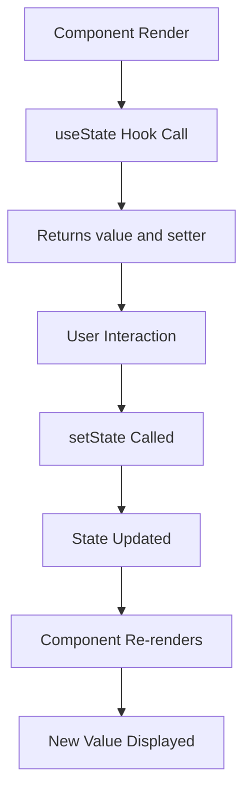
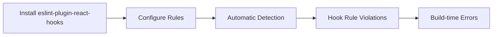
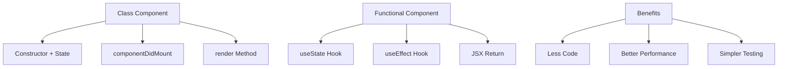
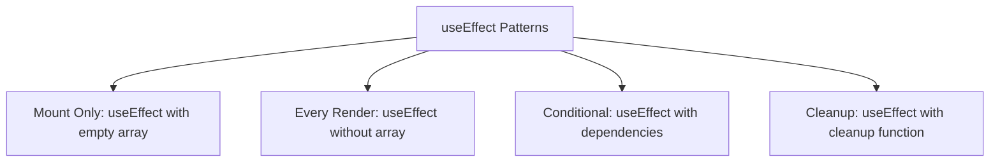
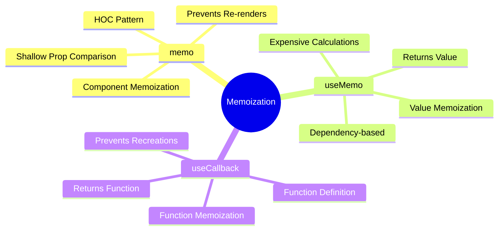
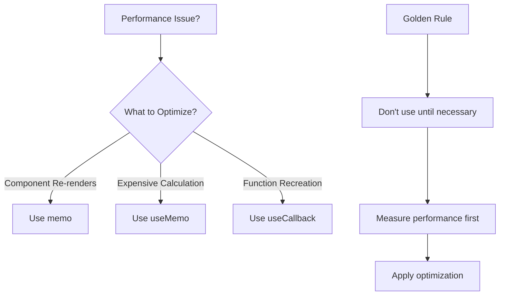
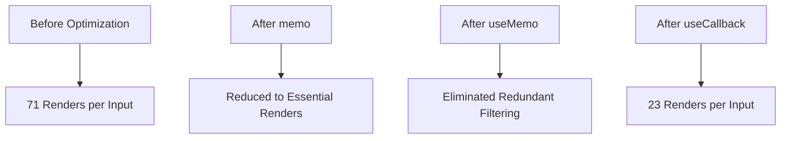
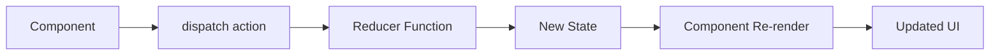
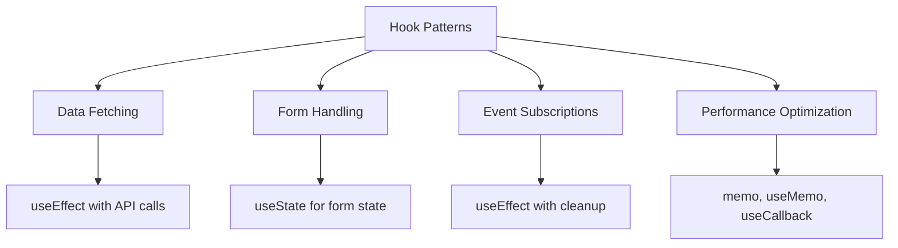

# React 18 Design Patterns - React Hooks

## 🚀 **React Hooks Revolution**
- **React 16.8 introduction** - functional components with state and effects
- **Backward compatible** - no breaking changes, class components still supported
- **Performance improvements** - better optimization and cleaner code patterns
- **Functional paradigm** - shift from class-based to function-based components
- **Code simplification** - reduce boilerplate and improve readability

## 📝 **useState Hook**

### **State Hook Fundamentals:**
- **Import pattern** - `import { useState } from 'react'`
- **Array destructuring** - `const [state, setState] = useState(initialValue)`
- **Type safety** - `useState<number>(0)` for TypeScript
- **Setter function** - `setState(newValue)` to update state

### **useState Example:**

### **Counter Implementation:**
- **Initial state** - `useState<number>(0)` sets starting value
- **Event handlers** - functions that call setState
- **Type definitions** - `type Operation = 'add' | 'subtract'`
- **Conditional logic** - handle different operations

## 📏 **Rules of Hooks**

### **Rule 1: Top Level Only**
- **No conditional calls** - avoid hooks inside conditions, loops, nested functions
- **Consistent order** - hooks must be called in same order every render
- **Function top level** - always call hooks at top level of React functions
- **React dependency** - ensures proper state preservation

### **Rule 2: React Functions Only**
- **Function components** - only call hooks in React function components
- **Custom hooks** - can call hooks in custom hook functions
- **No regular functions** - avoid hooks in plain JavaScript functions
- **Visibility principle** - keep stateful logic clearly visible

### **ESLint Plugin:**

## 🔄 **Class to Hooks Migration**

### **Migration Process:**
- **Remove class syntax** - convert to functional component
- **Replace state** - `this.state` becomes `useState`
- **Convert lifecycle** - `componentDidMount` becomes `useEffect`
- **Simplify imports** - remove unnecessary React class imports

### **Before/After Comparison:**

### **GitHub Issues Example:**
- **State management** - `useState<Issue[]>([])` for issues array
- **API calls** - `useEffect` with empty dependency for mounting
- **Data fetching** - axios integration within useEffect
- **Type safety** - TypeScript interfaces for API responses

## ⚡ **useEffect Hook**

### **Effect Fundamentals:**
- **Side effect handling** - API calls, subscriptions, DOM manipulation
- **Lifecycle replacement** - combines mount, update, unmount behaviors
- **Dependency array** - controls when effect runs
- **Cleanup function** - return function for cleanup logic

### **useEffect Patterns:**

### **Effect Timing:**
- **After paint** - useEffect runs after layout and paint
- **Deferred execution** - doesn't block browser updating screen
- **useLayoutEffect** - synchronous alternative when DOM mutation needed
- **Performance optimization** - prevents blocking user interface

### **Dependencies:**
- **Empty array** - run once on mount (like componentDidMount)
- **With dependencies** - run when specific values change
- **No array** - run on every render (usually not desired)
- **Cleanup** - return function runs before next effect or unmount

## 🧠 **Memoization Hooks**

### **Performance Optimization Strategy:**

### **memo HOC:**
- **Component wrapping** - `export default memo(Component)`
- **Shallow comparison** - compares props for changes
- **Re-render prevention** - only re-renders when props change
- **Performance rule** - only use when necessary for performance

### **useMemo Hook:**
- **Value memoization** - `const value = useMemo(() => calculation, [deps])`
- **Expensive calculations** - avoid repeated heavy computations
- **Dependency tracking** - recalculate only when dependencies change
- **Filter example** - memoize filtered arrays for better performance

### **useCallback Hook:**
- **Function memoization** - `const fn = useCallback(() => {}, [deps])`
- **Stable references** - prevent function recreation on each render
- **Props optimization** - when passing functions to memoized components
- **Effect dependencies** - when functions are used in useEffect

### **Memoization Decision Tree:**

## 📊 **Todo List Example**

### **Performance Problems:**
- **Unnecessary renders** - components re-render on every state change
- **Function recreation** - new functions created on each render
- **Expensive filtering** - filter runs on every input change
- **Cascading re-renders** - parent updates trigger child updates

### **Optimization Strategy:**
- **memo components** - wrap List and Task components
- **useMemo filtering** - memoize filtered todo list
- **useCallback handlers** - memoize event handler functions
- **Dependency management** - careful dependency array management

### **Performance Measurement:**

## 🔧 **useReducer Hook**

### **Redux-like Pattern:**
- **State management** - complex state logic with actions
- **Reducer function** - `(state, action) => newState` pattern
- **Dispatch method** - `const [state, dispatch] = useReducer(reducer, initialState)`
- **Action objects** - `{ type: 'ACTION_TYPE', payload: data }`

### **useReducer Structure:**

### **Notes App Example:**
- **Action types** - ADD, UPDATE, DELETE operations
- **Reducer logic** - switch statement handling different actions
- **Component integration** - dispatch actions from UI events
- **TypeScript types** - strong typing for actions and state

### **useReducer vs Redux:**
- **Local scope** - useReducer limited to component and children
- **No middleware** - no thunk, saga, or other middleware support
- **Simpler setup** - no store configuration required
- **Global state** - use Redux for application-wide state management

## 🎯 **Hook Best Practices**

### **Performance Guidelines:**
- **Measure first** - don't optimize without performance issues
- **Strategic memoization** - only memoize when beneficial
- **Dependency arrays** - be careful with dependency management
- **ESLint rules** - use react-hooks/exhaustive-deps

### **Common Patterns:**

### **Migration Strategy:**
- **Incremental approach** - migrate components one at a time
- **Start simple** - begin with useState and useEffect
- **Add optimization** - introduce memoization as needed
- **Team training** - ensure team understands hook patterns

### **Testing Considerations:**
- **Hook testing** - use @testing-library/react-hooks
- **Isolated testing** - test custom hooks separately
- **Integration testing** - test hook integration in components
- **Performance testing** - measure optimization impact

## 🚀 **Advanced Hook Concepts**

### **Custom Hooks:**
- **Logic reuse** - extract common stateful logic
- **Naming convention** - prefix with "use" (e.g., useCounter)
- **Composition** - combine multiple built-in hooks
- **Testability** - easier to test isolated logic

### **Hook Dependencies:**
- **Exhaustive deps** - include all referenced values
- **ESLint warnings** - pay attention to dependency warnings
- **useCallback deps** - functions in useEffect need useCallback
- **Stale closures** - avoid capturing stale values

### **Effect Cleanup:**
- **Subscription cleanup** - unsubscribe from event listeners
- **Timer cleanup** - clear timeouts and intervals
- **Request cancellation** - cancel ongoing API requests
- **Memory leaks** - prevent memory leaks in components