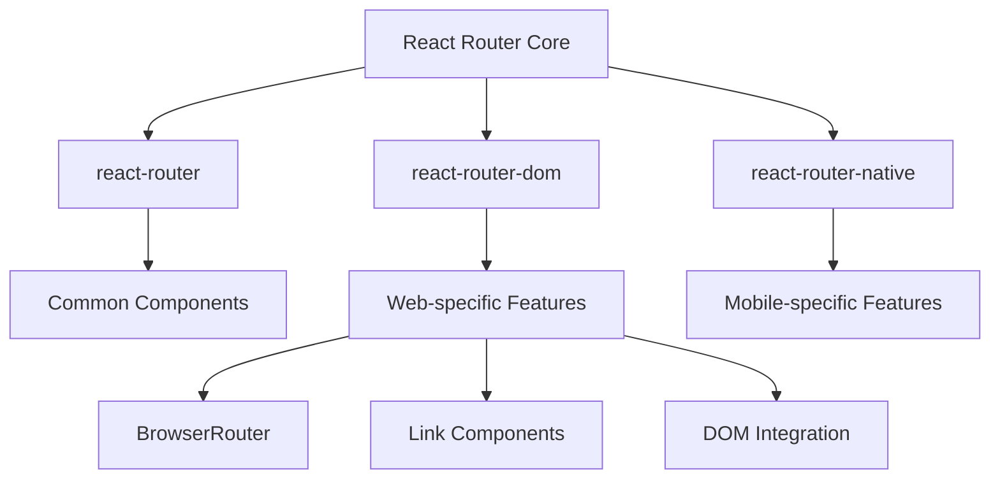
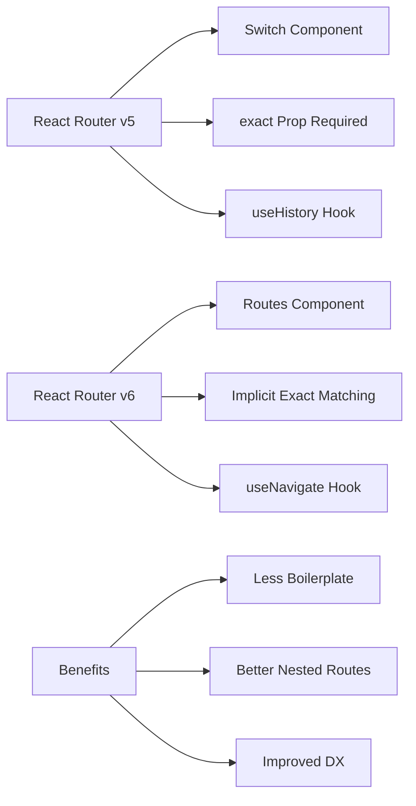
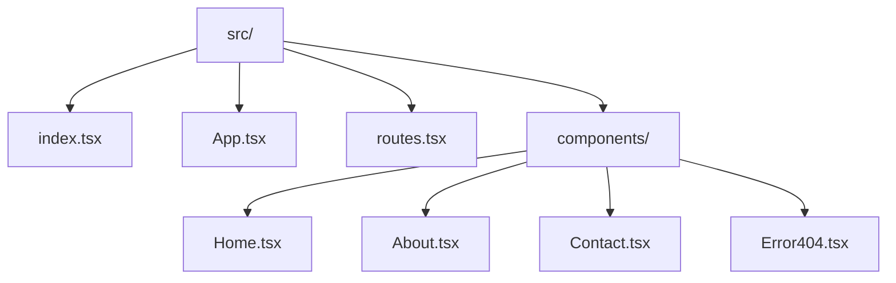
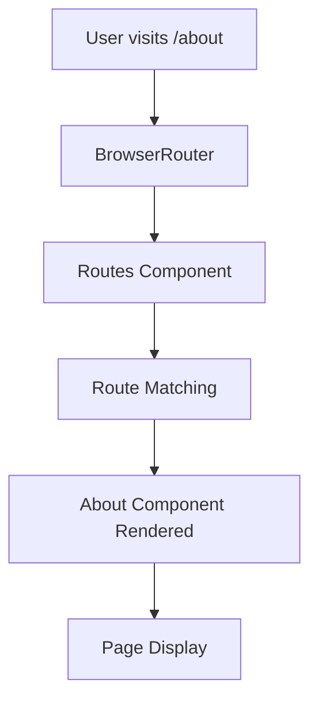
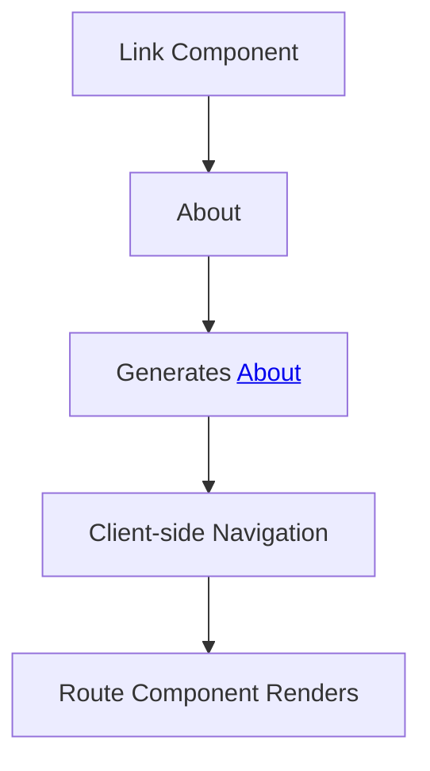
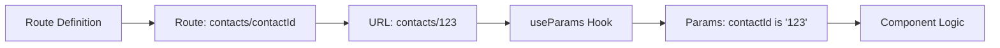
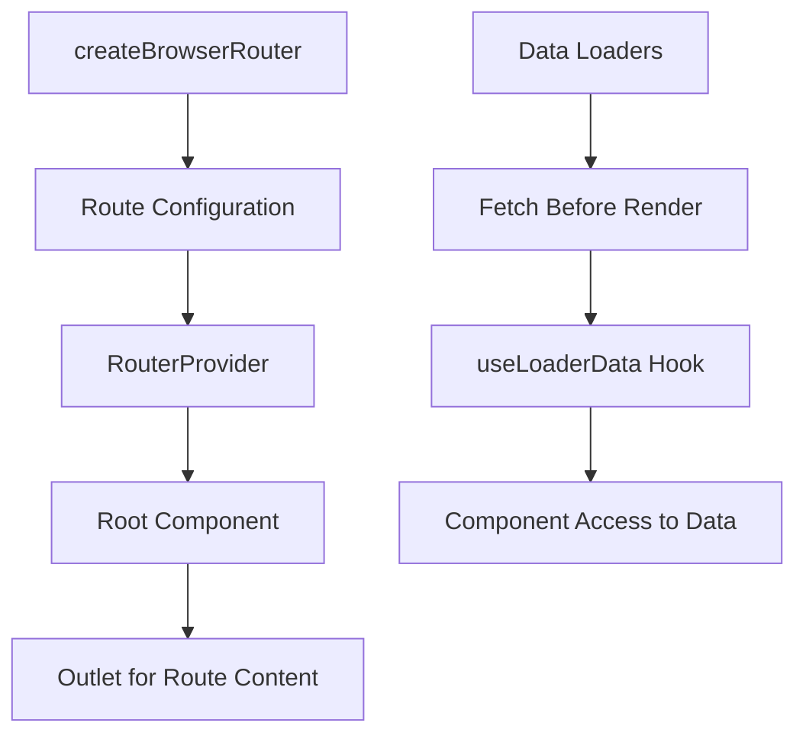
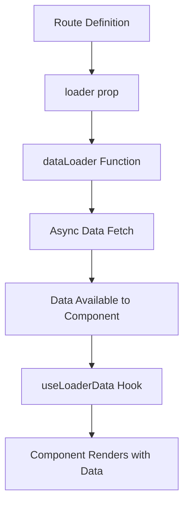
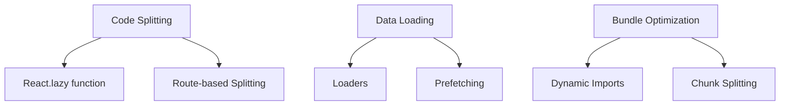

# React 18 Design Patterns - React Router

## 🚀 **React Router Overview**
- **Third-party routing** - React doesn't include routing out of the box
- **Single-page application** - handle URLs and navigation without page refreshes
- **Most popular solution** - React Router is the standard routing library
- **Platform-specific packages** - different packages for web and mobile
- **Version evolution** - significant improvements in v6 and v6.4

## 📦 **Package Structure**

### **React Router Packages:**
- **react-router** - core routing functionality, shared components
- **react-router-dom** - web-specific routing components and hooks
- **react-router-native** - React Native routing components
- **Installation** - `npm install react-router-dom @types/react-router-dom`

### **Why react-router-dom:**

## 🔧 **React Router v6 Improvements**

### **Key Enhancements:**
- **Simplified configuration** - no more Switch or exact props
- **Implicit prioritization** - routes prioritized by definition order
- **Nested routing** - improved support with Outlet component
- **useNavigate hook** - replaces useHistory for simpler navigation
- **Relative links** - easier route-relative navigation
- **Streamlined guards** - simplified route protection patterns

### **Configuration Comparison:**

## 🏗️ **Basic Setup and Configuration**

### **Initial Setup:**
- **BrowserRouter** - wrap application for routing functionality
- **Routes container** - holds all Route definitions
- **Route components** - define path-to-component mappings
- **App structure** - organize routing logic

### **File Structure:**

### **Router Configuration:**
- **BrowserRouter** - enables browser history API
- **Routes wrapper** - contains all route definitions
- **Route elements** - path and component mappings
- **Wildcard routes** - catch-all for 404 errors

### **Basic Route Example:**

## 🔗 **Navigation and Links**

### **Link Component:**
- **Client-side navigation** - no page refreshes
- **Accessible markup** - generates proper anchor tags
- **History integration** - works with browser back/forward
- **Active states** - can style active links

### **Navigation Patterns:**
- **Menu creation** - Link components for navigation
- **Programmatic navigation** - useNavigate hook
- **Relative links** - navigation relative to current route
- **External links** - regular anchor tags for external URLs

### **Link Usage:**

## 📋 **Route Parameters**

### **Parameter Types:**
- **URL parameters** - `:paramName` in route path
- **Query parameters** - search parameters in URL
- **useParams hook** - access URL parameters in components
- **Dynamic routing** - routes that change based on data

### **Parameter Workflow:**

### **Contacts Example:**
- **List view** - display all contacts with links
- **Detail view** - show specific contact based on ID
- **Shared component** - same component handles both views
- **Conditional rendering** - different content based on parameters

### **Nested Routes:**
- **Parent-child relationships** - routes within routes
- **Shared layouts** - common UI structure
- **Parameter inheritance** - child routes access parent parameters
- **Outlet component** - render location for child routes

## 🆕 **React Router v6.4 New Approach**

### **Major Changes:**
- **createBrowserRouter** - new router creation method
- **createRoutesFromElements** - route configuration helper
- **RouterProvider** - new way to provide router to app
- **Data loaders** - built-in data fetching capabilities

### **v6.4 Architecture:**

### **Route Configuration:**
- **Declarative structure** - routes defined as JSX elements
- **Root component** - shared layout for all routes
- **Outlet component** - placeholder for route content
- **Index routes** - default route for parent path

### **Root Component Pattern:**
- **Shared navigation** - common menu across all routes
- **Layout structure** - consistent page structure
- **Outlet placement** - where route content renders
- **Global elements** - headers, footers, navigation

## 📊 **Data Loading with Loaders**

### **Loader Concept:**
- **Pre-route data** - fetch data before component renders
- **Eliminates useEffect** - no more data fetching in components
- **Better UX** - loading states handled automatically
- **Error handling** - built-in error boundary integration

### **Loader Implementation:**

### **Pokemon Example:**
- **API integration** - fetch Pokemon data from API
- **Async loader** - dataLoader function handles API call
- **Loading states** - useNavigation for loading indicators
- **Data access** - useLoaderData hook in component

### **Loader Benefits:**
- **Performance** - data fetching starts before component mount
- **Simplicity** - no useState/useEffect patterns needed
- **Error handling** - automatic error boundaries
- **Loading states** - built-in loading state management

## 🎯 **Advanced Routing Patterns**

### **Route Guards:**
- **Authentication** - protect routes based on user state
- **Authorization** - role-based route access
- **Redirect patterns** - automatic route redirection
- **Conditional routing** - routes based on application state

### **Error Handling:**
- **404 pages** - wildcard routes for unmatched paths
- **Error boundaries** - catch and handle route errors
- **Fallback components** - graceful error recovery
- **Error reporting** - track routing errors

### **Performance Optimization:**

## 🔄 **Migration Strategies**

### **From v5 to v6:**
- **Switch to Routes** - update component usage
- **Remove exact prop** - no longer needed
- **Update useHistory** - migrate to useNavigate
- **Nested route updates** - use Outlet component

### **To v6.4 Features:**
- **Gradual adoption** - can use alongside existing patterns
- **Loader implementation** - add loaders to existing routes
- **RouterProvider migration** - update to new router setup
- **Data fetching refactor** - move from useEffect to loaders

### **Best Practices:**
- **Route organization** - keep routes in separate files
- **Component structure** - separate layout from page components
- **Error handling** - implement proper error boundaries
- **Loading states** - provide user feedback during navigation

## 🚀 **React Router Ecosystem**

### **Related Libraries:**
- **React Router Testing** - testing utilities for routes
- **History library** - underlying history management
- **Reach Router** - merged into React Router v6
- **Next.js Router** - alternative for Next.js applications

### **Integration Patterns:**
- **State management** - Redux/Zustand with routing
- **Authentication** - auth providers with route guards
- **Code splitting** - lazy loading with routes
- **SEO optimization** - meta tags and server rendering

### **Development Tools:**
- **React DevTools** - inspect router state
- **Browser DevTools** - debug navigation and history
- **Route debugging** - log route changes and data
- **Performance monitoring** - track route performance