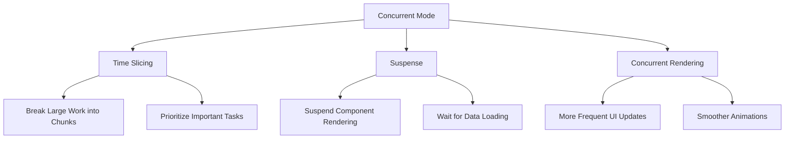
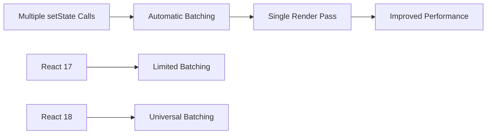
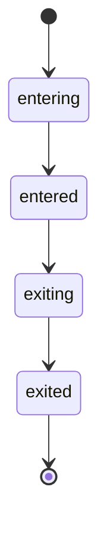
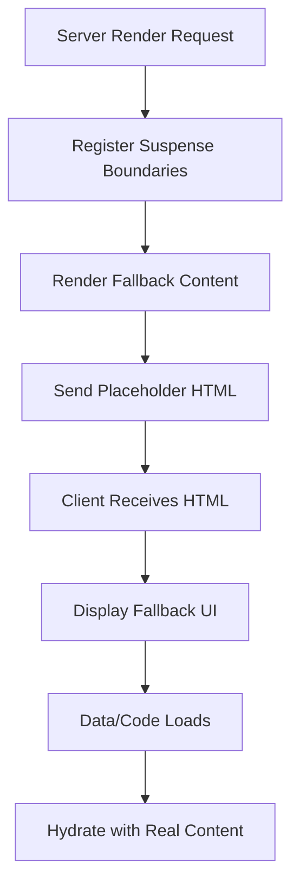
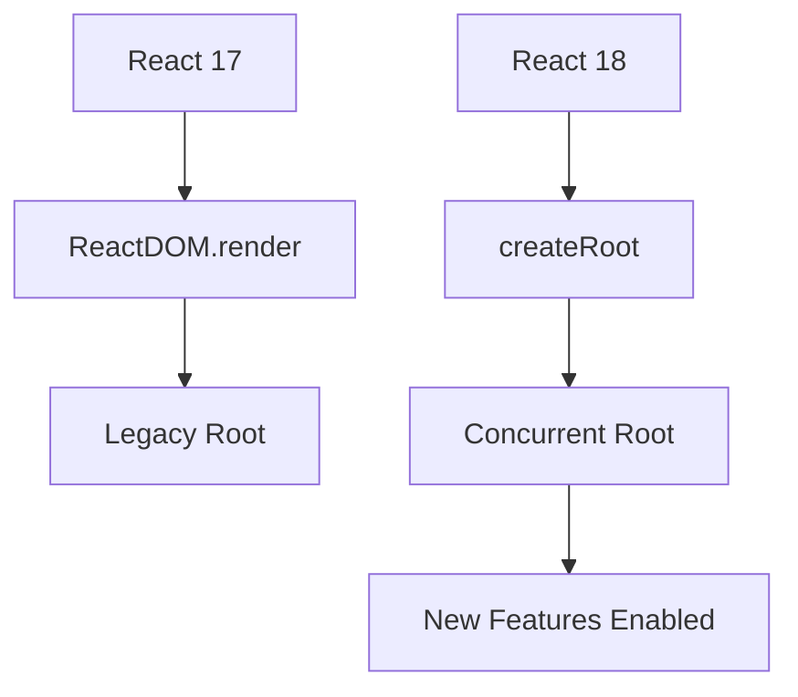
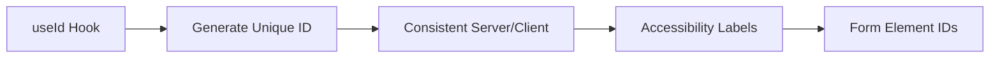
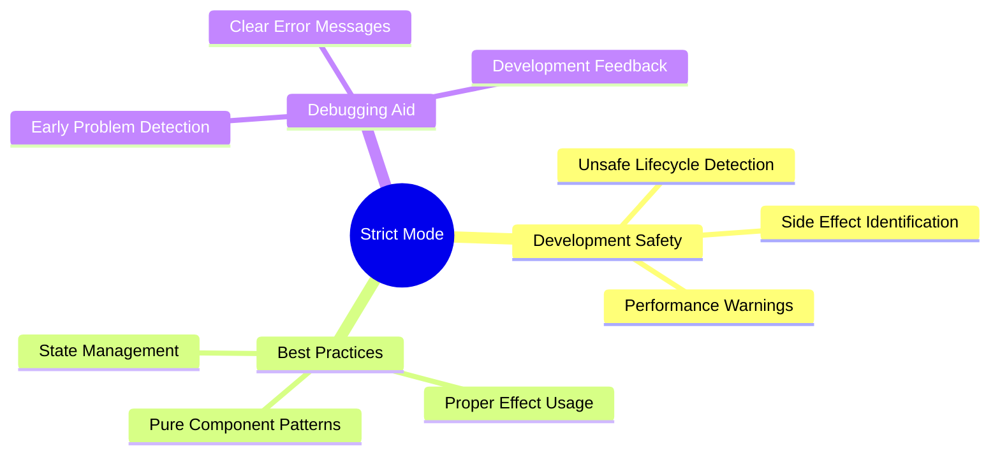
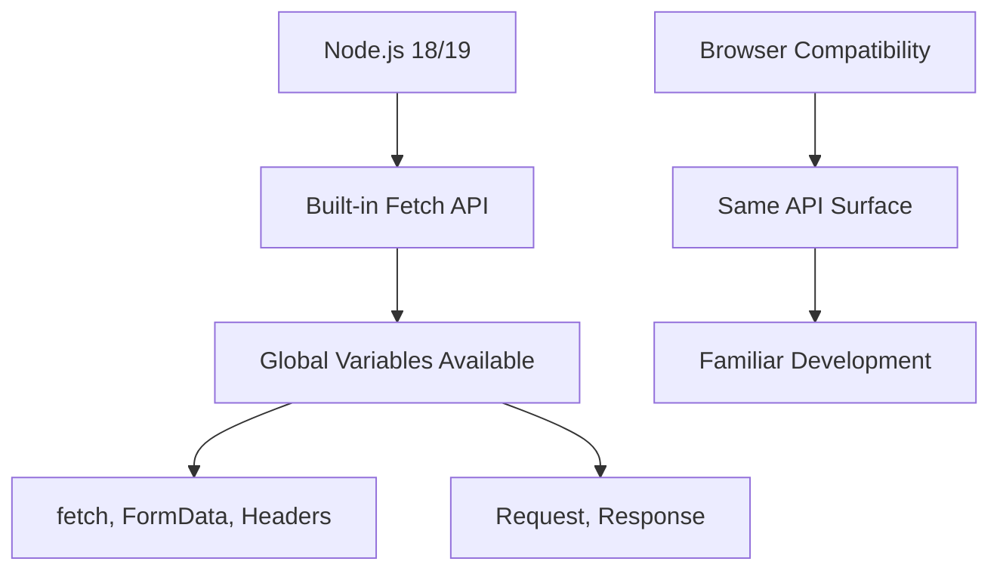
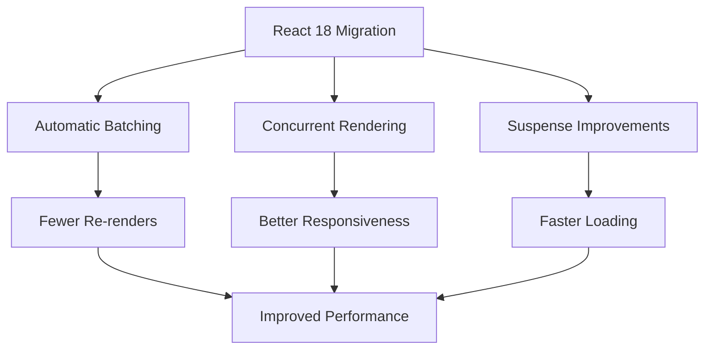

# React 18 Design Patterns - React 18 New Features

## 🚀 **React 18 Overview**
- **Performance improvements** - automatic batching and concurrent rendering
- **Enhanced user experience** - smoother animations and faster load times
- **Developer experience** - improved error handling and debugging tools
- **Modern web standards** - drops IE11 support for better performance
- **Backward compatible** - existing React apps work without major changes

## ⚡ **Concurrent Mode**

### **Concurrent Rendering Fundamentals:**
- **Multiple task handling** - React works on several tasks simultaneously
- **Non-blocking updates** - UI remains responsive during heavy operations
- **Prioritized rendering** - important updates processed first
- **Background processing** - less critical tasks run in background

### **Key Concurrent Features:**

### **Time Slicing:**
- **Work chunking** - breaks large rendering tasks into smaller pieces
- **Priority scheduling** - handles high-priority updates first
- **Reduced latency** - prevents UI blocking during heavy computations
- **Responsive interactions** - user input remains smooth during updates

### **Concurrent Benefits:**
- **Better perceived performance** - users see updates faster
- **Smoother user interactions** - no more frozen interfaces
- **Optimized resource usage** - efficient CPU and memory utilization
- **Future-proof architecture** - foundation for advanced features

## 🔄 **Automatic Batching**

### **Batching Concept:**
- **Multiple updates grouped** - several state updates combined into one render
- **Performance optimization** - reduces unnecessary re-renders
- **Automatic behavior** - no manual intervention required
- **Extended scope** - works with timeouts, promises, and event handlers

### **Batching Workflow:**

### **Before vs After:**
- **React 17** - batching only in React event handlers
- **React 18** - batching in all contexts (timeouts, promises, native events)
- **Performance gain** - significant reduction in render cycles
- **Consistent behavior** - predictable batching across all scenarios

### **Batching Example Impact:**
- **Three setState calls** - traditionally three renders, now one render
- **Event handlers** - multiple updates batched automatically
- **Async operations** - setTimeout, fetch callbacks also batched
- **Native events** - DOM event handlers benefit from batching

## 🎭 **Transitions**

### **Transition Fundamentals:**
- **Smooth animations** - declarative approach to transitions
- **State-based animation** - animations triggered by state changes
- **Performance optimized** - leverages React's rendering optimizations
- **Simple API** - easy to implement complex animations

### **Transition Components:**
- **react-transition-group** - external library for advanced transitions
- **State management** - entering, entered, exiting, exited states
- **CSS integration** - works seamlessly with CSS transitions
- **Conditional rendering** - animations based on application state

### **Animation States:**

## 🏗️ **Suspense on Server**

### **Server-Side Rendering Enhancement:**
- **Streaming HTML** - send partial content while loading
- **Progressive hydration** - components hydrate as data becomes available
- **Better performance** - faster initial page loads
- **Improved scalability** - more efficient server resource usage

### **SSR Suspense Workflow:**

### **Benefits:**
- **Faster perceived load** - users see content immediately
- **Better UX** - progressive content loading
- **Server efficiency** - avoid blocking on slow operations
- **Scalability** - handle more concurrent requests

## 🔧 **New APIs**

### **createRoot:**
- **Modern rendering** - replaces ReactDOM.render
- **Concurrent mode support** - enables new React 18 features
- **Multiple component rendering** - reusable root for different components
- **Explicit root management** - clearer rendering lifecycle

### **API Comparison:**

### **hydrateRoot:**
- **SSR hydration** - converts server HTML to interactive React
- **Performance optimization** - reuses server-rendered markup
- **Seamless transition** - from static to interactive
- **Error handling** - detects hydration mismatches

### **renderToPipeableStream:**
- **Node.js streaming** - render React to Node streams
- **Memory efficient** - no need to buffer entire HTML
- **Network optimization** - start sending content immediately
- **Scalable SSR** - better server performance

## 🎣 **New Hooks**

### **useId Hook:**
- **Unique identifier generation** - guaranteed unique IDs per render
- **Server-client consistency** - same IDs on server and client
- **Accessibility support** - proper labeling for form elements
- **Prefix support** - consistent naming conventions

### **useId Usage:**

### **useTransition Hook:**
- **Loading states** - manage pending transitions
- **Smooth UX** - prevent jarring state changes
- **Concurrent rendering** - works with React's scheduling
- **Timeout configuration** - control loading indicator timing

### **useDeferredValue Hook:**
- **Performance optimization** - defer expensive updates
- **Animation support** - smooth visual transitions
- **Frame-based updates** - updates aligned with browser frames
- **Value stabilization** - prevent thrashing during rapid changes

### **useInsertionEffect Hook:**
- **DOM insertion effects** - run after DOM node insertion
- **Third-party integration** - better library compatibility
- **Cleanup support** - automatic cleanup on unmount
- **Specialized use cases** - canvas manipulation, external libraries

## 🔒 **Strict Mode Enhancements**

### **Development Checks:**
- **Double rendering** - detect side effects in components
- **Unsafe lifecycle detection** - identify deprecated patterns
- **Performance warnings** - highlight potential issues
- **Best practice enforcement** - encourage proper React usage

### **Strict Mode Benefits:**

### **Production Impact:**
- **Development only** - no production behavior changes
- **Early detection** - catch issues before deployment
- **Code quality** - enforce React best practices
- **Future compatibility** - prepare for React updates

## 🟢 **Node.js 18/19 Features**

### **Experimental Fetch API:**
- **Built-in fetch** - no need for external HTTP libraries
- **Browser compatibility** - same API as browser fetch
- **Global availability** - fetch, FormData, Headers, Request, Response
- **Undici-based** - high-performance HTTP client

### **Fetch Implementation:**

### **Experimental Test Runner:**
- **Built-in testing** - no external test framework needed
- **TAP format** - standard test output format
- **Jest-like API** - familiar testing patterns
- **Nested tests** - organize tests with subtests

### **Node Watch Mode:**
- **File watching** - automatic restart on changes
- **Nodemon alternative** - built-in development tool
- **Easy usage** - `node --watch filename`
- **Development efficiency** - faster iteration cycles

### **LTS Status:**
- **Node 18 LTS** - "Hydrogen" codename, stable for production
- **Active support** - until October 2023
- **Maintenance phase** - security updates until April 2025
- **Production ready** - recommended for new projects

## 🎯 **Migration Considerations**

### **Upgrade Strategy:**
- **Gradual adoption** - enable features incrementally
- **createRoot migration** - update rendering calls
- **Concurrent features** - opt-in to new capabilities
- **Testing** - verify app behavior with new features

### **Breaking Changes:**
- **IE11 support dropped** - modern browsers only
- **Automatic batching** - may change component behavior
- **Strict mode changes** - additional development warnings
- **Node.js requirements** - minimum version updates

### **Performance Benefits:**

### **Best Practices:**
- **Start with createRoot** - enable React 18 features
- **Use Suspense** - for data fetching and code splitting
- **Implement transitions** - for smooth user interactions
- **Monitor performance** - measure improvements with React DevTools