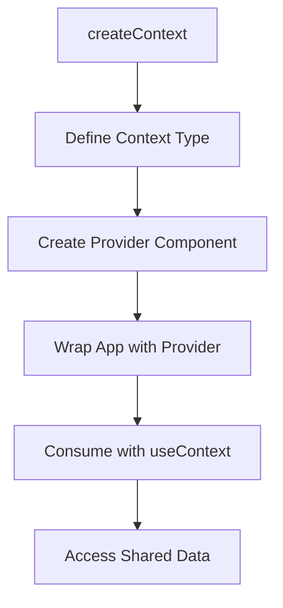
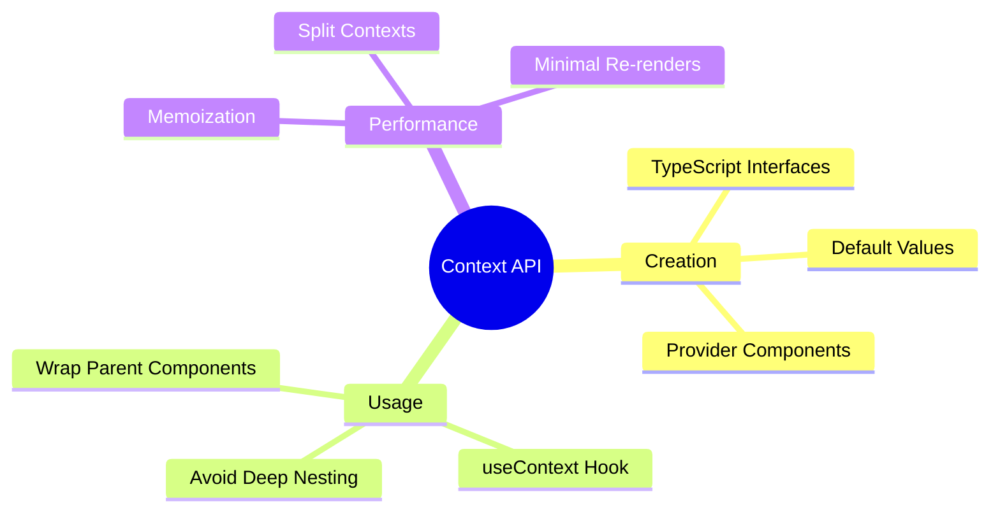
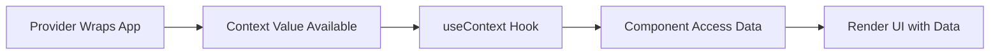
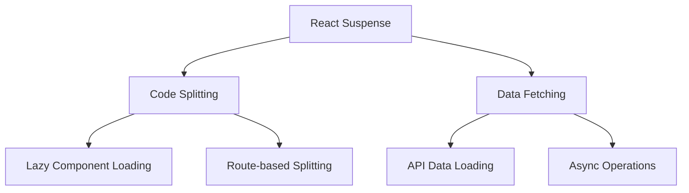
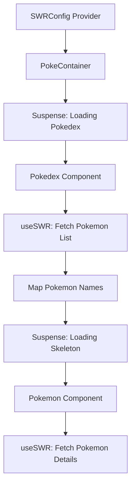
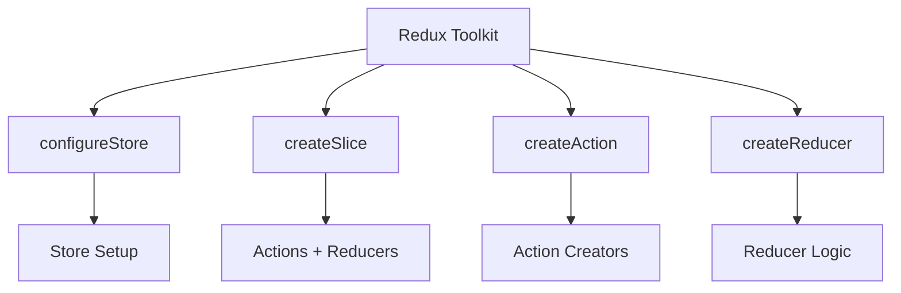
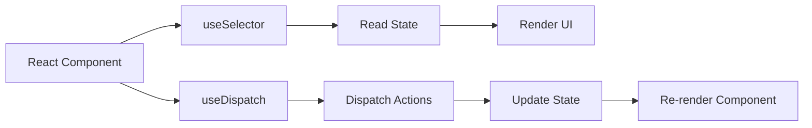
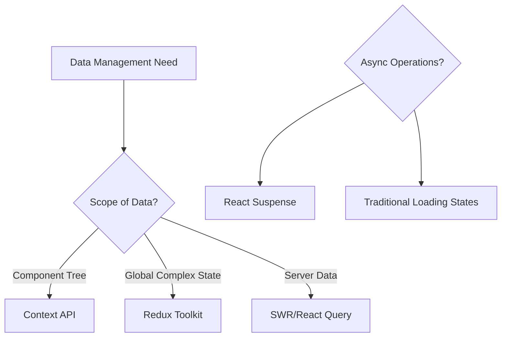
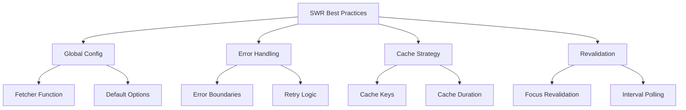

# React 18 Design Patterns - Data Management

## 🚀 **Data Management Overview**
- **Context API** - share data across components without prop drilling
- **React Suspense** - handle loading states and asynchronous operations
- **SWR** - data fetching with caching and revalidation
- **Redux Toolkit** - modern Redux with less boilerplate
- **Performance optimization** - efficient data flow and updates

## 🏗️ **React Context API**

### **Context Fundamentals:**
- **Global state** - share data without passing props through layers
- **Provider pattern** - wrap components to provide context
- **Consumer pattern** - access context data in child components
- **Type safety** - TypeScript interfaces for context structure

### **Context Creation Process:**

### **Context Architecture:**
- **Context creation** - `createContext<Type>(defaultValue)`
- **Provider component** - manages state and provides context value
- **Consumer components** - use `useContext` hook to access data
- **Data flow** - unidirectional from provider to consumers

### **GitHub Issues Example:**
- **Issue context** - shared state for GitHub issues data
- **Data fetching** - axios integration within provider
- **State management** - useState and useEffect in provider
- **Component consumption** - useContext hook in Issues component

### **Context Best Practices:**

## 🎣 **useContext Hook**

### **Hook Usage:**
- **Simple consumption** - `const { data } = useContext(MyContext)`
- **Destructuring** - extract specific values from context
- **Type safety** - TypeScript ensures correct context usage
- **Component isolation** - easy to test and maintain

### **Context Consumption Flow:**

### **Common Pitfalls:**
- **Missing provider** - undefined context when not wrapped
- **Performance issues** - entire context consumers re-render on changes
- **Over-usage** - using context for everything instead of local state
- **Debug difficulty** - complex data flow in large applications

## 🌀 **React Suspense with SWR**

### **Suspense Fundamentals:**
- **Component suspension** - pause rendering until condition met
- **Fallback UI** - loading states while waiting for data
- **Error boundaries** - handle errors in suspended components
- **Code splitting** - lazy load components and chunks

### **Suspense Use Cases:**

### **SWR Overview:**
- **Stale-While-Revalidate** - cache-first data fetching strategy
- **Automatic revalidation** - keeps data fresh automatically
- **Background updates** - fetch new data without blocking UI
- **Error handling** - built-in error states and retry logic

### **SWR Features:**
- **Cache management** - intelligent caching and invalidation
- **Request deduplication** - avoid duplicate requests
- **Focus revalidation** - refetch data when window regains focus
- **Interval polling** - automatic data refresh at intervals

## 🐾 **Pokedex Implementation**

### **Project Structure:**
- **Fetcher function** - centralized data fetching logic
- **SWRConfig provider** - global SWR configuration
- **Nested Suspense** - multiple loading states
- **Component hierarchy** - organized data flow

### **Data Flow:**

### **Loading States:**
- **Initial load** - "Loading Pokedex..." text fallback
- **Skeleton loading** - placeholder UI for individual Pokemon
- **Progressive loading** - components render as data becomes available
- **Error handling** - graceful fallbacks for failed requests

### **Performance Benefits:**
- **Caching** - subsequent visits use cached data
- **Background revalidation** - data stays fresh without user action
- **Request optimization** - SWR handles deduplication and timing
- **User experience** - smooth loading transitions

## 🔧 **Redux Toolkit**

### **Redux Toolkit Benefits:**
- **Less boilerplate** - simplified action and reducer creation
- **Built-in best practices** - opinionated setup with good defaults
- **Developer experience** - better debugging and development tools
- **Type safety** - excellent TypeScript integration

### **Key APIs:**

### **Store Configuration:**
- **configureStore** - sets up store with good defaults
- **DevTools integration** - automatic Redux DevTools support
- **Middleware setup** - includes commonly used middleware
- **Type inference** - automatic TypeScript types

### **Slice Creation:**
- **createSlice** - generates actions and reducers together
- **Immer integration** - write "mutative" logic safely
- **Action creators** - automatically generated from reducers
- **Type safety** - full TypeScript support

### **Component Integration:**

## 📊 **Data Management Patterns**

### **When to Use Each:**

### **Context API Use Cases:**
- **Theme management** - app-wide styling and themes
- **User authentication** - current user state and permissions
- **Language/i18n** - internationalization settings
- **Simple global state** - non-complex shared data

### **SWR Use Cases:**
- **API data fetching** - REST or GraphQL endpoints
- **Real-time updates** - data that changes frequently
- **Caching requirements** - reduce server load and improve UX
- **Background sync** - keep data fresh automatically

### **Redux Toolkit Use Cases:**
- **Complex state logic** - intricate state transformations
- **Multiple data sources** - coordinating various data streams
- **Time travel debugging** - need for state history
- **Predictable updates** - complex business logic requirements

## 🎯 **Best Practices**

### **Context API Guidelines:**
- **Split contexts** - separate concerns into different contexts
- **Memoization** - use useMemo for context values
- **Provider placement** - wrap at appropriate component level
- **Performance monitoring** - watch for unnecessary re-renders

### **Suspense Implementation:**
- **Granular boundaries** - multiple Suspense boundaries for better UX
- **Meaningful fallbacks** - skeleton screens over simple spinners
- **Error boundaries** - handle errors gracefully
- **Progressive loading** - prioritize above-the-fold content

### **SWR Configuration:**

### **Performance Optimization:**
- **Request deduplication** - avoid duplicate API calls
- **Cache management** - intelligent cache invalidation
- **Loading states** - provide immediate user feedback
- **Error recovery** - handle network failures gracefully

## 🔄 **Integration Patterns**

### **Combining Tools:**
- **Context + SWR** - global data fetching with local state
- **Redux + Suspense** - complex state with loading boundaries
- **SWR + Context** - cached server data with app state
- **All together** - comprehensive data management strategy

### **Migration Strategies:**
- **Gradual adoption** - introduce new patterns incrementally
- **Feature-based** - implement per feature or route
- **Performance monitoring** - measure impact of changes
- **Team training** - ensure team understands new patterns

### **Testing Considerations:**
- **Context testing** - mock providers in tests
- **Suspense testing** - handle async rendering in tests
- **SWR testing** - mock network requests and responses
- **Integration testing** - test complete data flow