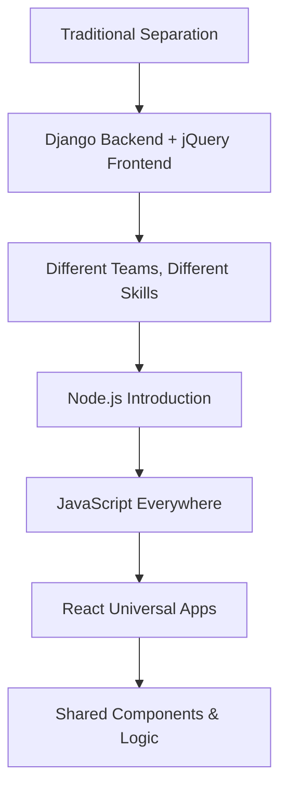
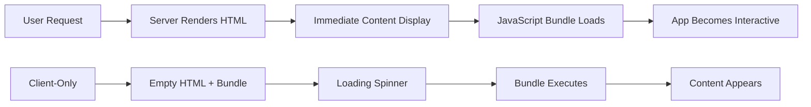
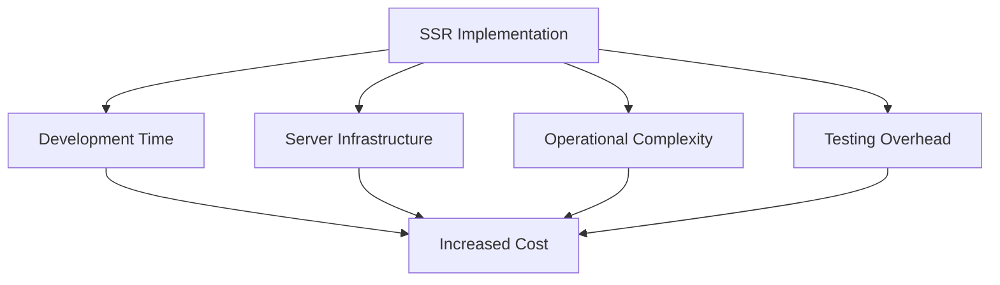
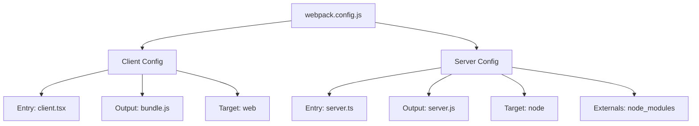
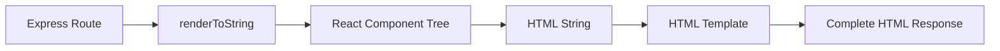
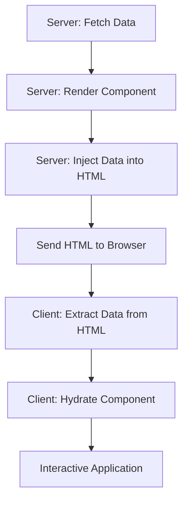
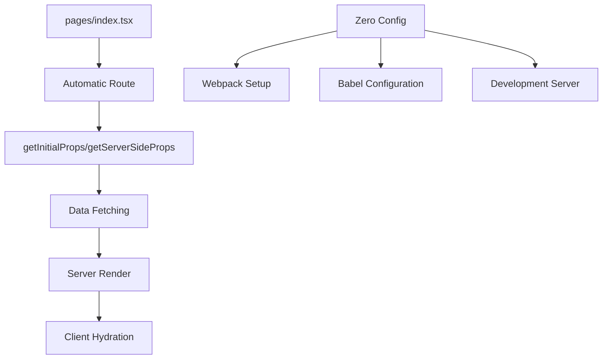
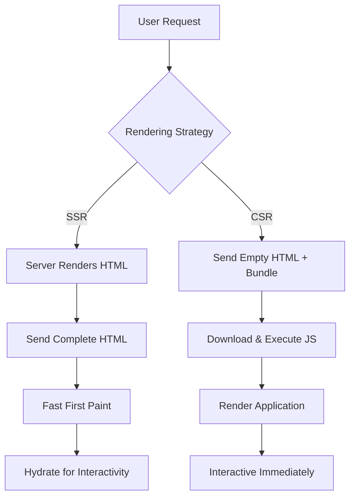
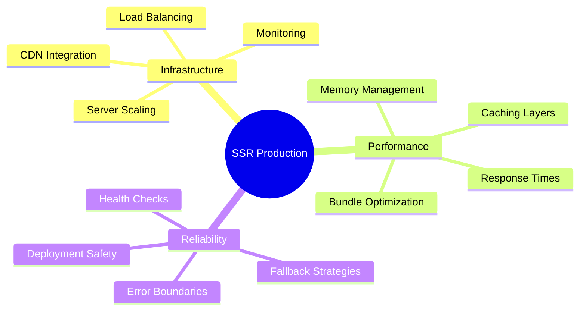

# React 18 Design Patterns - Server-Side Rendering

## 🚀 **Server-Side Rendering Overview**
- **Universal applications** - same code runs on server and client
- **SEO benefits** - search engines can crawl and index content
- **Performance improvements** - faster perceived load times
- **Social sharing** - proper meta tags for social media platforms
- **Complexity trade-offs** - additional server infrastructure and maintenance

## 🌐 **Universal Applications Concept**

### **Universal vs Isomorphic:**
- **Universal** - same application code, different execution environments
- **Isomorphic** - applications that look the same on server and client
- **Code sharing** - reuse logic, models, and views between server/client
- **Single language** - JavaScript on both frontend and backend

### **Evolution Timeline:**


### **Benefits of Universal Architecture:**
- **Shared knowledge** - developers work on both sides
- **Code reuse** - components work on server and client
- **Consistent behavior** - same logic execution everywhere
- **Reduced duplication** - single source of truth for business logic

## 🎯 **Reasons for Implementing SSR**

### **SEO Implementation:**
- **Search engine crawling** - content visible to search bots
- **Google JavaScript limitations** - not all JS features supported
- **Social media sharing** - Open Graph meta tags work properly
- **Content indexing** - meaningful content extracted from HTML

### **Performance Benefits:**


### **Common Code Base Advantages:**
- **Single language** - JavaScript for all development
- **Knowledge sharing** - team members work across stack
- **Reduced redundancy** - shared utilities and helpers
- **Faster development** - familiar patterns everywhere

### **Performance Considerations:**
- **Perceived speed** - users see content immediately
- **Mobile optimization** - better experience on slow connections
- **Conversion rates** - faster loading improves business metrics
- **Bundle loading** - client-side JavaScript still needed

## ⚠️ **SSR Complexity and Trade-offs**

### **Development Complexity:**
- **Server maintenance** - additional infrastructure requirements
- **Build configuration** - webpack setup for server and client
- **Data flow management** - coordinate server and client state
- **Debugging challenges** - issues across server and client

### **Operational Costs:**


### **When to Consider SSR:**
- **SEO requirements** - content needs to be crawlable
- **Performance issues** - client-side app loads too slowly
- **Social sharing** - proper meta tags required
- **Already optimized** - client-side optimizations exhausted

### **Recommendation Strategy:**
- **Start client-side** - build functional app first
- **Measure performance** - identify actual bottlenecks
- **Add SSR incrementally** - when genuinely needed
- **Monitor complexity** - balance benefits vs maintenance cost

## 🛠️ **Basic SSR Implementation**

### **Project Setup Requirements:**
- **webpack configuration** - separate client and server bundles
- **Babel transpilation** - ES6 and JSX support
- **Node.js externals** - exclude Node modules from server bundle
- **Express server** - handle HTTP requests and routing

### **Webpack Configuration:**


### **Application Structure:**
- **App component** - shared React component
- **Client entry** - ReactDOM.render for browser
- **Server entry** - Express server with renderToString
- **HTML template** - server-side HTML structure

### **Server-Side Flow:**


## 📊 **Data Fetching in SSR**

### **Data Loading Challenges:**
- **useEffect limitation** - doesn't run on server
- **Async rendering** - renderToString is synchronous
- **Data timing** - need data before component renders
- **State synchronization** - server and client must match

### **Data Fetching Strategy:**
- **Pre-render fetching** - load data before renderToString
- **Props passing** - provide data as component props
- **Dehydration** - serialize data into HTML
- **Hydration** - restore data on client-side

### **Dehydration/Hydration Process:**


### **Implementation Steps:**
- **Server fetch** - `fetch('api/data').then(data => ...)`
- **Component props** - `<App data={data} />`
- **HTML injection** - `window.data = ${JSON.stringify(data)}`
- **Client hydration** - `ReactDOM.hydrate(<App data={window.data} />)`

## 🚀 **Next.js Framework**

### **Next.js Benefits:**
- **Zero configuration** - works out of the box
- **Automatic SSR** - built-in server-side rendering
- **File-based routing** - pages directory structure
- **Hot reloading** - instant development feedback

### **Next.js Architecture:**


### **getInitialProps Pattern:**
- **Universal method** - runs on both server and client
- **Async data loading** - await API calls
- **Automatic prop passing** - data available as props
- **Page-level data fetching** - per-route data loading

### **Next.js Implementation:**
```javascript
// Simplified Next.js component
const App = ({ gists }) => (
  <ul>
    {gists.map(gist => (
      <li key={gist.id}>{gist.description}</li>
    ))}
  </ul>
)

App.getInitialProps = async () => {
  const response = await fetch('api/gists')
  const gists = await response.json()
  return { gists }
}
```

### **Development Experience:**
- **Hot module replacement** - instant code updates
- **Automatic code splitting** - optimized bundles
- **TypeScript support** - built-in TypeScript integration
- **Production optimization** - automatic performance optimizations

## 🎭 **SSR vs Client-Side Rendering**

### **SSR Advantages:**
- **SEO friendly** - content visible to crawlers
- **Fast first paint** - immediate content display
- **Social sharing** - proper meta tags
- **Mobile performance** - better on slow connections

### **CSR Advantages:**
- **Simpler deployment** - static file hosting
- **Rich interactions** - immediate user feedback
- **Caching benefits** - CDN distribution
- **Development simplicity** - single bundle

### **Rendering Comparison:**


## 🔧 **Implementation Best Practices**

### **Performance Optimization:**
- **Code splitting** - separate vendor and app bundles
- **Caching strategies** - cache rendered HTML when possible
- **Asset optimization** - minimize bundle sizes
- **Progressive enhancement** - graceful degradation without JS

### **Development Workflow:**
- **Environment separation** - different configs for dev/prod
- **Error handling** - graceful fallbacks for SSR failures
- **Monitoring** - track server rendering performance
- **Testing strategy** - test both server and client rendering

### **Production Considerations:**


### **Security Considerations:**
- **Data sanitization** - clean data before rendering
- **XSS prevention** - escape HTML content properly
- **State exposure** - don't leak sensitive server data
- **HTTPS enforcement** - secure data transmission

## 🔄 **Migration Strategies**

### **Gradual SSR Adoption:**
- **Route-by-route** - implement SSR per page
- **Feature flags** - toggle SSR for testing
- **Performance monitoring** - measure impact
- **Rollback plans** - quick revert strategies

### **From CSR to SSR:**
- **Audit current app** - identify SSR candidates
- **Data flow analysis** - understand state dependencies
- **Component preparation** - ensure SSR compatibility
- **Testing coverage** - verify functionality across environments

### **Framework Migration:**
- **Next.js adoption** - gradual framework introduction
- **Custom to framework** - migrate from custom SSR setup
- **Configuration transfer** - preserve existing optimizations
- **Team training** - ensure team understands new patterns