# React 18 Design Patterns - GraphQL

## 🚀 **GraphQL Project Overview**
- **Full-stack implementation** - backend GraphQL API + frontend React app
- **Authentication system** - complete login/registration with JWT
- **PostgreSQL database** - production-ready data storage
- **Apollo Server/Client** - GraphQL server and client integration
- **Real-world patterns** - practical implementation techniques

## 🗄️ **PostgreSQL Database Setup**

### **Database Installation:**
- **macOS with Homebrew** - `brew install postgres`
- **Symbolic links** - configure LaunchAgents for auto-start
- **Aliases setup** - `pg_start` and `pg_stop` commands
- **Initial database** - `createdb \`whoami\`` for user database

### **Database Management:**
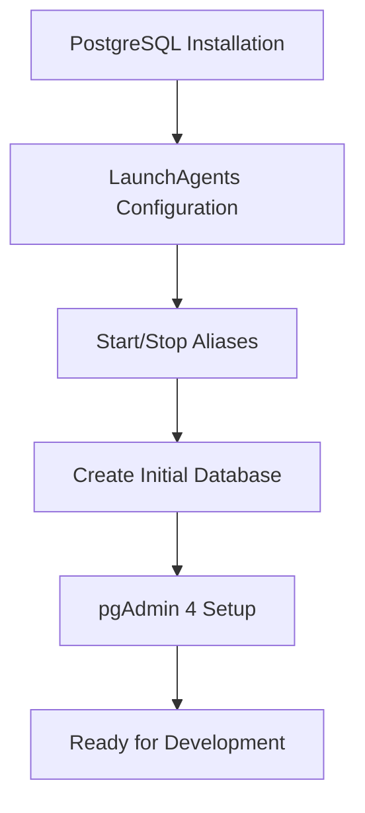

### **PostgreSQL Benefits:**
- **Data security** - robust ACID compliance
- **Extensibility** - supports custom data types and functions
- **Performance** - handles high concurrent user loads
- **Open source** - free with active community support
- **Standards compliance** - follows SQL standards

## 🛠️ **Backend Architecture**

### **Technology Stack:**
- **Apollo Server 4.7.3** - GraphQL server implementation
- **Express.js** - web application framework
- **Sequelize ORM** - database object-relational mapping
- **JWT** - JSON Web Token authentication
- **TypeScript** - type-safe development

### **Project Structure:**
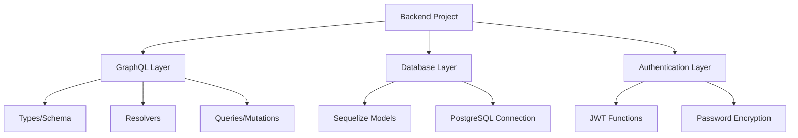

### **Environment Configuration:**
- **.env file** - database credentials and secrets
- **Config structure** - server, security, database settings
- **Type safety** - TypeScript interfaces for configuration
- **Environment separation** - development vs production settings

## 📋 **GraphQL Schema Design**

### **Scalar Types:**
- **UUID** - unique identifier format
- **Datetime** - timestamp formatting
- **JSON** - flexible data structures
- **Custom types** - application-specific data types

### **User Type Definition:**
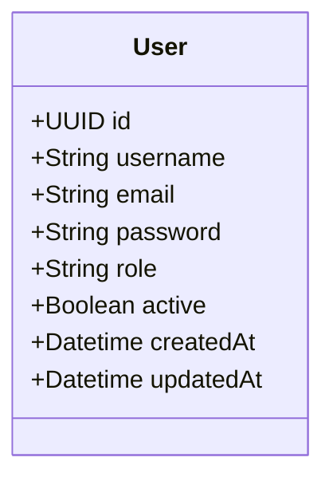

### **Query Operations:**
- **getUsers** - retrieve all users list
- **getUser(at: String!)** - get user by access token
- **Authentication validation** - verify user session
- **Role-based access** - permission checking

### **Mutation Operations:**
- **createUser(input: CreateUserInput)** - user registration
- **login(input: LoginInput)** - user authentication
- **Input validation** - ensure data integrity
- **Response formatting** - consistent return types

### **Input Types:**
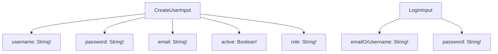

## 🔧 **Apollo Server Configuration**

### **Server Setup Process:**
- **Express integration** - Apollo Server with Express middleware
- **CORS configuration** - cross-origin request handling
- **Schema creation** - combine types and resolvers
- **Plugin system** - drain HTTP server plugin for graceful shutdown

### **Server Architecture:**
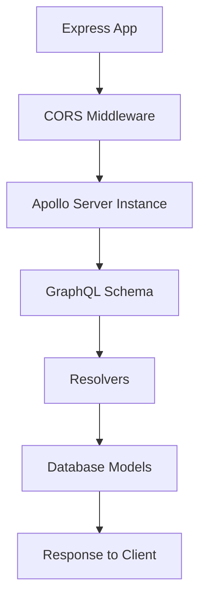

### **Database Synchronization:**
- **Sequelize sync** - model-to-table synchronization
- **Alter vs Force** - incremental vs complete table recreation
- **Development safety** - careful data preservation
- **Model changes** - automatic schema updates

## 🗃️ **Sequelize ORM Integration**

### **Model Definition:**
- **User model** - complete user entity structure
- **Field validation** - email, username, password rules
- **Hooks system** - beforeCreate password encryption
- **Relationships** - foreign key associations

### **Database Features:**
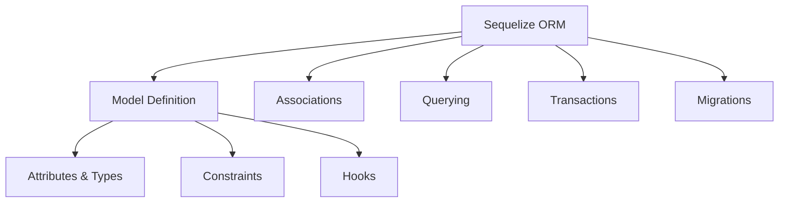

### **Validation System:**
- **Built-in validators** - email format, alphanumeric checks
- **Custom constraints** - username length, uniqueness
- **Error handling** - meaningful validation messages
- **Database integrity** - prevent invalid data insertion

## 🔐 **Authentication Implementation**

### **JWT Workflow:**
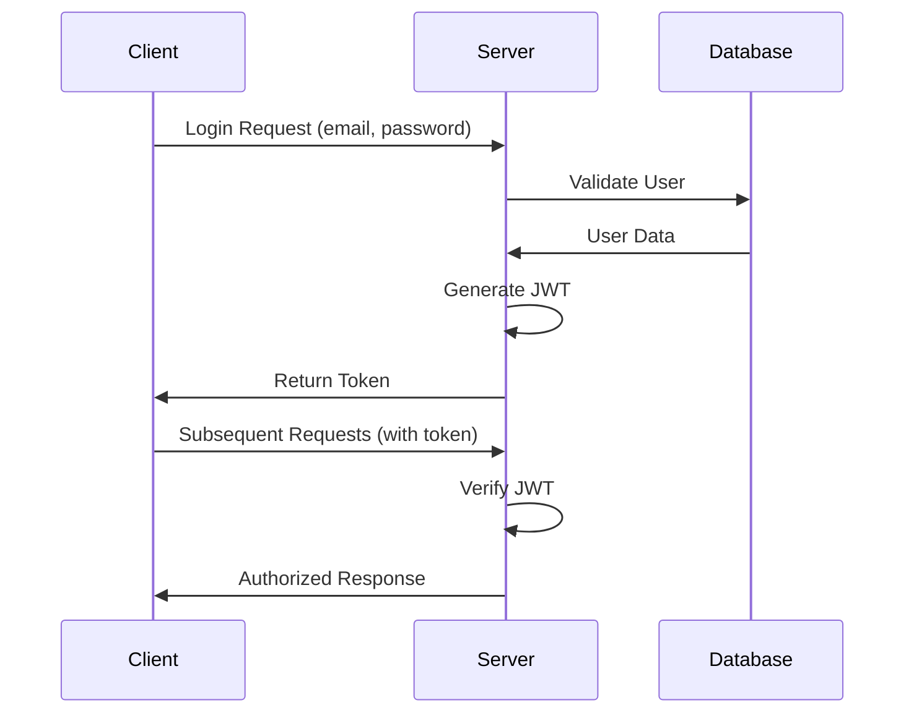

### **Security Functions:**
- **Password encryption** - SHA1 hashing with salt
- **Token creation** - JWT signing with secret key
- **Token verification** - validate and decode tokens
- **Session management** - token expiration handling

### **Authentication Flow:**
- **User validation** - check email existence
- **Password verification** - compare encrypted passwords
- **Account status** - ensure account is active
- **Token generation** - create signed JWT for session

## 🔍 **GraphQL Resolvers**

### **Resolver Structure:**
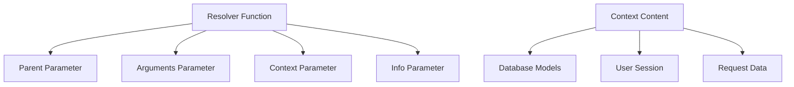

### **Query Resolvers:**
- **getUsers** - simple database query with findAll
- **getUser** - token validation + user lookup
- **Error handling** - graceful failure responses
- **Data transformation** - format response data

### **Mutation Resolvers:**
- **createUser** - input validation + user creation
- **login** - authentication logic + token return
- **Input processing** - spread operator for clean code
- **Response formatting** - consistent return structures

## 🌐 **Frontend Integration**

### **Webpack 5 Configuration:**
- **Client/Server split** - separate bundles for different targets
- **TypeScript support** - ts-loader configuration
- **Development server** - hot module replacement
- **Production optimization** - code splitting and minification

### **Apollo Client Setup:**
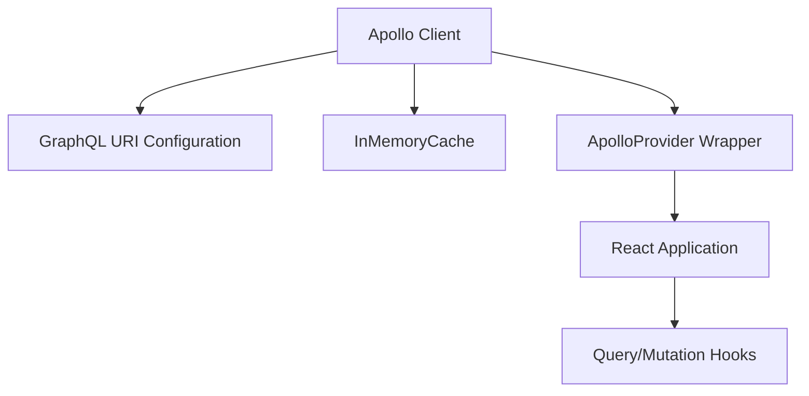

### **React Architecture:**
- **Context providers** - user authentication state
- **Protected routes** - middleware-based access control
- **Form components** - login and registration interfaces
- **Cookie management** - persistent session storage

### **Authentication Flow:**
- **Login form** - email/password input handling
- **GraphQL mutation** - login request to backend
- **Token storage** - save JWT in secure cookies
- **Session validation** - verify token on page loads

## 🔒 **Security Implementation**

### **Backend Security:**
- **Password hashing** - encrypted storage with hooks
- **JWT signing** - secure token generation
- **Input validation** - Sequelize model constraints
- **Role-based access** - permission checking

### **Frontend Security:**
- **Cookie security** - httpOnly and secure flags
- **Token validation** - verify JWT before requests
- **Route protection** - middleware authentication
- **Error handling** - secure error message display

### **Security Best Practices:**
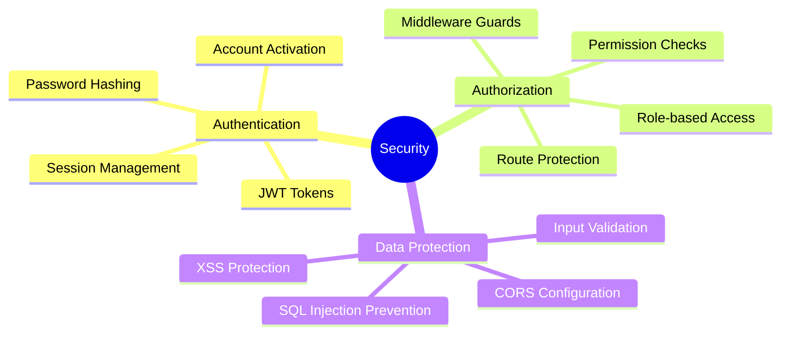

## 🧪 **Testing and Development**

### **GraphQL Playground:**
- **Interactive testing** - query and mutation execution
- **Schema exploration** - documentation browser
- **Variable input** - JSON parameter passing
- **Response inspection** - result analysis

### **Development Workflow:**
- **Hot reloading** - instant code updates
- **Error logging** - comprehensive debugging info
- **Database monitoring** - SQL query inspection
- **Token debugging** - JWT payload examination

### **Testing Scenarios:**
- **User registration** - create new accounts
- **Login validation** - authentication testing
- **Protected routes** - access control verification
- **Token expiration** - session timeout handling

## 🚀 **Production Considerations**

### **Deployment Preparation:**
- **Environment variables** - secure configuration management
- **Database optimization** - connection pooling and indexing
- **Error handling** - comprehensive error boundaries
- **Monitoring setup** - logging and alerting systems

### **Performance Optimization:**
- **Query optimization** - efficient database queries
- **Caching strategies** - Apollo Client cache configuration
- **Bundle optimization** - code splitting and lazy loading
- **Server optimization** - Express middleware configuration

### **Scalability Patterns:**
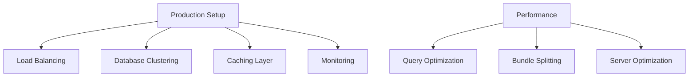