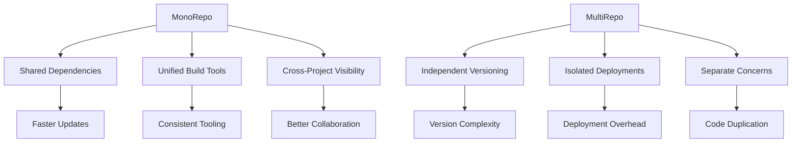
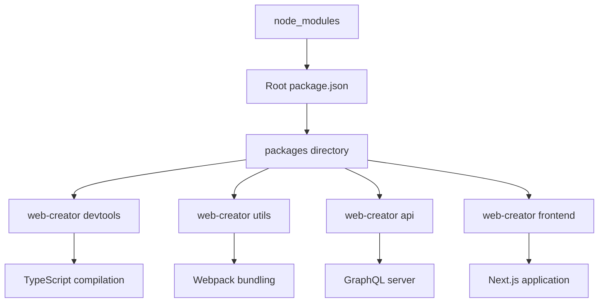
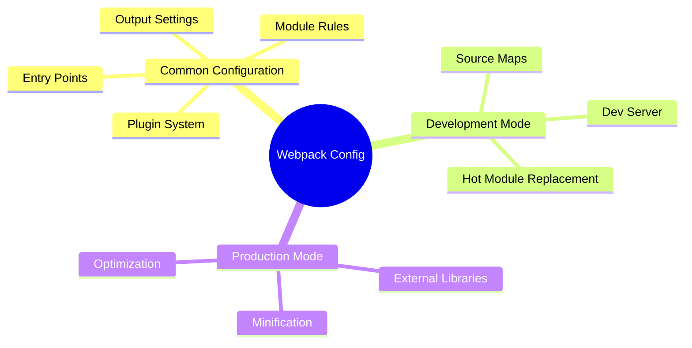
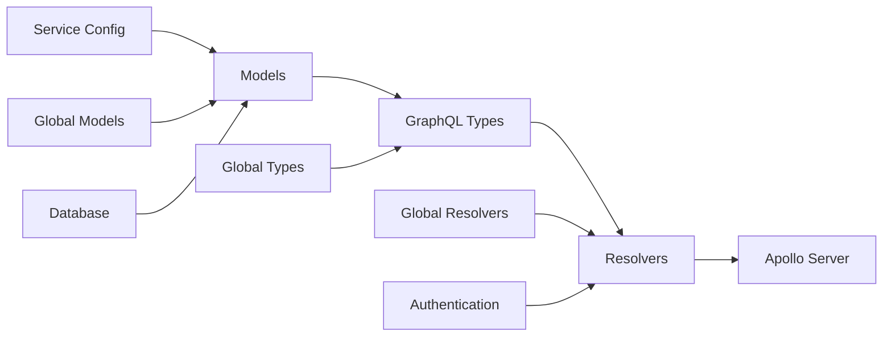
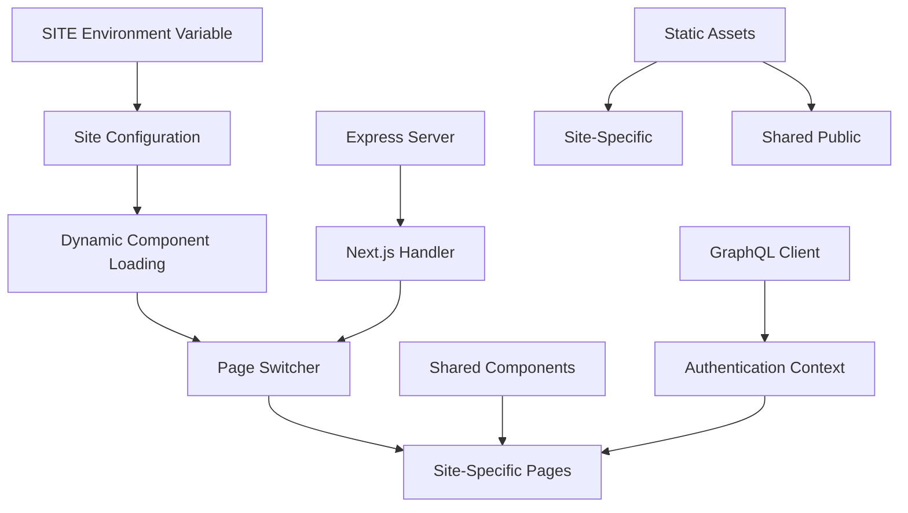
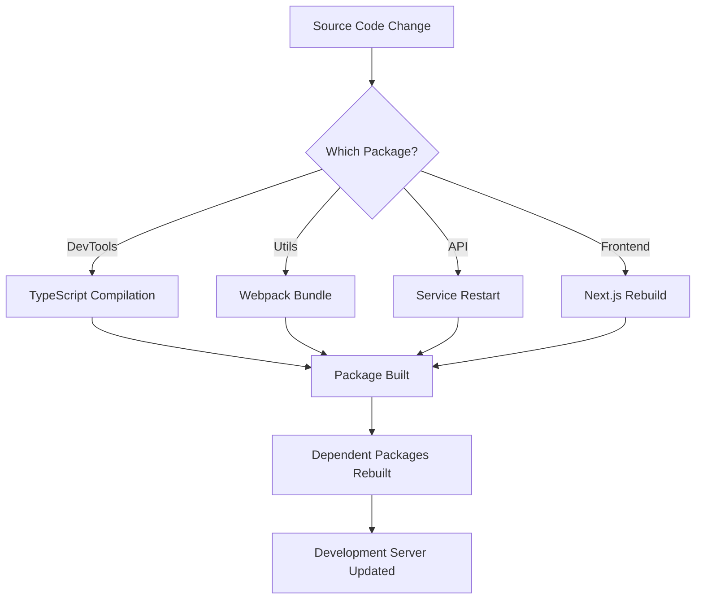

# React 18 Design Patterns - MonoRepo Architecture

## 🏗️ **MonoRepo Architecture Overview**
- **Single repository approach** - All applications, components, and libraries in one place
- **Shared dependencies** - Keep all dependencies synchronized across organization
- **Unified versioning** - Stop wasting time updating dependencies across separate projects
- **Better collaboration** - All developers have access to entire codebase
- **Easier onboarding** - New team members understand complete system quickly

## ⚖️ **MonoRepo vs MultiRepo Trade-offs**

### **MonoRepo Advantages:**
- **Easier sharing** - Reuse code and tools across multiple projects effortlessly
- **No version conflicts** - Everything uses same component versions
- **Atomic changes** - Update all projects simultaneously in single commit
- **Grouped changes** - Related components stay synchronized
- **Complete visibility** - All developers see entire system architecture

### **MonoRepo Challenges:**
- **Performance issues** - Can become slow with excessive size
- **Increased complexity** - More moving parts to manage
- **Build overhead** - Longer build times for entire repository

## 📦 **NPM Workspaces Setup**

### **Root Configuration:**
- **Private package** - Root package.json marked as private
- **Workspaces array** - Define packages directory pattern (`packages/*`)
- **Centralized node_modules** - Dependencies installed at root level
- **Package naming** - Use scoped naming (`@project-name/package-name`)

### **Package Structure:**
- **Consistent versioning** - All packages use same version number
- **Dependency linking** - Internal packages reference each other by name
- **Build scripts** - Standardized build commands across packages

## 🛠️ **DevTools Package Architecture**

### **Webpack Configuration System:**
- **Common configuration** - Shared webpack settings across packages
- **Environment-specific configs** - Development vs production builds
- **Modular approach** - Separate files for different concerns
- **Package compilation** - Transform TypeScript packages into distributable code

### **Configuration Types:**
- **Web packages** - Browser-targeted applications (React apps)
- **Package compilation** - Library bundling for npm distribution
- **Development server** - Hot reload and debugging support
- **Production optimization** - Minification and tree shaking

### **Webpack Layers:**

## 🔧 **TypeScript Integration**

### **Configuration Strategy:**
- **Base configuration** - `tsconfig.common.json` with shared settings
- **Package-specific configs** - Each package extends base configuration
- **Path mapping** - `@web-creator/*` aliases for clean imports
- **Declaration generation** - Automatic `.d.ts` file creation

### **Compilation Flow:**
- **TypeScript compilation** - Transform TS to JS with type checking
- **Webpack bundling** - Bundle compiled code for distribution
- **Type safety** - Maintain types across package boundaries

## 🌐 **Multi-Service API Architecture**

### **Service Configuration:**
- **Environment-based settings** - Different configs per deployment
- **Database connectivity** - Sequelize ORM with PostgreSQL
- **Service isolation** - Each service has independent models and resolvers
- **Shared authentication** - Common user model across services

### **GraphQL Schema Design:**
- **Type merging** - Combine global and service-specific types
- **Resolver composition** - Merge resolvers from different sources
- **Union types** - Handle success/error responses elegantly
- **Scalar types** - Custom UUID, DateTime, JSON scalars

## 🖥️ **Multi-Site Frontend System**

### **Site Switching Architecture:**
- **Dynamic imports** - Load site-specific components on demand
- **Router parameter handling** - Extract and process URL parameters
- **Page component mapping** - Map URLs to React components
- **Environment configuration** - Site-specific settings and API endpoints

### **Authentication System:**
- **Shared login component** - Reusable across all sites
- **Site-specific cookies** - Independent sessions per site
- **Context providers** - React Context for user state management
- **GraphQL integration** - Login mutations and user queries

### **Next.js Integration:**
- **Custom server** - Express server with Next.js integration
- **Static file serving** - Site-specific and shared static assets
- **Middleware protection** - Route-level authentication guards
- **Server-side rendering** - SEO-friendly page rendering

## 🔐 **Authentication & Authorization**

### **User Model Design:**
- **UUID primary keys** - Unique identifiers across services
- **Role-based access** - Flexible permission system
- **Password encryption** - Secure password storage with hooks
- **Email validation** - Built-in validation rules

### **JWT Token System:**
- **Site-specific tokens** - Independent authentication per site
- **Token validation** - GraphQL resolver for user verification
- **Cookie management** - Automatic token storage and retrieval
- **Session management** - Configurable token expiration

## 🚀 **Build & Deployment Strategy**

### **Package Compilation:**
- **Incremental builds** - Only rebuild changed packages
- **Dependency tracking** - Automatic rebuilds when dependencies change
- **Parallel processing** - Build multiple packages simultaneously
- **Output optimization** - Minified production bundles

### **Development Workflow:**
- **Hot reloading** - Instant updates during development
- **Type checking** - Real-time TypeScript validation
- **Linting integration** - Code quality enforcement
- **Testing automation** - Automated test execution

