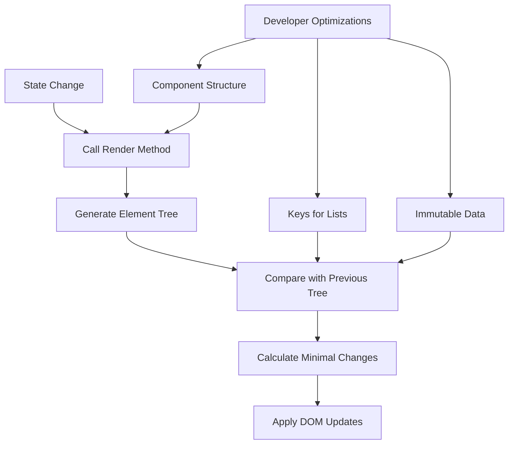
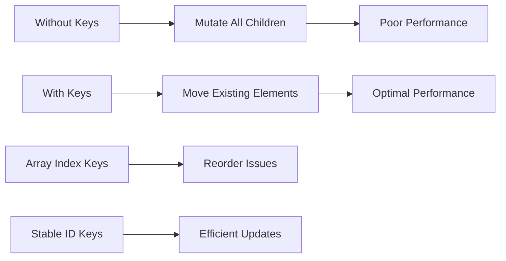
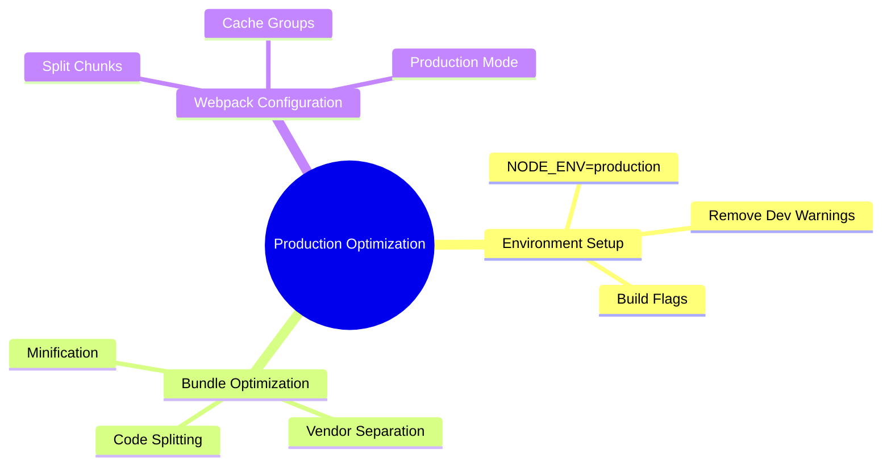
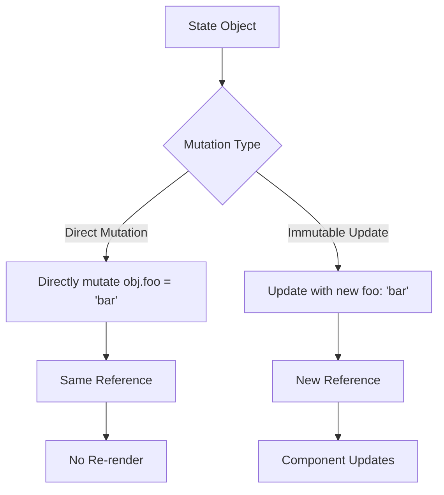
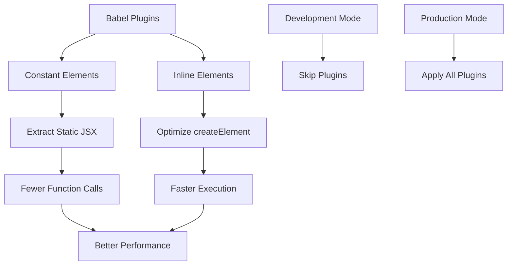

# React 18 Design Patterns - Application Performance

## ⚡ **Performance Fundamentals**
- **DOM operations are expensive** - React minimizes DOM touches through smart algorithms
- **Reconciliation process** - React compares element trees to find minimal change set
- **Developer responsibility** - Some optimizations require manual intervention
- **Avoid premature optimization** - Only optimize when performance issues are identified
- **Declarative approach** - Describe UI state, let React handle efficient updates

## 🔄 **Reconciliation Algorithm**

### **Core Principles:**
- **Tree comparison** - React compares previous and current element trees
- **Minimal operations** - Calculate smallest set of DOM changes needed
- **Two assumptions** - Different types render different trees, keys mark stable children
- **Recursive rendering** - Calls render method on component and all children

### **Reconciliation Process:**

## 🔑 **Keys for List Optimization**

### **Key Usage Patterns:**
- **Unique identifiers** - Use existing IDs from data when possible
- **Stable across renders** - Keys should remain consistent for same items
- **Sibling uniqueness** - Keys only need to be unique among siblings
- **Avoid array indices** - Poor performance when list order changes

### **List Performance Examples:**
- **Adding at end** - Efficient without keys
- **Adding at beginning** - Inefficient without keys, requires mutation of all children
- **Reordering items** - Keys prevent unnecessary re-renders and DOM manipulations

## 🛠️ **Production Optimization Techniques**

### **Environment Configuration:**
- **NODE_ENV=production** - Remove development warnings and checks
- **Bundle splitting** - Separate application and vendor code
- **Code minification** - Reduce bundle size through compression
- **DefinePlugin usage** - Replace environment variables at build time

### **Webpack Optimization:**
- **Split chunks configuration** - Automatic vendor/app bundle separation
- **Production mode** - Built-in optimizations and minification
- **Cache optimization** - Leverage browser caching with proper naming

## 🔧 **Immutability for Performance**

### **Shallow Comparison Issues:**
- **Object mutation problems** - React.memo can't detect internal object changes
- **Reference equality** - Shallow comparison only checks object references
- **State update patterns** - Create new objects instead of mutating existing ones

### **Immutable Update Patterns:**
- **Object.assign()** - Create new object with merged properties
- **Spread operator** - ES6 syntax for object/array copying
- **Immutable libraries** - External tools for complex immutable operations

### **Common Mutation Mistakes:**

## 🎯 **Babel Performance Plugins**

### **Constant Elements Transformer:**
- **Static element extraction** - Move unchanging elements out of render
- **Reduced createElement calls** - Avoid unnecessary JSX transformations
- **Build-time optimization** - Transform happens during compilation
- **Production-only usage** - Keep debugging capabilities in development

### **Inline Elements Transform:**
- **Optimized JSX output** - Replace createElement with faster alternatives
- **Runtime performance** - Faster execution through optimized calls
- **Bundle size impact** - Can affect final bundle characteristics

### **Plugin Configuration:**
- **Development vs Production** - Different plugin sets for different environments
- **Babel configuration** - .babelrc setup for plugin activation
- **Plugin ordering** - Some plugins have dependencies on execution order

## 📊 **Performance Monitoring Strategy**

### **Measurement Approaches:**
- **Identify bottlenecks first** - Profile before optimizing
- **Component-level analysis** - Isolate performance issues to specific components
- **Bundle analysis** - Understand what's contributing to bundle size
- **Runtime profiling** - Monitor actual user experience metrics

### **Optimization Priorities:**
- **Production builds** - Always use optimized React builds
- **Bundle splitting** - Reduce initial load times
- **Component structure** - Design for minimal re-renders
- **Data patterns** - Use immutable updates consistently

### **Development vs Production:**
- **Development focus** - Debugging and developer experience
- **Production focus** - Runtime performance and bundle size
- **Build configuration** - Different webpack setups for each environment
- **Plugin activation** - Conditional optimization based on environment