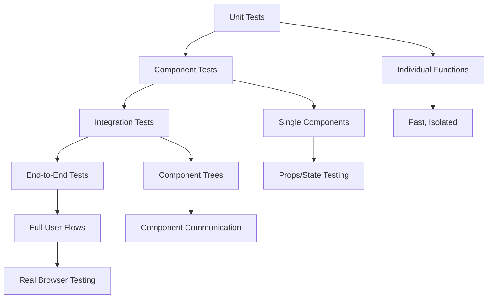
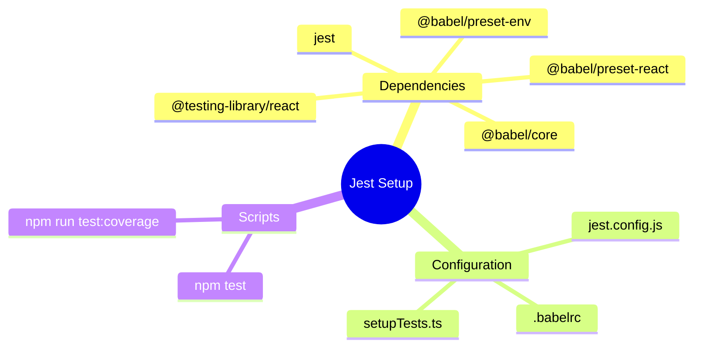
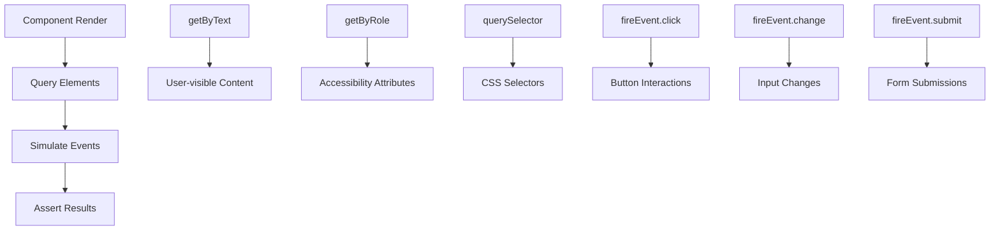
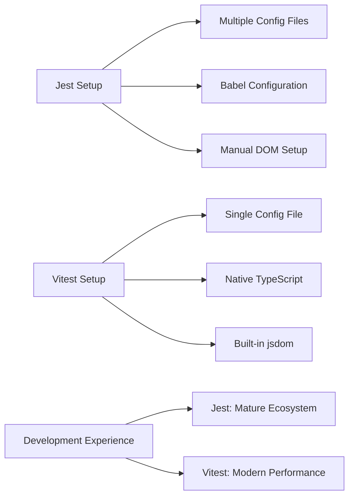
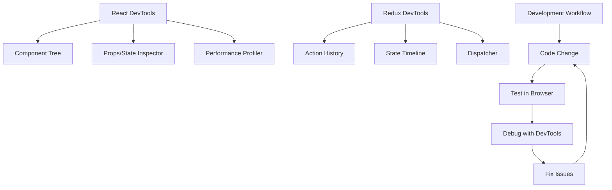

# React 18 Design Patterns - Testing

## 🧪 **Testing Benefits & Fundamentals**
- **Confidence in code** - Tests ensure functionality works as expected before shipping
- **Faster development** - Well-tested code allows faster feature development and refactoring
- **Regression prevention** - Tests catch bugs when new code breaks existing functionality
- **Component isolation** - React components can be tested as pure functions with clear boundaries
- **Console-based testing** - Node.js testing is faster and more predictable than browser testing

## 🎯 **React Testing Philosophy**

### **Component Testing Strategy:**
- **Pure component approach** - Test components as functions with inputs (props) and outputs (JSX)
- **State coverage** - Test all possible component states and transitions
- **Event handling** - Verify user interactions trigger correct behaviors
- **Edge case testing** - Handle null props, errors, and boundary conditions
- **Integration testing** - Test component trees working together

### **Testing Levels:**

## ⚙️ **Jest Setup & Configuration**

### **Project Setup:**
- **Jest installation** - Testing framework with minimal configuration
- **Babel integration** - ES6 and JSX transpilation for tests
- **React DOM setup** - Component rendering in test environment
- **jsdom environment** - Browser-like environment in Node.js

### **Configuration Files:**
- **jest.config.js** - Test environment and setup configuration
- **.babelrc** - Transpilation presets for test code
- **setupTests.ts** - Global test utilities and matchers
- **Package.json scripts** - Test running and coverage commands

## 🔬 **React Testing Library**

### **Testing Approach:**
- **User-focused testing** - Test how users interact with components
- **DOM queries** - Find elements by text, labels, roles (not implementation details)
- **Event simulation** - fireEvent for user interactions
- **Accessibility-first** - Encourages accessible component design

### **Core Methods:**
- **render()** - Mount component in test environment
- **getByText()** - Find elements by visible text content
- **fireEvent** - Simulate user interactions (clicks, input changes)
- **cleanup()** - Clean up DOM after tests

### **Testing Patterns:**

## 🚀 **Vitest as Jest Alternative**

### **Vitest Advantages:**
- **Vite-based** - Built on fast Vite build tool
- **Jest-compatible API** - Easy migration from Jest
- **TypeScript native** - Better TypeScript support
- **ES modules** - Native ESM support without configuration

### **Configuration Features:**
- **Global test functions** - Optional global imports for describe, it, expect
- **In-source testing** - Write tests alongside component code
- **UI interface** - Browser-based test runner and debugger
- **Hot reload** - Fast test re-running during development

### **Setup Comparison:**

## 🎯 **Event Testing Strategies**

### **User Interaction Testing:**
- **Input changes** - Test form field updates and validation
- **Button clicks** - Verify button handlers and state changes
- **Form submissions** - Test complete form workflows
- **Conditional rendering** - Test UI changes based on state

### **Event Testing Pattern:**
- **Setup component state** - Render with initial props
- **Simulate user action** - fireEvent for interaction
- **Assert state change** - Verify expected outcomes
- **Test side effects** - Check function calls, API requests

## 🛠️ **Development Tools**

### **React DevTools:**
- **Component inspection** - View component tree and props/state
- **Real-time editing** - Modify props/state to test behavior
- **Performance profiling** - Trace component updates and renders
- **Chrome extension** - Integrated browser debugging

### **Redux DevTools:**
- **Action tracking** - Monitor dispatched actions and state changes
- **Time travel debugging** - Replay actions and revert state
- **State inspection** - Deep dive into Redux store structure
- **Performance monitoring** - Track action timing and payload sizes

## 📊 **Testing Coverage & Quality**

### **Coverage Metrics:**
- **Line coverage** - Percentage of code lines executed
- **Function coverage** - Percentage of functions called
- **Branch coverage** - Percentage of code branches tested
- **Statement coverage** - Percentage of statements executed

### **Quality Indicators:**
- **Test maintainability** - Easy to update when code changes
- **Test reliability** - Consistent results across runs
- **Test speed** - Fast feedback loop for developers
- **Test clarity** - Easy to understand test intentions

### **Best Practices:**
- **Test behavior, not implementation** - Focus on user-visible outcomes
- **Avoid testing internal details** - Don't test private methods or state
- **Use descriptive test names** - Clear test intentions and scenarios
- **Keep tests focused** - One assertion per test when possible