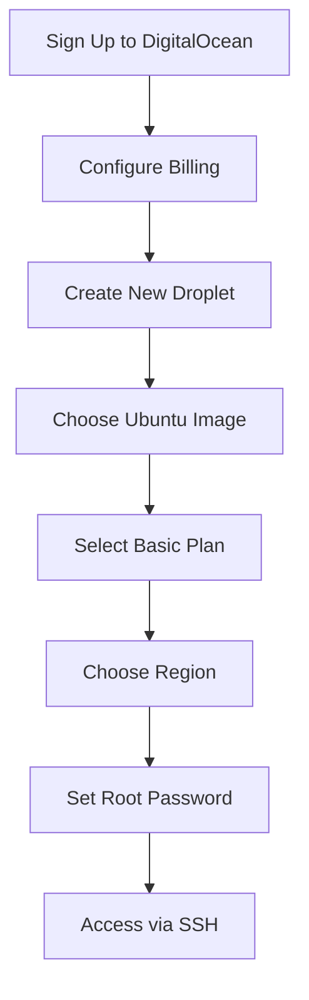
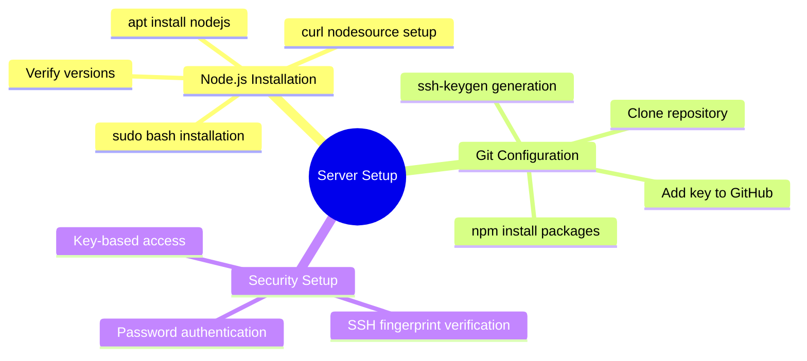
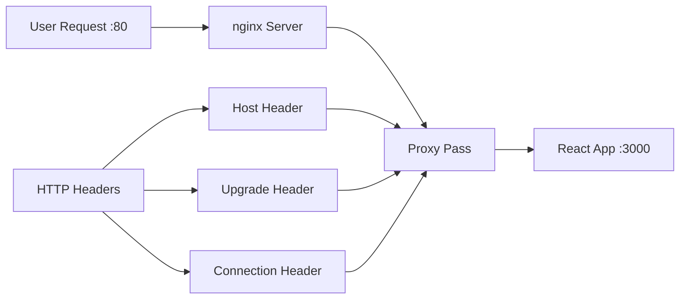
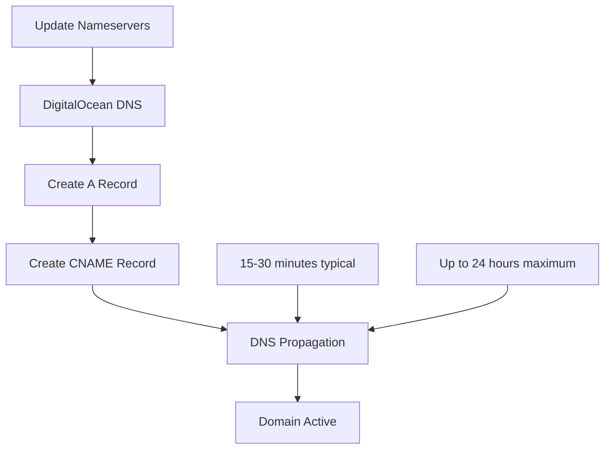
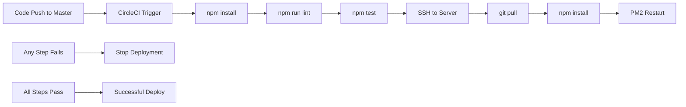
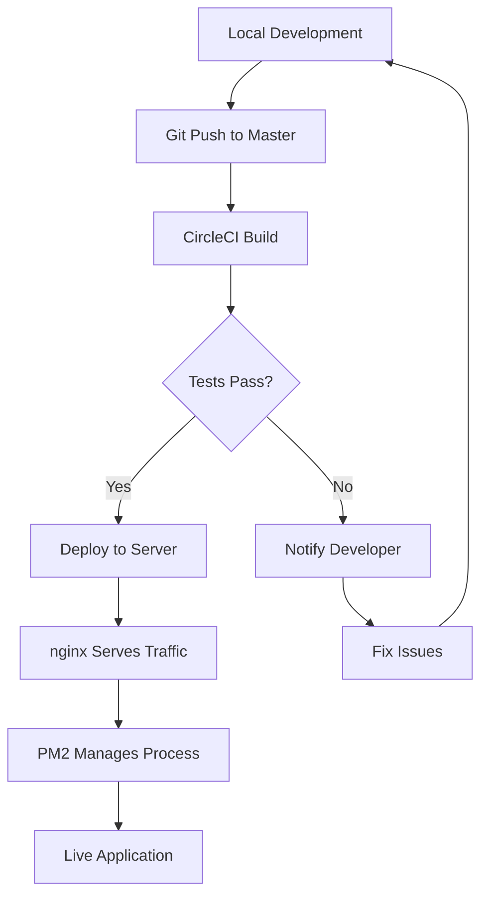

# React 18 Design Patterns - Deployment

## 🚀 **Production Deployment Overview**
- **DigitalOcean cloud service** - Affordable and easy-to-configure hosting platform
- **Ubuntu server setup** - Linux-based environment for React applications
- **nginx reverse proxy** - Web server for handling HTTP traffic and routing
- **PM2 process management** - Production-grade Node.js process manager
- **CircleCI integration** - Automated continuous integration and deployment

## 💰 **DigitalOcean Setup & Costs**

### **Droplet Configuration:**
- **Basic plan pricing** - Starting at $6/month ($0.009/hour)
- **Ubuntu 20.04 LTS** - Stable Linux distribution for production
- **Pay-per-use model** - Only charged when Droplet is running
- **Scalable resources** - Can upgrade capacity without reconfiguration

### **Account Setup Process:**

## 🔧 **Server Configuration**

### **Node.js Installation:**
- **Version management** - Install latest Node.js using PPA
- **npm package manager** - Comes bundled with Node.js
- **Version verification** - Confirm installation success
- **Global package access** - Enable system-wide npm packages

### **Git & GitHub Integration:**
- **SSH key generation** - Secure authentication for repository access
- **GitHub SSH key setup** - Add server's public key to GitHub account
- **Repository cloning** - Pull application code to server
- **Dependency installation** - Install npm packages on server

## 🌐 **nginx Configuration**

### **Web Server Setup:**
- **nginx installation** - High-performance web server
- **Firewall configuration** - Allow HTTP traffic on port 80
- **Process management** - Start, stop, restart nginx service
- **Configuration testing** - Validate nginx syntax

### **Reverse Proxy Setup:**
- **Port forwarding** - Route traffic from port 80 to 3000
- **Header configuration** - Set proper HTTP headers for proxying
- **WebSocket support** - Enable upgrade connections for real-time features
- **Cache bypass** - Prevent unwanted caching of dynamic content

### **Proxy Configuration:**

## 🔄 **PM2 Process Management**

### **Production Process Control:**
- **Global installation** - Install PM2 as system-wide tool
- **Process monitoring** - Automatic restart on application crashes
- **Memory management** - Efficient resource utilization
- **Log management** - Centralized logging for debugging

### **PM2 Benefits:**
- **Zero-downtime deployment** - Graceful application restarts
- **Load balancing** - Multi-instance application management
- **Process resurrection** - Automatic restart after server reboot
- **Monitoring dashboard** - Real-time application metrics

## 🌍 **Domain Configuration**

### **DNS Setup:**
- **Domain registrar** - Use services like GoDaddy for domain registration
- **Nameserver configuration** - Point domain to DigitalOcean DNS
- **A record creation** - Map domain to server IP address
- **CNAME record setup** - Enable www subdomain access

### **Domain Propagation:**

## 🔄 **CircleCI Continuous Integration**

### **CI/CD Pipeline Setup:**
- **GitHub integration** - Connect repository to CircleCI
- **SSH key configuration** - Enable server access for deployments
- **Environment variables** - Store sensitive server credentials
- **Automated workflows** - Trigger builds on code changes

### **Build Configuration:**
- **Docker containers** - Use Node.js image for consistent environment
- **Multi-step process** - Install, lint, test, deploy sequence
- **Failure handling** - Stop deployment on any step failure
- **Branch filtering** - Only deploy from master/main branch

### **Deployment Pipeline:**

## 📋 **CircleCI Configuration**

### **config.yml Structure:**
- **Version specification** - Use CircleCI 2.1 format
- **Job definitions** - Define build and deployment steps
- **Docker image selection** - Choose appropriate Node.js version
- **Workflow configuration** - Specify when jobs should run

### **Environment Variables:**
- **DROPLET_USER** - Server username for SSH access
- **DROPLET_IP** - Server IP address for connection
- **Security isolation** - Keep credentials separate from code
- **CircleCI dashboard** - Manage variables through web interface

## 🛡️ **Security & Best Practices**

### **SSH Security:**
- **Key-based authentication** - Disable password-based login
- **Strict host checking** - Verify server fingerprints
- **Separate deployment keys** - Use dedicated keys for CI/CD
- **Regular key rotation** - Update keys periodically

### **Production Considerations:**
- **Process monitoring** - Use PM2 for reliable application management
- **Error handling** - Implement proper error logging and alerting
- **Resource monitoring** - Track server performance and usage
- **Backup strategies** - Regular code and data backups

### **Development to Production Flow:**
